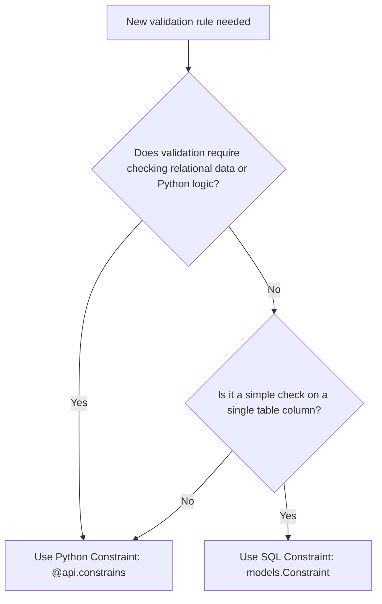

# Odoo 19 Constraints and Indexes: Schema Integrity & Performance

Odoo 19 provides declarative classes (`models.Constraint` and `models.Index`) to enforce schema rules at the database level and optimize search lookup performance.

---

## Database Constraints & Indexing Mechanics
Constraints are validation rules that prevent invalid data from being saved to the database. Indexes are data structures that PostgreSQL uses to speed up queries, preventing slow sequential table scans.

---

## The Importance of Data Integrity & Query Speed
*   **Data Integrity**: Validation at the Python layer is bypassable. Database-level constraints are absolute safeguards.
*   **Search Optimization**: Without indexes, searching millions of records forces PostgreSQL to read every row from disk. Correct indexing reduces search times from seconds to milliseconds.

---

## When to Enforce Validation or Create Indexes
*   Use **`models.Constraint`** for simple value validations (e.g. `price > 0`) or uniqueness constraints across single or multiple fields.
*   Use **`@api.constrains`** (Python constraints) when validation rules require checking relationships or comparing data from multiple tables.
*   Use **`models.Index`** to create composite indexes (multi-field lookups) or partial indexes for subset filtering.

---

## When to Avoid Constraints & Indexes
*   **Do not** use `models.Constraint` for logic that changes dynamically (like configuration parameters that users can edit in the UI).
*   **Do not** index columns with low cardinality (e.g., Booleans or status flags with only two states) unless creating a partial index.

---

## Declaring Constraints & Indexes in Python
Here is the Odoo 19 syntax for declaring constraints and indexes:

```python
from odoo import models, fields, api

class HospitalPatient(models.Model):
    _name = 'hospital.patient'
    _description = 'Patient Record'

    code = fields.Char(required=True)
    age = fields.Integer(default=0)
    
    # 1. SQL UNIQUE Constraint (Odoo 19 Declarative Style)
    _unique_code = models.Constraint(
        'UNIQUE(code)',
        'The patient code must be unique!'
    )
    
    # 2. SQL CHECK Constraint
    _check_age = models.Constraint(
        'CHECK(age >= 0)',
        'Age cannot be negative!'
    )
```

---

## Concrete Python & SQL Database Examples

### A. Python Constraints (`@api.constrains`)
For validation logic requiring relational lookups:

```python
from odoo import models, fields, api
from odoo.exceptions import ValidationError

class HospitalAppointment(models.Model):
    _name = 'hospital.appointment'
    _description = 'Patient Appointment'

    patient_id = fields.Many2one('hospital.patient', string="Patient", required=True)
    date = fields.Date("Date", required=True)

    @api.constrains('date', 'patient_id')
    def _check_appointment_date(self):
        for record in self:
            # Check if patient already has an appointment on this date
            duplicate = self.search([
                ('patient_id', '=', record.patient_id.id),
                ('date', '=', record.date),
                ('id', '!=', record.id)
            ], limit=1)
            if duplicate:
                raise ValidationError("This patient already has an appointment scheduled for this date.")
```

### B. Database Indexes (`models.Index`)
```python
class AuctionBid(models.Model):
    _name = 'auction.bid'
    _description = 'Auction Bid'

    listing_id = fields.Many2one('auction.listing')
    bid_amount = fields.Float()

    # 1. Composite Index on listing_id and bid_amount
    _listing_bid_idx = models.Index('(listing_id, bid_amount)')

    # 2. Index for descending date searches
    create_date = fields.Datetime("Created On")
    _date_idx = models.Index('(create_date DESC)')
```

---

## Common Indexing & Constraint Pitfalls
1.  **Trying to run joins in SQL Constraints**: SQL check constraints can only evaluate columns within the same row of the current table. They cannot contain subqueries or references to other tables.
2.  **Using Python Constraints for Uniqueness**: Writing `@api.constrains` check search loops for uniqueness. Under high concurrency, two parallel requests might check simultaneously, find no duplicates, and write duplicate records, causing race conditions. Always use `UNIQUE(field)` sql constraints instead.
3.  **Over-Indexing**: Adding indexes on high-write fields that are rarely searched. Every index slows down SQL writes (`INSERT`, `UPDATE`, `DELETE`) because PostgreSQL must rebuild the index structure.

---

## Database Integrity vs Write Speed Performance

This table compares SQL constraints and Python constraints:

| Feature | SQL Constraint (`models.Constraint`) | Python Constraint (`@api.constrains`) |
| :--- | :--- | :--- |
| **Enforcement** | **PostgreSQL Level** (Absolute) | **Odoo ORM Level** (Software) |
| **Performance** | Extremely Fast | Slower (requires Python execution) |
| **Scope** | Simple Logic (Unique, Check, etc.) | Complex Logic (relational lookups, multi-model) |
| **Trigger** | SQL Insert/Update | Odoo `create()` / `write()` calls |

---

## Senior Architect: Declarative Partial Indexes
In Odoo 19:
*   **Partial Indexing**: You can specify `where` parameters in `models.Index` to index a subset of records. This is highly performant for massive transactional tables:
    ```python
    # Creates an index ONLY for active records, keeping the index size tiny
    _active_listing_idx = models.Index(
        '(id)', 
        where="state = 'active'"
    )
    ```
*   The transition from the legacy `_sql_constraints = [...]` list to individual `models.Constraint` class attributes makes inheritance and overrides cleaner.

---

## Decision Pipeline Topology

This decision tree helps select the correct validation type based on business requirements:



---

## Related Database Guides
*   [Defining Models](../foundation/models.md)
*   [Decorators (@api)](decorators.md)
*   [Cache Management](cache_management.md)
