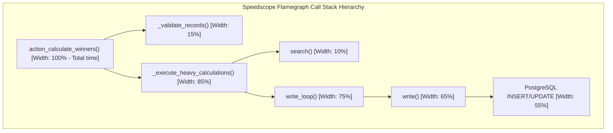

# Performance Profiling & SQL Optimization: Diagnostics & Speedscope

At scale, database query execution, memory inflation, and CPU blockages are the primary bottlenecks in Odoo. A single slow request can lock worker threads and trigger a cascade of timeouts for all concurrent users.

---

## Performance Profiling Concepts
Performance profiling in Odoo is the practice of capturing execution statistics (CPU cycles, query count, and method call durations) and visualizing execution stack traces to identify resource bottlenecks.

---

## The Need for Profiling & Query Optimization
As databases grow, previously unnoticeable N+1 query bugs, loops, and unindexed lookups turn into major performance issues. Profiling allows architects to pinpoint the exact line of Python code or database query causing bottlenecks.

---

## When to Profile & Analyze Odoo Executions
*   Use when optimizing long-running cron jobs or scheduled actions.
*   Use when a user view or client action takes more than 1 second to render.
*   Use during local test development to verify that SQL query counts remain flat as record numbers grow.

---

## When to Avoid Profiling in Production
*   **Do not** enable active profiling on live production servers during peak traffic. Profiling records file states to disk, adding overhead that can degrade performance further. Perform tests on staging replicas instead.

---

## Odoo Profiler API & Profiling Commands
Here is the Odoo 19 syntax for profiling decorators, context managers, cache flushes, and SQL wrappers:

```python
from odoo.tools.profiler import profile, Profiler
from odoo.tools import SQL

# 1. Method Decorator
@profile
def heavy_method(self):
    ...

# 2. Context Manager
with Profiler():
    execute_calculations()

# 3. Safe SQL Parameter Wrapper
query = SQL("UPDATE table SET name = %s WHERE id = %s", "New Name", record_id)

# 4. Cache Management Hooks
self.env['model.name'].flush_model(['field_name'])
self.invalidate_recordset(['field_name'])
```

---

## Real-world Profiling Cases & Output

### A. Surgical Context Manager & Query Counter
```python
from odoo import models, fields, api
from odoo.tools.profiler import Profiler

class AuctionListing(models.Model):
    _inherit = 'auction.listing'

    def action_evaluate_prices(self):
        # 1. Tracing query count programmatically before action
        stats_before = self.env.cr.statistics
        
        # 2. Profile only the heavy database transaction block
        with Profiler():
            self._execute_heavy_calculations()
            
        # 3. Tracing query count programmatically after action
        stats_after = self.env.cr.statistics
        queries = stats_after['sql_count'] - stats_before['sql_count']
        print(f"Executed Queries: {queries}")
```

### B. Safe SQL Querying with Cache Invalidation
```python
from odoo.tools import SQL

def update_bid_amounts_raw(self, new_amount):
    # 1. Write pending cache updates to PostgreSQL before query execution
    self.env['auction.bid'].flush_model(['amount'])
    
    # 2. Formulate and execute safe parameters-bound query
    query = SQL(
        "UPDATE auction_bid SET amount = %s WHERE listing_id = %s",
        new_amount,
        self.id
    )
    self.env.cr.execute(query)
    
    # 3. Invalidate local cache to force subsequent ORM reads to query DB
    self.invalidate_recordset(['amount'])
```

# Run safe query
query = SQL("UPDATE auction_bid SET amount = 500 WHERE id = %s", self.id)
self.env.cr.execute(query)

# Invalidate cache
self.<input type="text" class="quiz-input-inline w-200" data-answer="invalidate_recordset(['amount'])">
</code></pre>
<button class="quiz-check" onclick="checkCodeChallenge(this)">Check Code</button>
<div class="quiz-result"></div>
</div>

---

## Profiling Pitfalls & Optimization Traps
1.  **Direct SQL Queries without Cache Synchronization**: Running raw SQL commands directly via `cr.execute` without flushing the cache beforehand or invalidating it afterwards, which leads Odoo to read stale memory cache data.
2.  **SQL Injection via String Formatting**: Formatting raw queries like `cr.execute(f"SELECT * FROM table WHERE id = {user_input}")`. Always wrap query parameters inside the `SQL()` class to sanitize inputs.

---

## CPU Dwell vs Database Query Latency
To profile requests from the browser, activate **Developer Mode**, click the bug icon, select **Enable Profiling**, and download the generated execution stats file. You can also start Odoo with `--dev=profile` to capture all request files inside `~/.local/share/Odoo/speedscope/`.
*   **Flamegraph (Time Grid)**: Displays call stacks where each box is a function. The box width corresponds to the execution time.
*   **Heavy (Bottom-Up)**: Lists individual functions sorted by the time spent directly inside them (excluding call chains).
*   **Sandwich (Top-Down)**: Shows caller-callee hierarchies, tracing which parent methods triggered slow child operations.

---

## Senior Architect: Speedscope & Flamegraph Analysis
In Odoo 19:
*   Use the new `SQL()` wrapper class to make raw queries composable and parameterizable without security vulnerabilities.
*   Ensure `@api.depends_context` is added to computed fields depending on contextual cache flags to partition cached states correctly.

---

## Execution Flow & Call Stack Topology

This diagram shows the structural stack trace width and depth hierarchy inside a Speedscope Flamegraph analysis of a slow method:



---

## 💻 Code Challenge

**Complete the code sequence to flush, run a raw query safely, and invalidate the ORM cache:**

<div class="code-challenge">
<pre><code># Flush cache
self.env['auction.bid'].<input type="text" class="quiz-input-inline w-180" data-answer="flush_model(['amount'])">


---

## Related Tuning Guides
*   [PostgreSQL and Indexes](postgresql_indexes.md)
*   [Workers and Scaling](../deployment/scaling.md)
*   [Batch Operations](../crud/batch_operations.md)
*   [Cache Management](cache_management.md)
