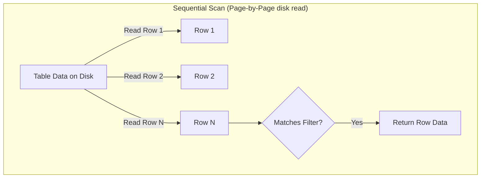
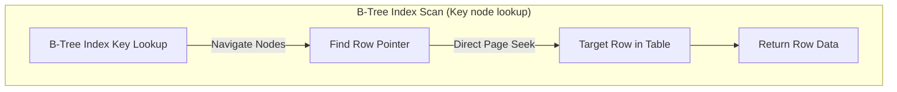

# PostgreSQL and Indexes: Database Optimization & Diagnostic Plans

At scale, database query performance is the primary bottleneck for Odoo installations. A single slow query can tie up a worker thread, leading to blocked requests for concurrent users.

---

## PostgreSQL Indexing Foundations
An index is a database schema structure that PostgreSQL uses to locate records without scanning the entire table. In Odoo 19, indexes are declared on field definitions (`index=True`) or at the model class level using the `models.Index` class wrapper.

---

## The Need for Page-Seek Index Searches
Without indexes, PostgreSQL must perform sequential table scans (page-by-page reads from disk). B-Tree indexes structure column values into balanced search trees, reducing key lookups from $O(N)$ sequential operations to $O(\log N)$ tree path traversals.

---

## When to Build DB Indexes
*   Use on fields frequently used in search domains (e.g. `[('reference', '=', val)]`).
*   Use on fields declared in sorting rules (`_order = 'create_date DESC'`).
*   Use composite indexes when queries routinely filter using combinations of multiple fields.
*   Use partial indexes for dashboards that target specific row flags (like active records).

---

## When to Avoid Table Indexes
*   **Do not** index fields with low selectivity (e.g. Booleans or status flags with only two options) as PostgreSQL will bypass the index and perform sequential scans anyway, unless you wrap it in a partial index filter.
*   **Do not** add indexes to models with heavy write frequency (`INSERT`/`UPDATE`/`DELETE`) on columns that change continuously (like counter fields) as index table rebuilding slows down database write execution.

---

## Declaring Database Indexes in SQL & Python
Here is the Odoo 19 syntax for defining indexes:

```python
from odoo import models, fields

class ResPartner(models.Model):
    _inherit = 'res.partner'

    # 1. Simple column index
    reference = fields.Char("Ref Code", index=True)

    # 2. Composite Index (Multi-field query)
    _name_ref_idx = models.Index('(name, reference)')

    # 3. Partial Index (Filters subset of rows)
    _active_code_idx = models.Index(
        '(reference)', 
        where="active = True"
    )
```

---

## Composite & Partial Indexing Scenarios

### A. Composite and Sorting Indexes
```python
from odoo import models, fields

class AuctionBid(models.Model):
    _name = 'auction.bid'
    _description = 'Auction Bid'

    listing_id = fields.Many2one('auction.listing')
    amount = fields.Monetary("Bid Amount")
    create_date = fields.Datetime("Date")

    # Composite index: Speeds up queries searching by listing AND sorting by amount
    _listing_bid_idx = models.Index('(listing_id, amount DESC)')

    # Date-sort index for descending queries
    _date_idx = models.Index('(create_date DESC)')
```

### B. Partial Indexing Configuration
```python
class AuctionListing(models.Model):
    _name = 'auction.listing'
    _description = 'Auction Item Listing'

    state = fields.Selection([('draft', 'Draft'), ('active', 'Active')])

    # Index active listings only. Ideal for active dashboard metrics!
    _active_listing_idx = models.Index(
        '(id)', 
        where="state = 'active'"
    )
```

---

## Database Indexing Anti-patterns
1.  **Over-Indexing**: Adding indexes to every single model column. Every active index slows down PostgreSQL `write` performance because index tables must be updated dynamically with each insert or delete.
2.  **Indexing Unstored Computed Fields**: Setting `index=True` on a computed field without `store=True`. Unstored computed fields do not exist inside PostgreSQL tables, making indexing impossible.

---

## Scan Costs: Index Scan vs Seq Scan
To locate database bottlenecks, prepend queries using `EXPLAIN (ANALYZE, BUFFERS)` to inspect database scan strategies:
*   **Seq Scan (Sequential Scan) ❌**: Postgres reads the entire table from disk page-by-page. High cost.
    ```text
    -> Seq Scan on auction_listing (cost=0.00..385.00 rows=15 width=4) (actual time=0.012..8.450 rows=12 loops=1)
       Filter: ((state = 'active'::text) AND (price > 5000))
    ```
*   **Index Scan ✅**: Postgres queries the B-Tree index to locate row pointers, then reads specific table pages. High performance.
    ```text
    -> Index Scan using active_listing_idx on auction_listing (cost=0.15..12.30 rows=5 width=4) (actual time=0.004..0.025 rows=12 loops=1)
    ```

---

## Senior Architect: Index Cardinality & EXPLAIN ANALYZE
In Odoo 19:
*   **Index Only Scan**: If your SQL query only selects columns that are defined within the active index key, PostgreSQL reads value structures directly from the index tree without loading table data pages, achieving maximum performance.
*   **Rollback Safety Caution**: Since `EXPLAIN ANALYZE` actually executes the query to collect timing metrics, running it on an `UPDATE` or `DELETE` statement will modify records. Always wrap diagnostic writes in rollback blocks:
    ```sql
    BEGIN;
    EXPLAIN ANALYZE UPDATE auction_bid SET amount = 1000 WHERE id = 5;
    ROLLBACK;
    ```

---

## Scan Access Mechanics

This diagram illustrates the data access difference between a Sequential Table Scan and a B-Tree Index Scan:





---

## 💻 Code Challenge

**Define a partial index in Odoo 19 that indexes the code field only for active partners (active = True):**

<div class="code-challenge">
<pre><code>class ResPartner(models.Model):
    _inherit = 'res.partner'
    
    code = fields.Char("Code")
    active = fields.Boolean("Active")
    
    _partner_code_idx = <input type="text" class="quiz-input-inline w-250" data-answer="models.Index('(code)', where=&quot;active = True&quot;)">
</code></pre>
<button class="quiz-check" onclick="checkCodeChallenge(this)">Check Code</button>
<div class="quiz-result"></div>
</div>


---

## Related Database Guides
*   [Performance & Set Operations](../search/performance_optimization.md)
*   [Performance Profiling & SQL](performance_profiling.md)
*   [SQL Performance](../integration/performance.md)
