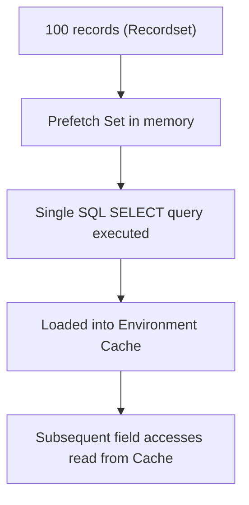

# Odoo 19: ORM Prefetching

Have you ever wondered why accessing `record.partner_id.name` in a loop of 1000 records doesn't cause 1000 SQL queries? The answer is **Prefetching**.

---

## 💡 The Concept: "Batch Loading"

Odoo is designed to be lazy. When you fetch a recordset, Odoo doesn't load all the fields for all the records immediately.

However, when you access a relational field (like `partner_id`) on *one* record in a recordset, Odoo assumes you will likely need that same field for the *other* records in that same recordset.



**It prefetches the data for all records in the recordset in one single SQL query.**

---

## 🏗️ How it Works

Imagine you have 100 auction listings and you loop through them to get the partner name:

```python
# 1. Fetch listings
listings = self.env['auction.listing'].search([('state', '=', 'active')])

# 2. Access partner_id.name
for listing in listings:
    # Odoo fetches partner_id for ALL 100 listings
    # in the very first iteration.
    print(listing.partner_id.name)
```

Without prefetching, this would trigger 100 queries for the partner name. With prefetching, Odoo intelligently bundles them.

---

## 3. Under the Hood: Prefetch Sets & The Cache

How does Odoo know which records to bundle together?

When you query records (via `search()` or `browse()`), Odoo instantiates them as a single recordset. Every record in that set is assigned a shared reference called a **Prefetch Set** (stored internally in `self._prefetch_ids`).

1.  **First Read**: You read `listing.price` on the first record.
2.  **ORM Lookup**: Odoo sees the record is part of a prefetch set of 100 listings.
3.  **SQL Query**: Instead of `SELECT price FROM ... WHERE id = 1`, Odoo executes `SELECT id, price FROM ... WHERE id IN (1, 2, ..., 100)`.
4.  **Cache Seeding**: The returned values are loaded into the **Environment Cache** (`self.env.cache`).
5.  **Subsequent Reads**: When the loop moves to listing #2, Odoo reads `listing.price` from `self.env.cache` without touching PostgreSQL.

---

## 4. The "Breaking the Prefetch" Trap

As a Senior Developer, you must know what breaks this optimization. If you discard the recordset and browse records individually, they get assigned **distinct prefetch sets**, destroying the prefetch mechanism.

### ❌ Breaking the Prefetch (N+1 Query Trigger)
```python
# Discarding the recordset to work with raw IDs
listing_ids = listings.ids

for listing_id in listing_ids:
    # Browsing individually creates a new, isolated prefetch set containing ONLY 1 ID
    listing = self.env['auction.listing'].browse(listing_id)
    print(listing.seller_id.name) # Triggers a separate SQL query every single iteration!
```

---

## 5. Senior: Disabling Prefetching

While prefetching is normally desired, it can consume massive amounts of server RAM when processing millions of records during bulk imports or background calculations.

If you are loading a huge recordset but only need to read a single field on each record, you can tell Odoo **not** to prefetch other fields by passing `prefetch_fields=False` in the context. This limits the SQL SELECT to the fields you actually read, saving DB buffer and server RAM memory.

```python
# Process a large list of listings without loading unnecessary field caches
large_set = self.env['auction.listing'].with_context(prefetch_fields=False).search([])
for record in large_set:
    # Only the name is fetched and cached, other columns are not preloaded.
    print(record.name)
```

---

## 🏗️ Master Project Challenge: Prefetching
1.  **Task**: Your dashboard currently fetches auction listings one by one.
2.  **Goal**: Refactor the fetch logic to use a single `search()` call, allowing Odoo to automatically prefetch related `owner_id` fields.

---

## 🏁 Senior Checkpoint
*   **Key Concept**: Odoo uses shared prefetch sets to load values for an entire recordset into the environment cache in a single SQL operation.
*   **Architect Insight**: Never loop over `browse(id)` inside ID-based lists; keep records bundled in a recordset as long as possible to prevent SQL N+1 storms.
*   **Verify Your Knowledge**: How do you disable prefetching during massive data updates? (Answer: Use `with_context(prefetch_fields=False)` on the recordset).
---

## 📝 Knowledge Check

<div class="quiz-container">
  <div class="quiz-question">1. What is the main benefit of Odoo's prefetching mechanism?</div>
  <input type="text" class="quiz-input" placeholder="Type your answer here...">
  <button class="quiz-check" data-answer="It bundles multiple SQL queries into one, drastically reducing database overhead when accessing related records in a loop." onclick="checkQuiz(this)">Check Answer</button>
  <div class="quiz-result"></div>
</div>


---
