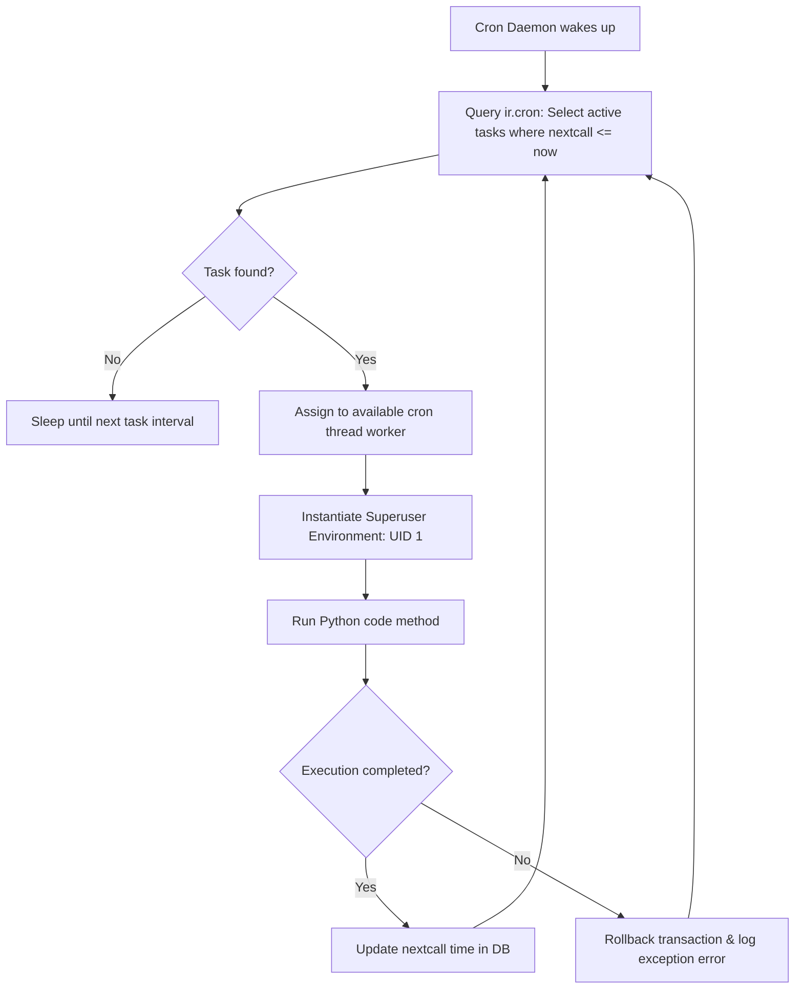

---
tags:
  - Automation
  - Backend
  - XML Data
  - Odoo 19
title: Odoo 19 Scheduled Actions Tutorial — Configuring ir.cron background tasks
description: Learn how to schedule automated background cron jobs in Odoo 19. Optimize intervals, set user contexts, and prevent concurrency locks.
---

# Scheduled Actions (Cron Jobs): Background Automation

In enterprise applications, tasks often need to run automatically in the background without user intervention. In Odoo, this background processing is handled by **Scheduled Actions** (Cron Jobs).

---

## 1. What is it
A Scheduled Action in Odoo is a database record in the `ir.cron` model that describes a periodic task. Odoo's registry manager daemon monitors this table and executes the associated Python methods when the scheduled run time has passed.

---

## 2. Why
Running heavy computations (like bulk invoice generation or database cleaning) inside a user's web request blocks the thread, causing user interfaces to freeze and triggering timeout errors. Scheduled Actions move this processing into background worker threads.

---

## 3. When
*   Use to execute recurring reports (e.g. daily sales summaries).
*   Use to auto-close records that have expired (e.g., closing ended auctions).
*   Use to trigger bulk external API synchronizations.
*   Use to execute periodic cleanup or archiving.

---

## 4. When Not
*   **Do not** use Scheduled Actions for operations that require immediate, real-time user feedback (use active buttons calling Python objects).
*   **Do not** run crons at high frequencies (e.g. every few seconds) in multi-process worker environments as they create continuous database read/write locks, degrading performance.

---

## 5. Syntax
Scheduled Actions are defined in XML files wrapped inside `<data noupdate="1">` blocks to prevent future module updates from overwriting user schedule custom changes:

```xml
<odoo>
    <data noupdate="1">
        <record id="ir_cron_close_expired_auctions" model="ir.cron">
            <field name="name">Auction: Close Expired Listings</field>
            <field name="model_id" ref="model_auction_listing"/>
            <field name="state">code</field>
            <field name="code">model._cron_close_expired()</field>
            <field name="user_id" ref="base.user_root"/>
            <field name="interval_number">5</field>
            <field name="interval_type">minutes</field>
            <field name="numbercall">-1</field>
            <field name="doall" eval="False"/>
            <field name="active" eval="True"/>
        </record>
    </data>
</odoo>
```

Python methods called by crons are decorated with `@api.model` because they run at the class level without an active recordset:

```python
from odoo import models, fields, api

class AuctionListing(models.Model):
    _name = 'auction.listing'

    @api.model
    def _cron_close_expired(self):
        # Class-level logic executed by background threads
        pass
```

---

## 6. Examples

### A. Batch Expiration Processor
```python
from odoo import models, fields, api

class AuctionListing(models.Model):
    _name = 'auction.listing'
    _description = 'Auction Listing'

    state = fields.Selection([('open', 'Open'), ('closed', 'Closed')])
    end_date = fields.Datetime("End Date")

    @api.model
    def _cron_close_expired(self):
        """Finds all open auctions whose end_date has passed and closes them."""
        # Search and fetch expired listings in batch
        expired_auctions = self.search_fetch(
            [('state', '=', 'open'), ('end_date', '<=', fields.Datetime.now())],
            ['id', 'state']
        )
        if expired_auctions:
            # Batch update
            expired_auctions.write({'state': 'closed'})
```

### B. Heavy Data Chunking with Manual Commit
```python
    @api.model
    def _cron_process_heavy_data(self):
        # Fetch records in chunks to prevent transaction timeouts (15 mins limit)
        records = self.search([('state', '=', 'pending')], limit=1000)
        for rec in records:
            rec.process_data()
            
        # Commit progress to database explicitly
        self.env.cr.commit()
        
        # If the chunk limit was hit, re-trigger the cron immediately to process next chunk
        if len(records) == 1000:
            self.env.ref('my_module.ir_cron_close_expired_auctions')._trigger()
```

### 🛠️ Master Project Challenge: The Auction Hammer
Auctions must close automatically when their time is up.
**Goal:** Create a cron job to close auctions.
1. Create a `data/cron.xml` file.
2. Define an `ir.cron` that runs every 5 minutes.
3. Call a `@api.model` method named `_cron_check_expirations` on `auction.listing`.

??? success "Show Solution"
    ```xml
    <odoo>
        <data noupdate="1">
            <record id="cron_close_auctions" model="ir.cron">
                <field name="name">Auction: Auto-Close</field>
                <field name="model_id" ref="model_auction_listing"/>
                <field name="state">code</field>
                <field name="code">model._cron_check_expirations()</field>
                <field name="interval_number">5</field>
                <field name="interval_type">minutes</field>
                <field name="numbercall">-1</field>
                <field name="doall" eval="False"/>
            </record>
        </data>
    </odoo>
    ```

---

## 7. Common Mistakes
1.  **Omitting `noupdate="1"`**: Bypassing the noupdate block. If a system administrator customizes the cron frequency in the database UI, upgrading the module will overwrite their changes with the default XML fields.
2.  **Using `@api.depends` or `@api.onchange` in Crons**: Writing cron methods assuming they execute on active recordsets. Always write your cron methods to execute `self.search` explicitly.
3.  **Monopolizing Transactions**: Executing massive, long loops without committing chunked progress. If Odoo hits a timeout, the entire transaction is rolled back, meaning zero progress is saved.

---

## 8. Performance
Odoo schedules tasks using database polling. In production setups:
*   Configure dedicated cron workers in `odoo.conf` by setting the `workers` parameter and disabling cron runs on frontend HTTP workers:
    ```ini
    workers = 4
    max_cron_threads = 2
    ```
*   Use `cr.commit()` during loops to flush changes to disk, reducing transaction locking time.

---

## 9. Senior
In Odoo 19:
*   **Self-Triggering Crons**: Use `self.env.ref('module.cron_xml_id')._trigger()` to dynamically chain execution cycles, bypassing interval wait times when data volume is high.
*   Crons execute under the superuser context (`base.user_root`). If you need to evaluate records under specific company limits, use `with_company(company)` or `sudo()` to ensure data isolation.

---

## 10. Diagrams

This diagram illustrates Odoo's background Cron Runner daemon checking and executing scheduled jobs:



---

## 11. Related
*   [Batch Operations](../crud/batch_operations.md)
*   [Wizards & TransientModels](../wizards/wizards.md)
*   [Performance & Set Operations](../search/performance_optimization.md)
