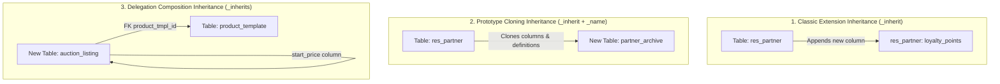

# Odoo 19 Inheritance: Extension, Cloning & Composition

In Odoo, inheritance allows developers to extend or modify existing database tables and model business logic without altering the original source code. This is fundamental for building modular and maintainable apps.

---

## 1. What is it
Odoo provides three primary inheritance patterns:
*   **Classic Inheritance (`_inherit`)**: Modifies an existing model class and its database table in-place.
*   **Prototype Inheritance (`_inherit` + `_name`)**: Copies all fields and methods of a parent model to create a new model and database table.
*   **Delegation Inheritance (`_inherits`)**: Connects a child model to a parent model via a Foreign Key, exposing the parent's fields directly as if they belonged to the child.

---

## 2. Why
Modern ERP applications are built dynamically. To add custom fields or change default behaviors in a core Odoo module (such as Sales or Inventory), you must inherit from it. This ensures core updates from Odoo S.A. can be installed without overwriting custom code.

---

## 3. When
*   Use **Classic Inheritance** to add custom columns or alter method flows in existing core tables (e.g. adding a customer loyalty rating to `res.partner`).
*   Use **Prototype Inheritance** when you need a separate model that replicates all calculations and database columns of a parent model but has isolated data (e.g., creating an archival copy of active listings).
*   Use **Delegation Inheritance** when a record in a new model has an "is-a" relationship with a parent model but requires distinct identity (e.g., `res.users` delegates to `res.partner` because every user is a partner, but not every partner is a user).

---

## 4. When Not
*   **Do not** use `_inherits` (Delegation) if a simple `Many2one` field is enough to reference the parent without needing direct access to all its columns in search filters.
*   **Do not** use prototype inheritance when your goal is to customize a core view or business flow; modifying the model in-place (classic inheritance) is required for those overrides.

---

## 5. Syntax
Here is the core Python syntax for declaring all three inheritance patterns in Odoo 19:

```python
from odoo import models, fields

# 1. Classic Inheritance (In-Place modification)
class ResPartner(models.Model):
    _inherit = 'res.partner'

    loyalty_points = fields.Integer("Loyalty Points", default=0)

# 2. Prototype Inheritance (Cloned copy, new table)
class PartnerArchive(models.Model):
    _name = 'partner.archive'
    _inherit = 'res.partner'  # Copies columns/logic to new partner_archive table

# 3. Delegation Inheritance (Composition, separate tables linked via Many2one)
class AuctionListing(models.Model):
    _name = 'auction.listing'
    _inherits = {'product.template': 'product_tmpl_id'}

    product_tmpl_id = fields.Many2one(
        'product.template', 
        required=True, 
        ondelete='cascade'
    )
    start_price = fields.Float("Starting Price")
```

---

## 6. Examples

### A. Classic Method Overriding (Calling super())
```python
class SaleOrder(models.Model):
    _inherit = 'sale.order'

    @api.model_create_multi
    def create(self, vals_list):
        # Override write creation: inject custom logging or modifications
        for vals in vals_list:
            vals['note'] = "Created via Custom Sales extension."
        # Invoke parent to perform database inserts
        return super().create(vals_list)
```

### B. Delegation Inheritance in Action
```python
from odoo import models, fields

class VehicleListing(models.Model):
    _name = 'vehicle.listing'
    _description = 'Vehicle Catalog'
    
    # Connects Vehicle to Product Template
    _inherits = {'product.template': 'product_id'}

    product_id = fields.Many2one(
        'product.template', 
        required=True, 
        ondelete='cascade'
    )
    mileage = fields.Integer("Mileage")
```
*Note: Because vehicle listing delegates to product template, writing `vehicle.name = 'Sedan'` works transparently, writing 'Sedan' directly to the parent template table.*

### 📝 Knowledge Check

<div class="quiz-container">
  <div class="quiz-question">1. What is the difference between `_inherit` and `_inherits`?</div>
  <input type="text" class="quiz-input" placeholder="Type your answer here...">
  <button class="quiz-check" data-answer="`_inherit` modifies an existing table (classic inheritance) or clones it (prototype inheritance), while `_inherits` (delegation inheritance) creates a separate table and links it to a parent table via a Many2one field." onclick="checkQuiz(this)">Check Answer</button>
  <div class="quiz-result"></div>
</div>

<div class="quiz-container">
  <div class="quiz-question">2. When should you use classic inheritance (`_inherit`) without a new `_name`?</div>
  <input type="text" class="quiz-input" placeholder="Type your answer here...">
  <button class="quiz-check" data-answer="Use it when you want to add fields or modify behavior of an existing Odoo model in place (e.g., adding a field to `res.partner`)." onclick="checkQuiz(this)">Check Answer</button>
  <div class="quiz-result"></div>
</div>

<div class="quiz-container">
  <div class="quiz-question">3. What determines the order in which multiple inheritance changes are applied?</div>
  <input type="text" class="quiz-input" placeholder="Type your answer here...">
  <button class="quiz-check" data-answer="The order is determined by the module dependencies defined in the `__manifest__.py` file." onclick="checkQuiz(this)">Check Answer</button>
  <div class="quiz-result"></div>
</div>

<div class="quiz-container">
  <div class="quiz-question">4. Why should you usually call `super()` when overriding a method?</div>
  <input type="text" class="quiz-input" placeholder="Type your answer here...">
  <button class="quiz-check" data-answer="Calling `super()` ensures that the original logic and any logic added by other modules are preserved, preventing your change from breaking existing functionality." onclick="checkQuiz(this)">Check Answer</button>
  <div class="quiz-result"></div>
</div>

---

## 7. Common Mistakes
1.  **Missing module dependencies in `__manifest__.py`**: Inheriting from `sale.order` without adding `'sale'` to your module's dependency list. Odoo will load your module before `sale`, resulting in `KeyError: 'sale.order'` at server boot.
2.  **Overwriting methods without calling `super()`**: Discarding parent logic by omitting `super().method_name()`, which breaks functionality introduced by Odoo or other third-party modules.
3.  **Forgetting `required=True` on Delegation foreign keys**: Omitting `required=True` on the `Many2one` relational field linked inside the `_inherits` dictionary, leading to database schema mismatches.

---

## 8. Performance
*   **Classical Inheritance**: Modifies the parent table directly. If you add columns, they are appended to the existing PostgreSQL table, meaning zero database join overhead.
*   **Delegation Inheritance**: Keeps tables normalized. To read parent values, Odoo performs SQL `LEFT JOIN` structures or transparently fires separate queries. Use only when parent-child separation is necessary to prevent table size bloating.

---

## 9. Senior
In Odoo 19:
*   **Method Hooks (`_get_xxx`)**: Senior developers write overridable method hooks returning lists or dictionaries so that other developers can extend behaviors without rewriting logic:
    ```python
    # In Parent Module:
    def _get_supported_types(self):
        return ['draft', 'open']

    # In Your Inheriting Module:
    def _get_supported_types(self):
        res = super()._get_supported_types()
        res.append('custom')
        return res
    ```
*   Inheritance sequence: If multiple modules extend the same class, Odoo applies them dynamically in sequence based on their installation tree order.

---

## 10. Diagrams

This diagram illustrates how Odoo maps each of the three inheritance patterns at the PostgreSQL database table layer:



---

## 11. Related
*   [XPath & View Overrides](../foundation/xpath.md)
*   [AbstractModel Pattern](../advanced/abstract_models.md)
*   [Core Mixins (Chatter & Activities)](mixins.md)
*   [Defining Models](../foundation/models.md)
