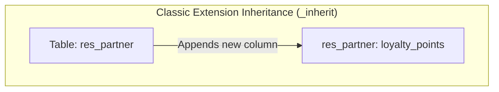
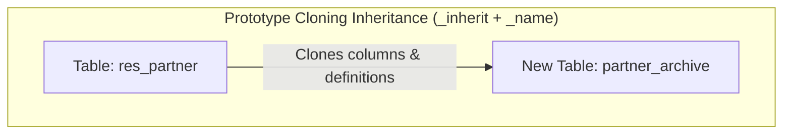
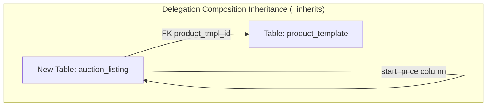
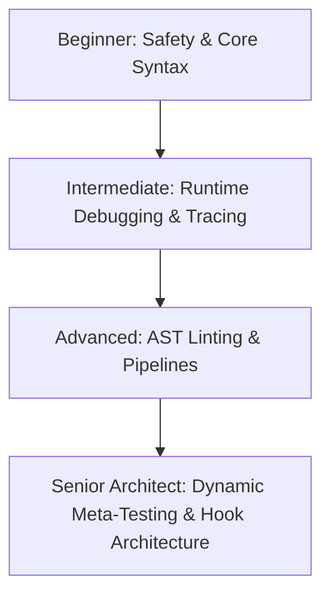

# Odoo 19 Inheritance: Extension, Cloning & Composition

In Odoo, inheritance allows developers to extend or modify existing database tables and model business logic without altering the original source code. This is fundamental for building modular, robust, and maintainable enterprise applications.

---

## Core Inheritance Patterns

Odoo provides three primary inheritance patterns, each serving a distinct database and business logic structure:

*   **Classic Inheritance (`_inherit` without `_name`)**: Modifies an existing model class and its database table in-place.
*   **Prototype Inheritance (`_inherit` + `_name`)**: Copies all fields and methods of a parent model to create a new model and database table.
*   **Delegation Inheritance (`_inherits`)**: Connects a child model to a parent model via a Foreign Key, exposing the parent's fields directly as if they belonged to the child.

---

## Choosing the Right Inheritance Pattern

### Classic Inheritance
*   **Use Cases:** Add custom columns or alter method flows in existing core tables (e.g., adding a customer loyalty rating to `res.partner`).
*   **Avoid When:** You need a separate model that replicates all calculations and database columns of a parent model but has isolated data.

### Prototype Inheritance
*   **Use Cases:** When you need a separate model that replicates all calculations and database columns of a parent model but has isolated data (e.g., creating an archival copy of active listings).
*   **Avoid When:** Your goal is to customize a core view or business flow; modifying the model in-place (classic inheritance) is required for those overrides.

### Delegation Inheritance
*   **Use Cases:** When a record in a new model has an "is-a" relationship with a parent model but requires distinct identity (e.g., `res.users` delegates to `res.partner` because every user is a partner, but not every partner is a user).
*   **Avoid When:** A simple `Many2one` field is enough to reference the parent without needing direct access to all its columns in search filters.

---

## Declaring Inheritance: Python Syntax

Here is the core Python syntax for declaring all three inheritance patterns in Odoo 19:

```python
from odoo import models, fields

# 1. Classic Inheritance (In-Place modification)
class ResPartner(models.Model):
    _inherit = 'res.partner'

    loyalty_points = fields.Integer("Loyalty Points", default=0)

# 2. Prototype Inheritance (Cloned copy, new table)
class PartnerArchive(models.Model):
    _name = 'partner.archive'
    _inherit = 'res.partner'  # Copies columns/logic to new partner_archive table

# 3. Delegation Inheritance (Composition, separate tables linked via Many2one)
class AuctionListing(models.Model):
    _name = 'auction.listing'
    _inherits = {'product.template': 'product_tmpl_id'}

    product_tmpl_id = fields.Many2one(
        'product.template', 
        required=True, 
        ondelete='cascade'
    )
    start_price = fields.Float("Starting Price")
```

---

## Concrete Implementation Examples

### Classic Method Overriding via the Super Chain
```python
class SaleOrder(models.Model):
    _inherit = 'sale.order'

    @api.model_create_multi
    def create(self, vals_list):
        # Override write creation: inject custom logging or modifications
        for vals in vals_list:
            vals['note'] = "Created via Custom Sales extension."
        # Invoke parent to perform database inserts
        return super().create(vals_list)
```

### Delegation Inheritance in Action
```python
from odoo import models, fields

class VehicleListing(models.Model):
    _name = 'vehicle.listing'
    _description = 'Vehicle Catalog'
    
    # Connects Vehicle to Product Template
    _inherits = {'product.template': 'product_id'}

    product_id = fields.Many2one(
        'product.template', 
        required=True, 
        ondelete='cascade'
    )
    mileage = fields.Integer("Mileage")
```
*Note: Because vehicle listing delegates to product template, writing `vehicle.name = 'Sedan'` works transparently, writing 'Sedan' directly to the parent template table.*

---

## Database Topology and Schema Mapping

This diagram illustrates how Odoo maps each of the three inheritance patterns at the PostgreSQL database table layer:







---

## Performance and Query Cost Analysis

*   **Classical Inheritance:** Modifies the parent table directly. If you add columns, they are appended to the existing PostgreSQL table, meaning zero database join overhead.
*   **Delegation Inheritance:** Keeps tables normalized. To read parent values, Odoo performs SQL `LEFT JOIN` structures or transparently fires separate queries. Use only when parent-child separation is necessary to prevent table size bloating. Always ensure the `Many2one` reference field has `required=True` and `ondelete='cascade'` to maintain database schema integrity.

---

## Common Implementation Pitfalls

1.  **Missing Module Dependencies in Manifests:** Inheriting from `sale.order` without adding `'sale'` to your module's dependency list. Odoo will load your module before `sale`, resulting in `KeyError: 'sale.order'` at server boot.
2.  **Overriding Methods without Calling `super()`:** Discarding parent logic by omitting `super().method_name()`, which breaks functionality introduced by Odoo or other third-party modules.
3.  **Forgetting `required=True` on Delegation Foreign Keys:** Omitting `required=True` on the `Many2one` relational field linked inside the `_inherits` dictionary, leading to database schema mismatches.

---

## The Graduated Oversight Flow: Junior to Senior Architect

As a developer progresses through the Odoo 19 Masterclass, their responsibilities for system integrity and code quality grow. Managing a modular Odoo database requires different levels of oversight depending on the complexity of the changes and the size of the team.



---

### Level 1: Junior Developer (Safety & Local Verification)
At the beginner level, oversight centers on core execution safety and syntax compliance to prevent registry loading crashes.

*   **The Manifest Rule:** When inheriting an existing model (e.g., `_inherit = 'sale.order'`), you must declare the parent module (e.g., `'sale'`) in the `'depends'` list of your `__manifest__.py` file. Missing this causes a critical `KeyError` at server start because Odoo does not know to load the base model first.
*   **The Super Chain Boilerplate:** Every method override should call `super()` to keep the inheritance chain intact:
    ```python
    @api.model_create_multi
    def create(self, vals_list):
        # Perform custom logic before database insert
        res = super().create(vals_list)
        # Perform custom logic after database insert
        return res
    ```
*   **Local Warning Inspection:** Run the Odoo service using the `--dev=all` command flag. This displays real-time layout warnings in the browser and reloads Python code instantly without server restarts, helping developers see registry anomalies immediately.

---

### Level 2: Intermediate Developer (Runtime Auditing & Context Tracing)
As you write advanced business logic, the oversight flow moves from syntax rules to auditing the runtime database environment and tracking execution context.

*   **Registry Verification via Odoo Shell:** Use Odoo's interactive shell to inspect active models and print the Method Resolution Order (MRO) list to confirm which code is loading and in what sequence:
    ```python
    # Launch interactive shell: python3 odoo-bin shell -c odoo.conf -d my_database
    >>> self.env['sale.order'].__class__.__mro__
    (<class 'odoo.addons.my_custom_module.models.sale_order.SaleOrder'>,
     <class 'odoo.addons.sale.models.sale_order.SaleOrder'>,
     <class 'odoo.models.Model'>,
     <class 'object'>)
    ```
*   **Context Isolation Auditing:** Ensure context modifications (like `with_context(skip_rules=True)`) made before calling `super()` are scoped tightly. Accidental context leakage can propagate down the inheritance chain, leading to unexpected performance penalties or security holes.

---

### Level 3: Advanced Developer (Automated Quality Controls & CI)
At this stage, developers establish automated processes to ensure large-scale, multi-module developments conform to project rules without manual reviews.

*   **Static AST Linting (pylint-odoo):** Configure static code analysis in the team's local hooks. Standard rules check that all manifest dependency links are accurate and that overridden methods do not swallow parent routines by omitting `super()`.
*   **Pipeline Checks:** Include standard test commands (`odoo-bin -c odoo.conf -i my_module --test-enable --stop-after-init`) in pull request pipelines to verify that newly added inheritance overrides do not break existing model fields or CRUD actions.

---

### Level 4: Senior Architect (Governance, Metaprogramming & Scalability)
Senior Architects design the system's extensibility guidelines and build automated registry validation checks to monitor and regulate third-party addons.

*   **Programmatic Source-Code Inspections:** Write specialized unit tests that use Python's `inspect` module to dynamically scan all inheriting classes in the registry. This guarantees that custom overrides or third-party apps do not hijack core processes without calling `super()`:
    ```python
    from odoo.tests.common import TransactionCase
    import inspect

    class TestInheritanceOversight(TransactionCase):
        def test_verify_sale_order_overrides(self):
            """ Assert that no module has overridden create() without a super() call """
            mro = self.env['sale.order'].__class__.__mro__
            for cls in mro:
                # Target modules inside our custom addons path
                if 'my_addons' in getattr(cls, '__module__', ''):
                    if hasattr(cls, 'create'):
                        source = inspect.getsource(cls.create)
                        self.assertIn('super', source, f"Method create() in {cls} lacks a super() call!")
    ```
*   **The Hook Method Pattern:** Enforce the use of return-driven hooks (`_prepare_xyz` or `_get_xyz`) in base custom modules. Instead of allowing downstream teams to inherit and rewrite giant monolith methods, base methods are split into granular hooks, facilitating parallel modifications:
    ```python
    # Core Module:
    def action_approve(self):
        vals = self._prepare_approval_values()
        self.write(vals)

    def _prepare_approval_values(self):
        return {'state': 'approved', 'approval_date': fields.Datetime.now()}

    # Downstream Module:
    def _prepare_approval_values(self):
        res = super()._prepare_approval_values()
        res['approved_by_id'] = self.env.user.id
        return res
    ```
*   **Performance & Query Auditing:** Delegation inheritance (`_inherits`) performs `LEFT JOIN` structures or transparent queries when reading values. Architects use Odoo's SQL profiler or automated database query count assertions (`assertQueryCount`) to verify that recursive inheritance patterns do not cause query volume explosions.

---

## Interactive Knowledge Check

<div class="quiz-container">
  <div class="quiz-question">1. What is the difference between `_inherit` and `_inherits`?</div>
  <input type="text" class="quiz-input" placeholder="Type your answer here...">
  <button class="quiz-check" data-answer="`_inherit` modifies an existing table (classic inheritance) or clones it (prototype inheritance), while `_inherits` (delegation inheritance) creates a separate table and links it to a parent table via a Many2one field." onclick="checkQuiz(this)">Check Answer</button>
  <div class="quiz-result"></div>
</div>

<div class="quiz-container">
  <div class="quiz-question">2. When should you use classic inheritance (`_inherit`) without a new `_name`?</div>
  <input type="text" class="quiz-input" placeholder="Type your answer here...">
  <button class="quiz-check" data-answer="Use it when you want to add fields or modify behavior of an existing Odoo model in place (e.g., adding a field to `res.partner`)." onclick="checkQuiz(this)">Check Answer</button>
  <div class="quiz-result"></div>
</div>

<div class="quiz-container">
  <div class="quiz-question">3. What determines the order in which multiple inheritance changes are applied?</div>
  <input type="text" class="quiz-input" placeholder="Type your answer here...">
  <button class="quiz-check" data-answer="The order is determined by the module dependencies defined in the `__manifest__.py` file." onclick="checkQuiz(this)">Check Answer</button>
  <div class="quiz-result"></div>
</div>

<div class="quiz-container">
  <div class="quiz-question">4. Why should you usually call `super()` when overriding a method?</div>
  <input type="text" class="quiz-input" placeholder="Type your answer here...">
  <button class="quiz-check" data-answer="Calling `super()` ensures that the original logic and any logic added by other modules are preserved, preventing your change from breaking existing functionality." onclick="checkQuiz(this)">Check Answer</button>
  <div class="quiz-result"></div>
</div>

---

## Related Guides

*   [XPath & View Overrides](../foundation/xpath.md)
*   [AbstractModel Pattern](../advanced/abstract_models.md)
*   [Core Mixins (Chatter & Activities)](mixins.md)
*   [Defining Models](../foundation/models.md)

---

<div class="feedback-container">
    <span class="feedback-label">Was this page helpful?</span>
    <div class="feedback-buttons">
        <button class="feedback-btn" onclick="sendFeedback(true)">👍 Yes</button>
        <button class="feedback-btn" onclick="sendFeedback(false)">👎 No</button>
    </div>
</div>
