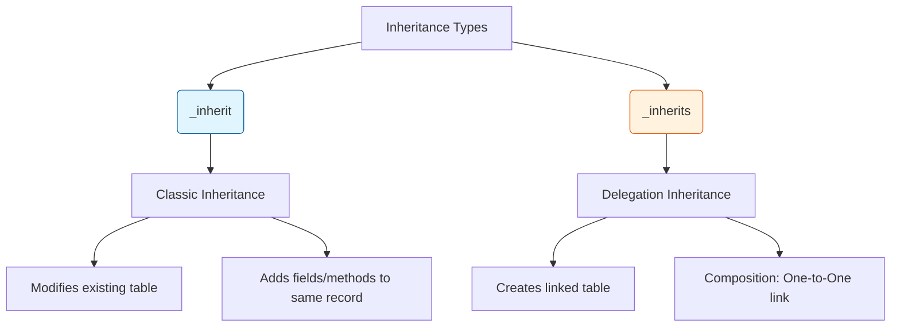

# Odoo 19 Inheritance

In Odoo, inheritance is the mechanism used to extend or modify existing models without altering the original source code. This is fundamental for building modular and maintainable applications.

---

## Inheritance Overview



---

## 1. Classic Inheritance (`_inherit`)

Classic inheritance allows you to add fields, override methods, or change attributes of an existing model.

### How it Works
When you use `_inherit`, Odoo takes the original model and "mixes in" your changes.

```python
class ProductTemplate(models.Model):
    _inherit = 'product.template'

    auction_listing_count = fields.Integer(string="Auction Listings", compute='_compute_auction_count')
```

### When to use:
* To add new fields to an existing Odoo model (e.g., adding `is_verified` to `res.partner`).
* To change the behavior of an existing method (e.g., overriding `create()` or `write()`).
* To modify field attributes (e.g., making a field `required`).

!!! info "Note"
    If you do not provide a `_name` attribute, Odoo modifies the original model in place. If you provide a new `_name`, Odoo creates a new model that inherits all fields and methods from the parent (Prototype Inheritance).

---

## 2. Delegation Inheritance (`_inherits`)

Delegation inheritance (often called "polymorphism" in Odoo) is used when you want to link a new model to an existing one via a Foreign Key, making the parent's fields available as if they belonged to the child.

### How it Works
It uses the `_inherits` dictionary where the key is the parent model and the value is the name of the field linking to it.

```python
class AuctionListing(models.Model):
    _name = 'auction.listing'
    _inherits = {'product.template': 'product_tmpl_id'}

    product_tmpl_id = fields.Many2one('product.template', required=True, ondelete='cascade')
    start_price = fields.Float("Starting Price")
```

### When to use:
* When you want to "be" another object but keep your own identity. 
* Example: A `res.users` inherits from `res.partner`. Every user is a partner, but not every partner is a user.
* When you need to avoid "polluting" the parent table with too many specific fields.

!!! tip "Key Difference"
    * **_inherit**: Modifies the existing table or copies it.
    * **_inherits**: Creates a separate table and links them via a Many2one field, providing seamless access to parent fields.

---

## Inheritance Priority

!!! tip "Pro-Tip: Inheritance Priority"
    When multiple modules inherit from the same model, the order is determined by the **module dependencies** in the `__manifest__.py`. 
    
    If Module B depends on Module A, and both inherit `res.partner`, Module B's changes will be applied **after** Module A's, allowing B to override A. Use the `_sequence` attribute or ensure your dependencies are correctly defined to avoid unpredictable behavior.

---

## Comparison Table

| Feature | Classic (`_inherit`) | Delegation (`_inherits`) |
| :--- | :--- | :--- |
| **Database** | Same table (usually) | Two separate tables |
| **Relationship** | "Extension" | "Composition" |
| **Use Case** | Adding features to a model | Creating a specific "type" of object |

---

## Senior: Inheritance Hooks

### 1. Prototype Inheritance
When you use `_inherit` **and** `_name`, Odoo creates a new table that is a "clone" of the parent but stores data separately.

```python
class AuctionArchive(models.Model):
    _name = 'auction.archive'
    _inherit = 'auction.listing' # Copies all fields/logic to a NEW table
```

### 2. Method Hooks: `_get_xxx`
Senior developers design their models with "hooks"—small methods that return a list or dict—to make inheritance easier for others.

**In Parent Module:**
```python
def _get_supported_currencies(self):
    return ['USD', 'EUR']
```

**In Your Inheriting Module:**
```python
def _get_supported_currencies(self):
    res = super()._get_supported_currencies()
    res.append('GBP')
    return res
```

!!! tip "Architect Tip: Avoid Overwriting"
    Never overwrite a method entirely unless absolutely necessary. Always call `super()` to ensure you don't break logic introduced by other installed modules (like `account` or `stock`).

---

## 📝 Knowledge Check

<div class="quiz-container">
  <div class="quiz-question">1. What is the difference between `_inherit` and `_inherits`?</div>
  <input type="text" class="quiz-input" placeholder="Type your answer here...">
  <button class="quiz-check" data-answer="`_inherit` modifies an existing table (classic inheritance) or clones it (prototype inheritance), while `_inherits` (delegation inheritance) creates a separate table and links it to a parent table via a Many2one field." onclick="checkQuiz(this)">Check Answer</button>
  <div class="quiz-result"></div>
</div>

<div class="quiz-container">
  <div class="quiz-question">2. When should you use classic inheritance (`_inherit`) without a new `_name`?</div>
  <input type="text" class="quiz-input" placeholder="Type your answer here...">
  <button class="quiz-check" data-answer="Use it when you want to add fields or modify behavior of an existing Odoo model in place (e.g., adding a field to `res.partner`)." onclick="checkQuiz(this)">Check Answer</button>
  <div class="quiz-result"></div>
</div>

<div class="quiz-container">
  <div class="quiz-question">3. What determines the order in which multiple inheritance changes are applied?</div>
  <input type="text" class="quiz-input" placeholder="Type your answer here...">
  <button class="quiz-check" data-answer="The order is determined by the module dependencies defined in the `__manifest__.py` file." onclick="checkQuiz(this)">Check Answer</button>
  <div class="quiz-result"></div>
</div>

<div class="quiz-container">
  <div class="quiz-question">4. Why should you usually call `super()` when overriding a method?</div>
  <input type="text" class="quiz-input" placeholder="Type your answer here...">
  <button class="quiz-check" data-answer="Calling `super()` ensures that the original logic and any logic added by other modules are preserved, preventing your change from breaking existing functionality." onclick="checkQuiz(this)">Check Answer</button>
  <div class="quiz-result"></div>
</div>

---

## 🏁 Senior Checkpoint
*   **Key Concept:** `_inherit` modifies existing tables, while `_inherits` (Delegation) links two separate tables.
*   **Architect Insight:** Designing with "Method Hooks" (small overridable functions) is the hallmark of a Senior Developer, making your module "Inheritance Friendly."
*   **Verify Your Knowledge:** When would you use Prototype Inheritance (`_inherit` + `_name`)? (Answer: When you want a complete clone of a model's logic but in a separate table).

!!! success "Next Step"
    Model inheritance is half the story. Now learn how to [Override Views](../foundation/xpath.md) using XPath.

---

<div class="feedback-container">
    <span class="feedback-label">Was this page helpful?</span>
    <div class="feedback-buttons">
        <button class="feedback-btn" onclick="sendFeedback(true)">👍 Yes</button>
        <button class="feedback-btn" onclick="sendFeedback(false)">👎 No</button>
    </div>
</div>
