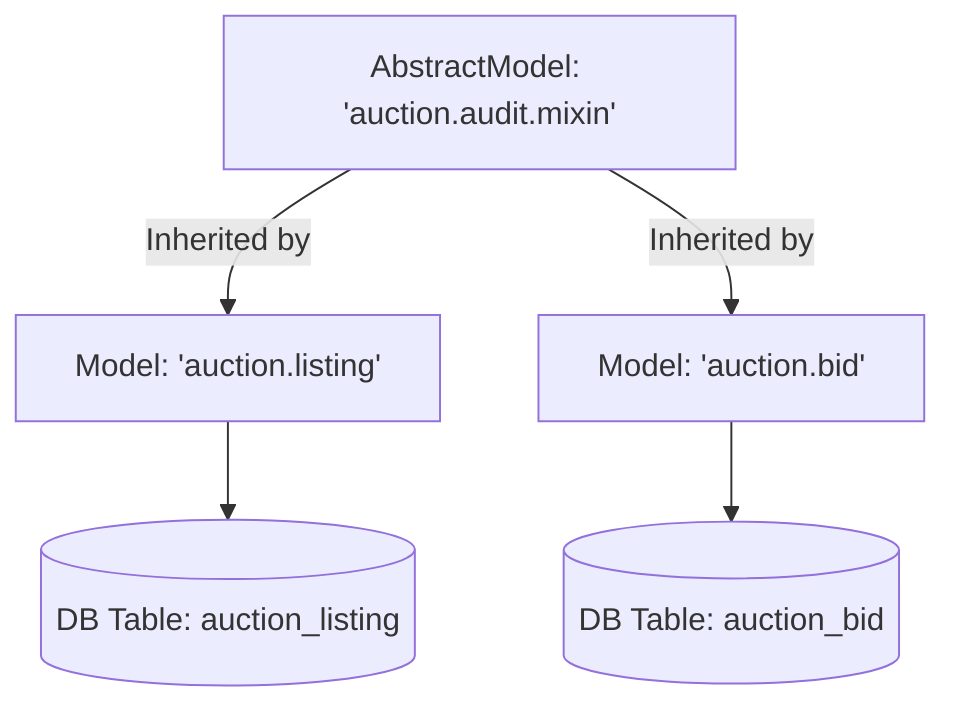

# Odoo Mixins: mail.thread & AbstractModel

Mixins are **Abstract Models** that provide "off-the-shelf" functionality to any model that inherits them. In Odoo 19, mastering mixins is the difference between a developer who copies code and an architect who builds systems.

---

## 1. What is an AbstractModel?

Unlike a standard `models.Model`, an `models.AbstractModel` **does not create a database table**. It exists purely as a template of fields and methods to be shared across other models.



### Why use AbstractModel?
- **DRY (Don't Repeat Yourself):** Define auditing, security, or utility logic once.
- **Modularity:** Plugin functionality like Chatter or SEO metadata only where needed.
- **Consistency:** Ensure every model in your app behaves the same way (e.g., all have "last modified" timestamps).

---

## 2. The Chatter Mixin (`mail.thread`)

The `mail.thread` mixin provides the "Chatter" or "Log" section at the bottom of a form view. It allows users to send messages, log notes, and track field changes.

### Step 1: Python Inheritance
To use it, your model must inherit from `mail.thread`.

```python
class AuctionListing(models.Model):
    _name = 'auction.listing'
    _inherit = ['mail.thread'] # Inherit the mixin

    # tracking=True enables field logging in the Chatter
    name = fields.Char(string="Title", tracking=True)
    state = fields.Selection(..., tracking=True)
```

### Step 2: XML View
You must add the `<chatter/>` component to the bottom of your `<form>` view.

```xml
<form>
    <header>...</header>
    <sheet>...</sheet>
    <chatter/> <!-- This renders the entire Chatter UI -->
</form>
```

---

## 3. The Activity Mixin (`mail.activity.mixin`)

This mixin adds "Activities" (Tasks, Meetings, Phone Calls) to your model. It usually goes hand-in-hand with `mail.thread`.

```python
class AuctionListing(models.Model):
    _name = 'auction.listing'
    _inherit = ['mail.thread', 'mail.activity.mixin']
```

The `<chatter/>` component automatically includes activities if the model inherits this mixin.

---

## 4. Advanced Mail Features (Followers & Subtypes)

Inheriting `mail.thread` doesn't just give you a UI; it provides a powerful Python API for managing communication.

### Managing Followers
You can programmatically add or remove followers (partners) from a record. Followers receive email notifications when a message is posted.

```python
# Add the seller as a follower
self.message_subscribe(partner_ids=[self.seller_id.id])

# Remove a follower
self.message_unsubscribe(partner_ids=[self.seller_id.id])
```

### Advanced `message_post`
The `message_post()` method is heavily used in Odoo backend logic. It accepts several parameters to control *how* the message is sent.

```python
self.message_post(
    body="<p>Your auction has been approved!</p>",
    subject="Auction Approved",
    message_type="notification", # 'email', 'comment', or 'notification'
    partner_ids=[self.seller_id.id], # Send email to these specific partners
    attachment_ids=[pdf_attachment.id] # Attach files
)
```

### Senior: Custom Message Subtypes
By default, followers receive emails for "Discussions" (comments). You can create **Custom Subtypes** to allow users to opt-in to specific types of notifications (e.g., "Only email me when a new Bid is placed").

```xml
<record id="mt_listing_new_bid" model="mail.message.subtype">
    <field name="name">New Bid Placed</field>
    <field name="res_model">auction.listing</field>
    <field name="default" eval="True"/> <!-- Auto-subscribe followers to this -->
</record>
```
To post a message using this subtype:
```python
self.message_post(body="New bid!", subtype_xmlid="pways_auction.mt_listing_new_bid")
```

---

## 5. Creating Your Own Mixin

In the **Auction Marketplace**, we want a custom audit trail that goes beyond standard Odoo fields. We will create a mixin to track the user's IP address and a "Verified" status across multiple models.

### Define the Mixin
```python
# models/audit_mixin.py
from odoo import models, fields, api

class AuditMixin(models.AbstractModel):
    _name = 'auction.audit.mixin'
    _description = 'Auction Audit Mixin'

    is_verified = fields.Boolean("Verified", default=False)
    verification_date = fields.Datetime("Verification Date")

    def action_verify(self):
        self.write({
            'is_verified': True,
            'verification_date': fields.Datetime.now()
        })
```

### Apply the Mixin
```python
class AuctionListing(models.Model):
    _name = 'auction.listing'
    _inherit = ['mail.thread', 'auction.audit.mixin']
```

---

## 6. How Mixins Work (The Senior View)

### Method Resolution Order (MRO)
When you inherit from multiple mixins, Odoo follows Python's MRO. If two mixins define the same method, the one listed **first** in the `_inherit` list takes precedence—unless you call `super()`.

```python
class AuctionListing(models.Model):
    _name = 'auction.listing'
    _inherit = ['mixin.a', 'mixin.b'] # mixin.a wins conflicts
```

### BaseModel vs AbstractModel
At the very top of the Odoo hierarchy is `models.BaseModel`. Standard `Model`, `TransientModel`, and `AbstractModel` all inherit from it. 
- **Senior Insight:** You can use `models.BaseModel` to write low-level hooks that apply to *every* model in the registry, but this is extremely rare and potentially dangerous for performance.

---

## 🏁 Senior Checkpoint
*   **Key Concept:** `AbstractModel` is a ghost model—no table, just logic.
*   **Architect Insight:** Custom mixins like `auction.audit.mixin` allow you to enforce architecture across large modules (e.g., ensuring Bids, Listings, and Invoices all have a `verification_date`).
*   **Verify Your Knowledge:** If `MixinA` and `MixinB` both define `write()`, and you inherit `_inherit = ['MixinA', 'MixinB']`, which `write()` runs first? (Answer: MixinA).

!!! success "Next Step"
    Now that your models have advanced logic, let's make them searchable with [Search Views](../foundation/search_view.md).

---

<div class="feedback-container">
    <span class="feedback-label">Was this page helpful?</span>
    <div class="feedback-buttons">
        <button class="feedback-btn" onclick="sendFeedback(true)">👍 Yes</button>
        <button class="feedback-btn" onclick="sendFeedback(false)">👎 No</button>
    </div>
</div>
