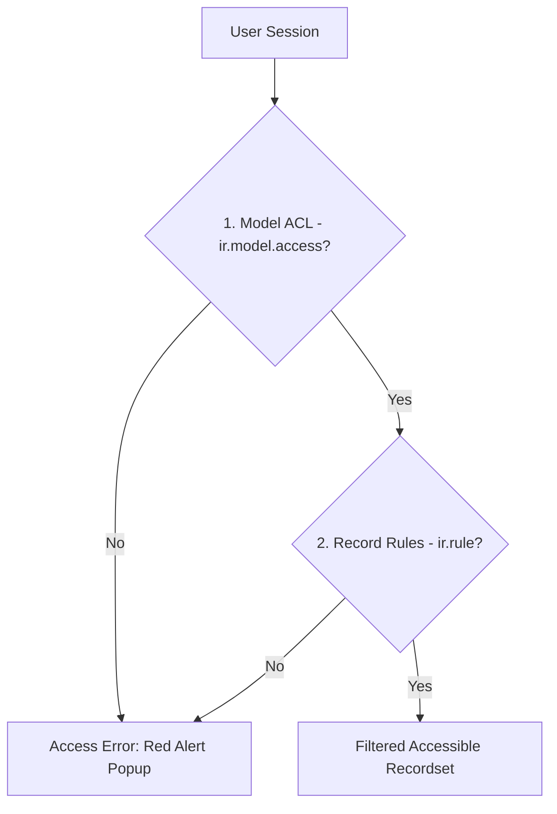

# Security & Access Control Lists (ACL)

## 1. What is it?
Security in Odoo is a multi-layered gatekeeper system that controls access to data models and specific database rows. The outermost layer is the **Access Control List (ACL)**, which governs model-level access permissions (Create, Read, Update, Delete) for different user groups.



---

## 2. Why does it exist?
Enterprise Resource Planning (ERP) systems store highly sensitive company data (e.g. financials, contracts, employee profiles). 

ACLs ensure that users can only access models relevant to their roles, preventing unauthorized data modification, security breaches, and user interface clutter by hiding inaccessible actions and views.

---

## 3. When should I use it?
Define security groups and ACLs for **every new custom model** you create. In Odoo, if a model does not have explicit ACL rules, it is inaccessible to all non-admin users by default.

---

## 4. When should I NOT use it?
*   Do not use ACLs to filter records belonging to the *same* model dynamically (e.g. allowing users to only see their own sales leads). ACLs are boolean model-level rules. For row-level filtering, use **Record Rules** (`ir.rule`).
*   Do not use ACLs to hide fields from a view for certain roles; use field-level security (`groups="..."` attribute on fields) instead.

---

## 5. Syntax

### A. Security Group XML Definition
Groups are defined in XML files (typically inside `security/security.xml`) under the `res.groups` model:
```xml
<record id="group_auction_manager" model="res.groups">
    <field name="name">Auction Administrator</field>
    <field name="category_id" ref="base.module_category_sales_sales"/>
    <field name="implied_ids" eval="[(4, ref('base.group_user'))]"/>
</record>
```

### B. Access Control CSV Syntax
Model access rules are mapped in `security/ir.model.access.csv`:
```csv
id,name,model_id:id,group_id:id,perm_read,perm_write,perm_create,perm_unlink
access_auction_manager,auction.manager,model_auction_listing,pways_auction.group_auction_manager,1,1,1,1
```

---

## 6. Multiple Examples

### Beginner: Standard ACL CSV Definition
Create a simple CSV mapping full read, write, and create rights to internal users, but denying delete permissions.
```csv title="security/ir.model.access.csv"
id,name,model_id:id,group_id:id,perm_read,perm_write,perm_create,perm_unlink
access_auction_user,auction.user,model_auction_listing,base.group_user,1,1,1,0
```

### Intermediate: Manager Security XML & CSV
Define a Manager group that inherits from the Standard User group and grants full delete (unlink) rights.

=== "security/security.xml"
    ```xml
    <odoo>
        <data noupdate="1">
            <record id="group_auction_user" model="res.groups">
                <field name="name">Auction User</field>
                <field name="category_id" ref="base.module_category_sales_sales"/>
            </record>

            <record id="group_auction_manager" model="res.groups">
                <field name="name">Auction Manager</field>
                <field name="category_id" ref="base.module_category_sales_sales"/>
                <field name="implied_ids" eval="[(4, ref('group_auction_user'))]"/>
            </record>
        </data>
    </odoo>
    ```

=== "security/ir.model.access.csv"
    ```csv
    id,name,model_id:id,group_id:id,perm_read,perm_write,perm_create,perm_unlink
    access_auction_user,auction.user,model_auction_listing,pways_auction.group_auction_user,1,1,1,0
    access_auction_manager,auction.manager,model_auction_listing,pways_auction.group_auction_manager,1,1,1,1
    ```

### Real-World: Public/Portal Access ACL
Grant read-only access to portal/public web users for a guest-facing catalog model.
```csv title="security/ir.model.access.csv"
id,name,model_id:id,group_id:id,perm_read,perm_write,perm_create,perm_unlink
access_catalog_public,catalog.public,model_auction_listing,,1,0,0,0
```
*(Leaving the `group_id:id` column empty applies the permission to all users, including unauthenticated public guests).*

---

## 7. Common Mistakes

### ❌ Forgetting `model_` Prefix in CSV
Beginners often reference the python `_name` directly in the CSV `model_id:id` column.
```csv
# Wrong: Will fail compilation
access_listing,auction.listing,auction.listing,base.group_user,1,1,1,0
```

### ✅ Correct XML ID Reference
Always prefix the model name with `model_` and replace dots with underscores.
```csv
# Right: Translates to XML ID of ir.model database record
access_listing,auction.listing,model_auction_listing,base.group_user,1,1,1,0
```

---

## 8. Performance Notes
*   **Cache Invalidation**: Modifying ACL groups at runtime causes Odoo to clear the security cache for all active sessions. Group modifications should be handled during module updates to prevent performance drops.
*   **Superuser Loophole**: The system user (ID `1` or `__system__`) and users running methods under `sudo()` completely bypass all ACL checks, saving CPU cycles but ignoring security barriers.

---

## 9. Senior Notes
*   **Impersonation Trap**: Never test access configurations using the primary administrative account. Odoo’s Superuser (ID 1) bypasses ACL validations, which can mask missing CSV configurations until production deployment.
*   **Noupdate Management**: Wrap your group XML records in `<data noupdate="1">` blocks to prevent database changes made by server administrators in the UI from being overwritten during system updates.

---

## 10. Related Topics
*   **Previous Lesson**: [XML Data Engine](../foundation/data_files.md)
*   **Next Lesson**: [Views Syntax (List, Form, Kanban)](../foundation/views.md)
*   **See Also**: [Record Rules (Row-level Security)](rules.md), [Security Modifiers (sudo)](../env/security_modifiers.md)
