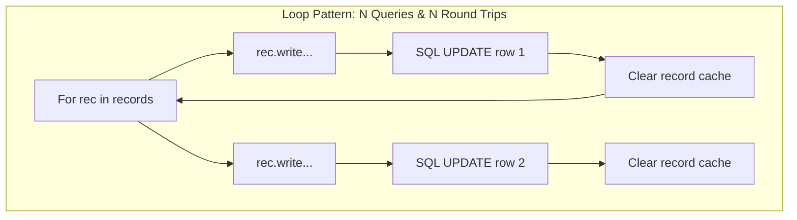
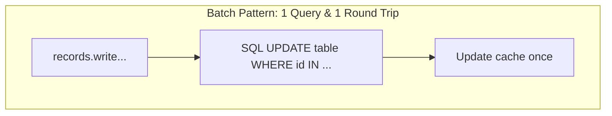

# Odoo 19 Batch Operations: Set-Based Optimization

A hallmark of a Senior Odoo developer is minimizing database hits. Every time you write, create, or delete records inside a loop, Odoo executes individual SQL statements. Recordsets are designed to process operations in **batches** natively.

---

## Set-Based Batch Operations
Batch operations in Odoo refer to calling ORM methods (`write()`, `create()`, `unlink()`) on a multi-recordset or passing list structures to create methods rather than executing individual actions on a record-by-record basis inside loops.

---

## Minimizing Network Roundtrips & SQL Overhead
Executing ORM writes in loops triggers an "ORM Storm":
*   **Database Hits**: Every loop execution generates a database round-trip (TCP overhead).
*   **Cache Invalidation**: The environment cache is repeatedly cleared and rebuilt.
*   **Row-Level Locks**: Row-level locking occurs sequentially, increasing database latency and the risk of concurrency deadlocks.

---

## When to Perform Batch Mutations
*   Use set-based writes to update field values across multiple records matching a search filter (e.g., closing all completed auctions).
*   Use batch creates (`@api.model_create_multi`) when writing bulk data migration scripts or integration APIs.
*   Use `Command` helper lists to link or unlink relational fields in a single step.

---

## When to Process Records Individually
*   **Do not** batch if calculations require immediate, sequential database locks where subsequent record inputs depend on the exact database state of the previous record (though this is extremely rare and can usually be handled via memory buffers).

---

## Writing Batch-Safe Python Code
Here is the python syntax for batch operations in Odoo 19:

```python
# 1. Batch writes (Set-Based)
recordset.write({'field_name': 'new_value'})

# 2. Batch creates (Requires list of dicts)
recordset.create([
    {'name': 'Record A', 'qty': 10},
    {'name': 'Record B', 'qty': 20}
])

# 3. Batch relational updates (Command list)
from odoo import Command
recordset.write({
    'line_ids': [
        Command.create({'name': 'Line 1'}),
        Command.link(existing_id),
        Command.set([id1, id2])
    ]
})
```

---

## Multi-Record Creation & Write Scenarios

### A. Batch Writes vs Loops
```python
# ❌ The "Junior" Loop Trap: 1000 listings = 1000 SQL queries!
for listing in listings:
    listing.write({'state': 'confirmed'})

# ✅ The "Senior" Solution: 1 SQL query!
listings.write({'state': 'confirmed'})
```

### B. Batch Creates Override (`@api.model_create_multi`)
```python
from odoo import models, fields, api

class AuctionBid(models.Model):
    _name = 'auction.bid'
    _description = 'Auction Bid'

    name = fields.Char("Reference")

    @api.model_create_multi
    def create(self, vals_list):
        # Apply batch updates/naming in memory
        for vals in vals_list:
            if not vals.get('name'):
                vals['name'] = 'Bid'
        # Pass list of values to parent in a single SQL INSERT block
        return super().create(vals_list)
```

### C. Relational Batching with Command helpers
```python
from odoo import Command

# ❌ Bad: Relational links executed in loop queries
for tag in tags:
    listing.write({'tag_ids': [Command.link(tag.id)]})

# ✅ Good: Execute one single relational command transaction
commands = [Command.link(tag.id) for tag in tags]
listing.write({'tag_ids': commands})
```

---

## Batch Execution & Loop Traps
1.  **Iterating recordsets prior to calling `write()`**: Writing loops like `for rec in records: rec.write({'flag': True})` instead of `records.write({'flag': True})`.
2.  **Writing single creates inside dynamic loops**: Building scripts that call `self.env['model'].create(vals)` inside loop iterators, completely bypassing Odoo 19's multi-create performance optimizations.

---

## O(N) Loops vs O(1) Bulk SQL Operations

This table compares PostgreSQL metrics and execution costs between record loops and batch set-based operations:

| Metric | Record-by-Record Loop | Batch Recordset Operation |
| :--- | :--- | :--- |
| **SQL Queries** | $N$ queries | **1** query |
| **DB Locking** | Row locks acquired sequentially ($N$ times) | Single transaction lock (minimized risk of deadlocks) |
| **Cache Invalidation** | Cache cleared $N$ times | Cache updated once |
| **Network Latency** | High overhead of $N$ TCP socket round-trips | **1** database round-trip |

---

## Senior Architect: Prefetching & Cache Batching
In Odoo 19:
*   The `@api.model_create_multi` decorator is strictly enforced. Creating single records via `create(vals)` wraps the dictionary in a list behind the scenes, meaning there is zero performance benefit to single-record calls. Always write your API endpoints to compile lists of dictionaries and invoke `create(vals_list)` as a single operation.
*   Batching writes prevents PostgreSQL deadlock situations under heavy concurrent load (such as multiple parallel orders updating product inventory counts).

---

## Loop vs Batch Query Cost Topology

This diagram contrasts the database interactions between looping operations and set-based batch operations:





---

## 💻 Code Challenge

**Refactor this loop to update all draft listings to open in a single batch operation:**

```python
# Before:
# for listing in self.search([('state', '=', 'draft')]):
#     listing.write({'state': 'open'})
```

<div class="code-challenge">
<pre><code>self.search([('state', '=', 'draft')]).<input type="text" class="quiz-input-inline w-150" data-answer="write({'state': 'open'})">
</code></pre>
<button class="quiz-check" onclick="checkCodeChallenge(this)">Check Code</button>
<div class="quiz-result"></div>
</div>


---

## Related Performance Guides
*   [The write() Method](write.md)
*   [create() Multi](create.md)
*   [Relational Commands (Command)](relational_commands.md)
*   [Prefetching Mechanism](../advanced/prefetching.md)
*   [Performance & Set Operations](../search/performance_optimization.md)
