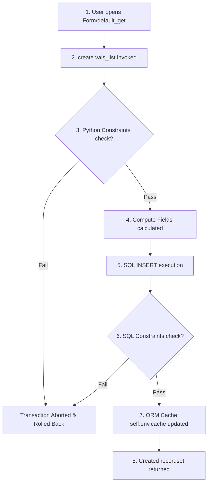

# CRUD Operations: The create() Method

## The Record Creation Lifecycle (create)
The `create()` method is Odoo's ORM gateway for inserting new rows of data into the PostgreSQL database. In Odoo 19, the method is designed for batch processing, allowing developers to create multiple records across a single database transaction.



---

## Batch Creation Validation & Lifecycle Hooking
In a relational enterprise database, inserting data row-by-row creates massive TCP network latency overhead, locks database tables sequentially, and invalidates registry caches repeatedly. 

The Odoo `create()` engine enforces batching via the `@api.model_create_multi` decorator, which bundles multiple data structures into a single compiled database `INSERT` operation, optimizing transaction speeds and memory footprint.

---

## When to Override create()
Use `create()` whenever you need to programmatically insert records into Odoo database tables (e.g. converting a confirmed auction bid into an invoice line, duplicating listings, or bulk importing datasets).

---

## When to Use Default Getters or Action Buttons
*   Do not call `create()` inside loops. Collecting dicts into lists and calling `create()` once is the benchmark standard.
*   Do not invoke `create()` to update values of already existing records; use `write()` instead.

---

## Overriding create() for Batch Processing
The modern `create()` method always takes a list of dictionaries (`vals_list`) and returns a recordset of the newly created records.

```python
# Signature
@api.model_create_multi
def create(self, vals_list):
    # Prepare or modify values inside the batch before writing to DB
    for vals in vals_list:
        if not vals.get('name'):
            vals['name'] = 'Default Item'
            
    # Always invoke parent super() to write to DB
    return super().create(vals_list)
```

---

## Sequence Insertion & Related Creation Examples

### Beginner: Standard Record Creation
Creating a single auction listing with default values.
```python
def create_single_listing(self):
    new_listing = self.env['auction.listing'].create([{
        'name': 'Vintage Desk Clock',
        'starting_price': 50.0,
    }])
    return new_listing
```

### Intermediate: Parent-Child Atomic Creation
Creating a listing and its initial starting bids simultaneously in a single atomic call using the `Command` class.
```python
from odoo import Command

def create_listing_with_bids(self):
    new_listing = self.env['auction.listing'].create([{
        'name': 'Rare Comic Book',
        'starting_price': 150.0,
        # Create child bid records under One2many listing_id relation
        'bid_ids': [
            Command.create({
                'amount': 150.0,
                'bidder_id': self.env.user.partner_id.id,
            })
        ]
    }])
    return new_listing
```

### Real-World: Batch Imports from Integration Endpoints
Parsing external JSON payloads and bulk creating listing records under a single transaction.
```python
@api.model
def import_external_listings(self, payload_list):
    vals_list = []
    for item in payload_list:
        vals_list.append({
            'name': item.get('title'),
            'starting_price': item.get('base_price', 0.0),
            'description': item.get('notes'),
            'state': 'draft',
        })
    # Triggers exactly ONE SQL INSERT transaction for N listings
    return self.env['auction.listing'].create(vals_list)
```

---

## create() Override Pitfalls

### ❌ Looping Creates (The N+1 Loop Trap)
Calling create in a loop triggers separate database connection requests, cache clearing, and slow insertion rates.
```python
# Wrong: 1000 items = 1000 insert queries!
for data in dataset:
    self.env['auction.listing'].create([data])
```

### ✅ Set-Based Multi Create
Grouping lists of dictionaries and executing `create()` once.
```python
# Better: 1 insert query containing all records
vals_list = [data for data in dataset]
self.env['auction.listing'].create(vals_list)
```

---

## Batch Insert Costs & Recomputation Checks
*   **Single Transaction Isolation**: Odoo wraps the entire `create(vals_list)` execution inside a single PostgreSQL database savepoint. If one dictionary within the `vals_list` fails validation (such as a database unique constraint check), the entire batch is rolled back, preserving database sanity.
*   **Cache Feeding**: During execution, the ORM seeds `self.env.cache` with the newly assigned IDs and column values, ensuring subsequent calls to read fields on the returned recordset hit RAM rather than Postgres disk storage.

---

## Senior Architect: Bypassing Creation Hooks Safely
*   **Super Overrides**: When overriding the `create()` method in custom models, always preserve the `vals_list` integrity. Do not split the list inside the override to run `super().create()` individually for each element, as this breaks the `@api.model_create_multi` optimization.
*   **XML Data Prefill**: If fields have defaults defined (`default=lambda self: ...`), Odoo applies them dynamically during `create()` only if the key is missing from the dictionary. If you need to override fields to write `False`, explicitly pass the key as `False` in your `vals_list`.

---

## Record Creation Step Pipeline
*   **Previous Lesson**: [State Initialization (default_get)](state_initialization.md)
*   **Next Lesson**: [read() & browse()](read.md)
*   **See Also**: [The write() Method](write.md), [Relational Commands (Command)](relational_commands.md)
