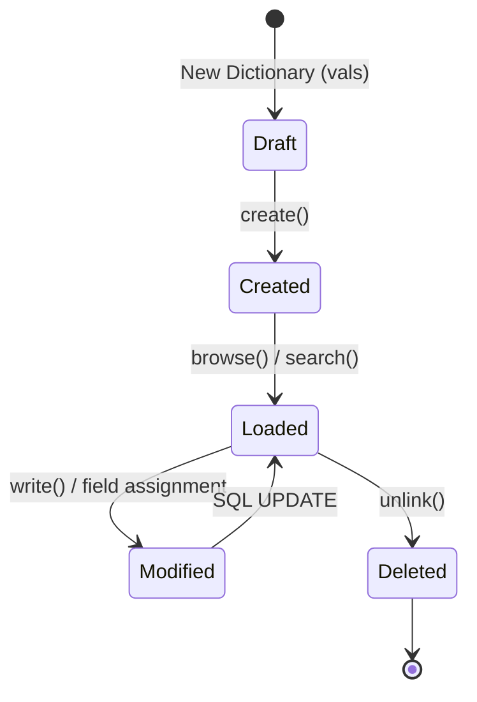

# CRUD Operations in Odoo 19

**CRUD** stands for **C**reate, **R**ead, **U**pdate, and **D**elete. These are the four basic functions of persistent storage. In Odoo 19, the ORM makes these operations highly efficient and batch-friendly.

---

## Lifecycle of a Record



---

## 1. Create (Insert Records)

To create new records, we use the `create()` method. Odoo 19 strongly encourages batch creation using a list of dictionaries.

### Using `@api.model_create_multi`
This decorator ensures that your method is optimized for creating multiple records at once.

```python
from odoo import models, api

class AuctionListing(models.Model):
    _inherit = 'auction.listing'

    @api.model_create_multi
    def create(self, vals_list):
        # vals_list is a list of dictionaries: [{'field': 'value'}, ...]
        for vals in vals_list:
            # You can modify data before creation here
            vals['name'] = vals.get('name', 'New Auction').upper()
        
        # Call super() to perform the actual database insert
        return super().create(vals_list)
```

!!! note "Batch Creation"
    Using `create([vals1, vals2])` is much faster than calling `create(vals)` inside a loop because it executes fewer SQL INSERT statements.

---

## 2. Read (Fetch Records)

Reading data involves finding records (Search) and then retrieving their field values (Read/Browse).

### Browse
If you have an ID or a list of IDs, use `browse()` to get a recordset.
```python
# Fetches record with ID 42
record = self.env['auction.listing'].browse(42)
```

### Search
Use `search()` with a **domain** to find records matching specific criteria.
```python
# Find all open auctions with price > 100
open_auctions = self.env['auction.listing'].search([
    ('state', '=', 'open'),
    ('current_price', '>', 100)
])
```

!!! tip "Performance"
    Use `search_count(domain)` if you only need the number of records, as it is much faster than `len(search(domain))`.

---

## 3. Update (Modify Records)

To update existing records, use the `write()` method. It can be called on a single record or a recordset.

```python
# Update a single record
my_auction.write({'state': 'closed'})

# Update all records in a recordset at once
open_auctions.write({'state': 'draft'})
```

!!! info "Active Record Style"
    You can also update fields directly on a record object:
    `my_auction.name = "Modified Title"`
    Odoo will automatically queue the `write()` operation.

---

## 4. Delete (Remove Records)

To remove records from the database, use the `unlink()` method.

```python
# Delete specific records
to_delete = self.env['auction.listing'].search([('state', '=', 'draft')])
to_delete.unlink()
```

!!! warning "Permanent Action"
    `unlink()` is permanent. In many business models, it is better to add an `active` field (Archive) instead of deleting data.

---

## Summary Table

| Operation | Method | Context |
| :--- | :--- | :--- |
| **Create** | `create(vals_list)` | Class level (`@api.model_create_multi`) |
| **Read** | `browse(ids)` or `search(domain)` | Environment level |
| **Update** | `write(vals)` | Recordset level |
| **Delete** | `unlink()` | Recordset level |

---

## 🏁 Senior Checkpoint
*   **Key Concept:** CRUD methods (`create`, `browse`, `write`, `unlink`) are the primary interface between Python and the Database.
*   **Architect Insight:** Odoo 19 prioritizes batch operations (`model_create_multi`) to minimize SQL round-trips and maximize performance.
*   **Verify Your Knowledge:** Why should you prefer `search_count()` over `len(search())`? (Answer: `search_count()` performs a lightweight SQL `COUNT(*)`, while `search()` fetches all record IDs into memory).

!!! success "Next Step"
    Let's dive deeper into the first step: [Create Logic](create.md).

---

<div class="feedback-container">
    <span class="feedback-label">Was this page helpful?</span>
    <div class="feedback-buttons">
        <button class="feedback-btn" onclick="sendFeedback(true)">👍 Yes</button>
        <button class="feedback-btn" onclick="sendFeedback(false)">👎 No</button>
    </div>
</div>
