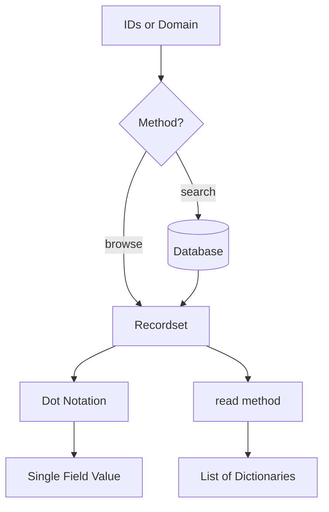

# Odoo Read Operations

In Odoo, reading data is done through recordsets. You can access fields directly, browse records by ID, or use the `read()` method for specific data structures.

## Direct Field Access



Once you have a recordset, you can access its fields using dot notation. This is the most common way to "read" data in Odoo.

```python
# Assuming 'record' is a single record
print(record.name)
print(record.partner_id.city)  # Chained access
```

### The Power of Prefetching
Odoo is smart. When you access a field on one record in a loop, it automatically fetches that field for all other records in the recordset to improve performance and avoid "N+1" query problems.

---

## browse()

The `browse()` method takes database IDs and returns a **recordset**. It does not execute a query immediately; it creates an object that will fetch data when you access its fields.

### Example: Single ID
```python
# Returns a single record
partner = self.env['res.partner'].browse(42)
```

### Example: List of IDs
```python
# Returns a recordset of multiple records
partners = self.env['res.partner'].browse([1, 2, 3])
```

---

## read()

The `read()` method is used when you need a list of dictionaries containing specific field values. This is often used for API responses or when you want to bypass the overhead of recordset objects.

### Syntax
`records.read([fields])`

### Example
```python
partners = self.env['res.partner'].search([('is_company', '=', True)])
data = partners.read(['name', 'email', 'city'])

# Output:
# [
#   {'id': 1, 'name': 'Azure Interior', 'email': 'azure@example.com', 'city': 'San Francisco'},
#   {'id': 2, 'name': 'Deco Addict', 'email': 'deco@example.com', 'city': 'Paris'}
# ]
```

---

## Summary Table

| Method | Returns | Best Used For... |
| :--- | :--- | :--- |
| **Dot Notation** | Field Value | Standard business logic and UI templates. |
| **`browse()`** | Recordset | When you have IDs and need to perform ORM operations. |
| **`read()`** | List of Dicts | External integrations, performance-critical raw data. |

---

## Senior: Customizing Search & Display

In professional Odoo development, you often need to control how records are identified and selected in the UI (specifically in `Many2one` dropdowns).

### 1. `_compute_display_name()` (The "What you see")
Odoo 19 uses this method to determine the string representation of a record. By default, it uses the `_rec_name` (usually `name`).

```python
def _compute_display_name(self):
    for record in self:
        record.display_name = f"[{record.code}] {record.name}"
```

### 2. `name_search()` (The "How you find")
When a user types into a `Many2one` field, Odoo calls `name_search()`. Override this to allow searching by multiple fields (e.g., search a Partner by name OR by phone number).

```python
@api.model
def _name_search(self, name, domain=None, operator='ilike', limit=100, order=None):
    domain = domain or []
    if name:
        # Search by name OR by internal code
        name_domain = ['|', ('name', operator, name), ('code', operator, name)]
        if operator in expression.NEGATIVE_TERM_OPERATORS:
            name_domain = ['&', ('name', operator, name), ('code', operator, name)]
        domain = expression.AND([domain, name_domain])
    return self._search(domain, limit=limit, order=order)
```

!!! info "Note on name_search vs _name_search"
    In modern Odoo, you should generally override `_name_search` (with underscore). The framework handles the higher-level logic, and you focus on the domain building.

---

## 🏁 Senior Checkpoint
*   **Key Concept:** Odoo's prefetching engine makes field access on recordsets extremely efficient.
*   **Architect Insight:** `browse()` is "Lazy"; it doesn't hit the database until you access a field. `read()` is "Eager" and returns raw dictionaries.
*   **Verify Your Knowledge:** When should you use `read()` over dot notation? (Answer: When building an API or a controller where you need raw JSON-friendly data).

!!! success "Next Step"
    Reading is done. Now learn to [Modify Records](write.md) using the write method.

---

<div class="feedback-container">
    <span class="feedback-label">Was this page helpful?</span>
    <div class="feedback-buttons">
        <button class="feedback-btn" onclick="sendFeedback(true)">👍 Yes</button>
        <button class="feedback-btn" onclick="sendFeedback(false)">👎 No</button>
    </div>
</div>
