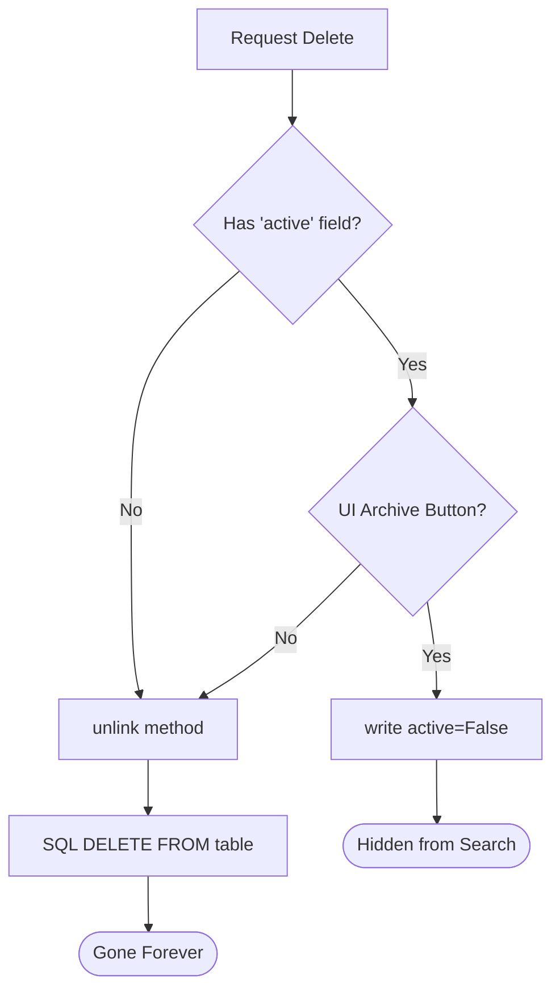

# Odoo Delete (unlink)

Deleting records in Odoo is handled by the `unlink()` method. This removes the records from the database.

## Using unlink()

To delete records, simply call `.unlink()` on a recordset.

```python
# Delete a single record
record = self.env['auction.listing'].browse(5)
record.unlink()

# Delete multiple records at once
records = self.env['auction.listing'].search([('state', '=', 'canceled')])
records.unlink()
```

> **Warning:** Deletion is permanent. Always ensure you have the correct recordset before calling `unlink()`.

---

## The 'ondelete' Attribute

When you have a relationship (like a `Many2one` field), you can define what happens to the current record if the referenced record is deleted using the `ondelete` attribute.

### Example
```python
class AuctionBid(models.Model):
    listing_id = fields.Many2one(
        'auction.listing', 
        ondelete='cascade'  # If listing is deleted, delete all its bids
    )
```

### ondelete Options

| Option | Description |
| :--- | :--- |
| **`cascade`** | Automatically delete the current record when the referenced record is deleted. |
| **`set null`** | Clear the field (set to False) but keep the record. |
| **`restrict`** | Prevent the deletion of the referenced record as long as it is being used here. |

---

## Best Practices

1. **Archive instead of Delete:** In Odoo, it is often better to use the `active` field to "archive" records instead of deleting them. This preserves history.
2. **Check Dependencies:** Before deleting, Odoo automatically checks for `ondelete='restrict'` constraints. If a dependency exists, it will raise a User Error.
3. **Batch Deletion:** Try to call `unlink()` on a recordset of multiple records rather than in a loop to improve performance.

```python
# ❌ BAD: Multiple queries (Performance issue)
for rec in records:
    rec.unlink()

# ✅ GOOD: Single query
records.unlink()
```

---

## Senior: Safe Deletion Patterns



### 1. Soft Delete (The `active` field)
In enterprise systems, "Hard Deleting" (removing from DB) is dangerous. If you add an `active` boolean field to your model, Odoo automatically implements **Soft Delete**.
- `records.unlink()` still removes from DB.
- But the UI "Archive" button sets `active = False`.
- Odoo's `search()` automatically ignores `active = False` records.

### 2. Overriding `unlink()` for Safety
Sometimes you want to prevent deletion if an auction has already started.

```python
def unlink(self):
    for record in self:
        if record.state != 'draft':
            raise UserError("You cannot delete an auction that has already started!")
    return super().unlink()
```

!!! danger "Cascade Deletion Performance"
    Be careful with `ondelete='cascade'` on models with millions of records. Deleting one "Parent" can trigger a massive chain of deletions that locks the database for minutes. For high-volume data, consider "cleaning up" children via a background Cron job instead.

---

## 🏁 Senior Checkpoint
*   **Key Concept:** `unlink()` is the permanent removal of records, while "Archiving" (`active=False`) is a safe soft-delete.
*   **Architect Insight:** Always check for `ondelete` constraints in your relational fields to prevent accidental data loss or restricted deletion errors.
*   **Verify Your Knowledge:** What is the safest way to delete records if they have an `active` field? (Answer: Use the Archive button in the UI, or `write({'active': False})` in code).

!!! success "Next Step"
    Standard CRUD is just the beginning. Let's look at Odoo 19's high-speed [search_fetch](search_fetch.md) for massive datasets.

---

<div class="feedback-container">
    <span class="feedback-label">Was this page helpful?</span>
    <div class="feedback-buttons">
        <button class="feedback-btn" onclick="sendFeedback(true)">👍 Yes</button>
        <button class="feedback-btn" onclick="sendFeedback(false)">👎 No</button>
    </div>
</div>
