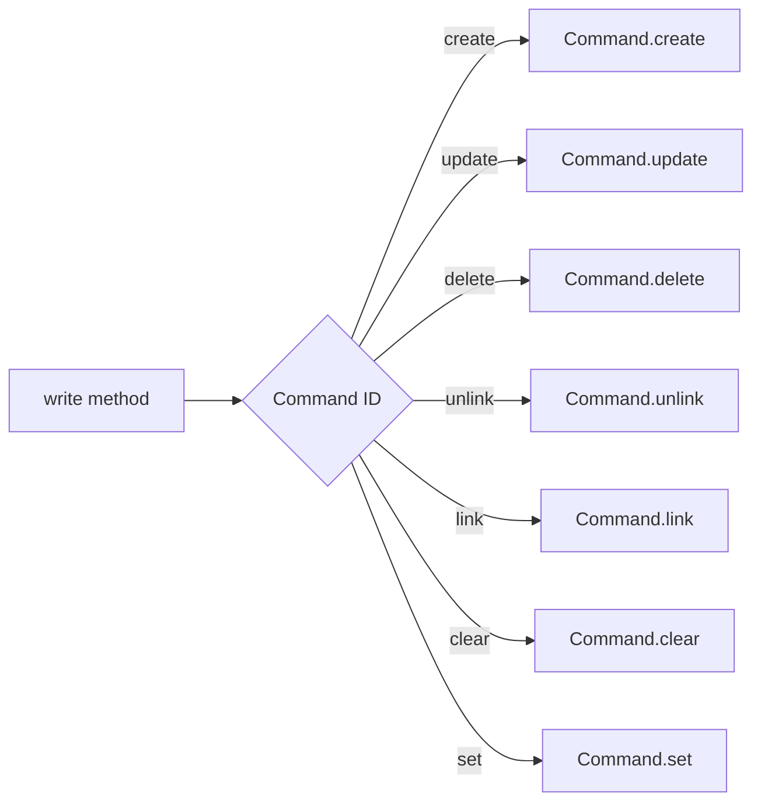

# Odoo 19: The write() Method

The `write()` method is used to update existing records in the database.

---

## How it Works
Unlike `create()`, the `write()` method:
- Takes a **single dictionary** of values.
- Updates **all records** in the current recordset.
- Returns `True` if the update was successful.

### Simple Example
```python
# Update a single record
listing = self.env['auction.listing'].browse(42)
listing.write({
    'state': 'published',
    'start_price': 200.0
})
```

---

## Relational Commands (using Command)



| Method | Syntax | Action |
| :--- | :--- | :--- |
| **`Command.create(vals)`** | `(0, 0, {values})` | **Create** a new record and link it. |
| **`Command.update(id, vals)`** | `(1, id, {values})` | **Update** an existing linked record. |
| **`Command.delete(id)`** | `(2, id, 0)` | **Remove and Delete** the linked record. |
| **`Command.unlink(id)`** | `(3, id, 0)` | **Unlink** (remove relationship) but don't delete. |
| **`Command.link(id)`** | `(4, id, 0)` | **Link** an existing record. |
| **`Command.clear()`** | `(5, 0, 0)` | **Unlink All** records (doesn't delete them). |
| **`Command.set([ids])`** | `(6, 0, [ids])` | **Replace All** existing links with this specific list of IDs. |

---

## 💡 How to Remember: The "CURL LCS" Mnemonic

Relational commands are hard to memorize. Use the **"CURL LCS"** acronym to recall the most common ones:

*   **C**reate: **`Command.create()`**
*   **U**pdate: **`Command.update()`**
*   **R**emove: **`Command.delete()`**
*   **L**ink: **`Command.link()`**
*   **L**ist: **`Command.set()`** (Replace All)
*   **C**lear: **`Command.clear()`**
*   **S**ever: **`Command.unlink()`**

---

## Practical Examples

### 1. Updating Field and Adding a Child Record
To change the title of an auction and add a new bid simultaneously:
```python
from odoo import Command

listing.write({
    'name': 'Updated Luxury Watch',
    'bid_ids': [Command.create({'amount': 300.0, 'bidder_id': 12})]
})
```

### 2. Unlinking (Removing) Child Records
To remove specific bids from an auction without deleting the bid records themselves:
```python
listing.write({
    'bid_ids': [Command.unlink(5), Command.unlink(7)]  # Unlinks bids with ID 5 and 7
})
```

### 3. Replacing All Links
Often used for `Many2many` fields (like tags):
```python
listing.write({
    'tag_ids': [Command.set([1, 2, 5])] # Now the listing ONLY has tags 1, 2, and 5
})
```

---

## Important Tips
1. **Recordsets**: If `self` contains 10 records, `self.write({'active': False})` will archive all 10 records at once.
2. **Computed Fields**: Writing to a field that triggers a `@api.depends` will automatically cause the computed fields to recalculate.
3. **No Batch write()**: Unlike `create()`, there is no `write_multi`. `write()` is already "multi" because it acts on the entire recordset it is called on.

---

## Senior: Overriding Duplication

When a user clicks **Action > Duplicate** in the Odoo UI, the ORM calls the `copy()` method.

### 1. `copy_data()` (The "What to duplicate")
This method returns the values that will be used to create the new record. Override this if you want to exclude specific fields or modify them during duplication.

```python
def copy_data(self, default=None):
    vals_list = super().copy_data(default=default)
    for vals in vals_list:
        # Prevent copying the internal reference code
        vals['code'] = False 
        # Append " (copy)" to the name
        if 'name' in vals:
            vals['name'] = _("%s (copy)", vals['name'])
    return vals_list
```

### 2. `copy()` (The "Process of duplication")
This method calls `copy_data()` and then `create()`. You generally override `copy()` if you need to perform additional logic *after* the new record is created (like duplicating non-relational files or sending a notification).

```python
@api.returns('self', lambda value: value.id)
def copy(self, default=None):
    # Perform logic BEFORE
    new_record = super().copy(default=default)
    # Perform logic AFTER
    return new_record
```

!!! tip "Architect Tip"
    Always prefer overriding `copy_data()` over `copy()` when possible. It is cleaner and handles multi-record duplication (Batch Copy) more efficiently.

---

## 🏁 Senior Checkpoint
*   **Key Concept:** `write()` updates all records in a recordset simultaneously with a single dictionary.
*   **Architect Insight:** Command 6 (Replace All) is the standard for Many2many fields like tags, ensuring a clean state in one call.
*   **Verify Your Knowledge:** What is the difference between Command 2 and Command 3? (Answer: Command 2 deletes the child record; Command 3 only removes the link).

!!! success "Next Step"
    You can write. Now learn to find what you need with [Search & Domains](../search/search.md).

---

<div class="feedback-container">
    <span class="feedback-label">Was this page helpful?</span>
    <div class="feedback-buttons">
        <button class="feedback-btn" onclick="sendFeedback(true)">👍 Yes</button>
        <button class="feedback-btn" onclick="sendFeedback(false)">👎 No</button>
    </div>
</div>
