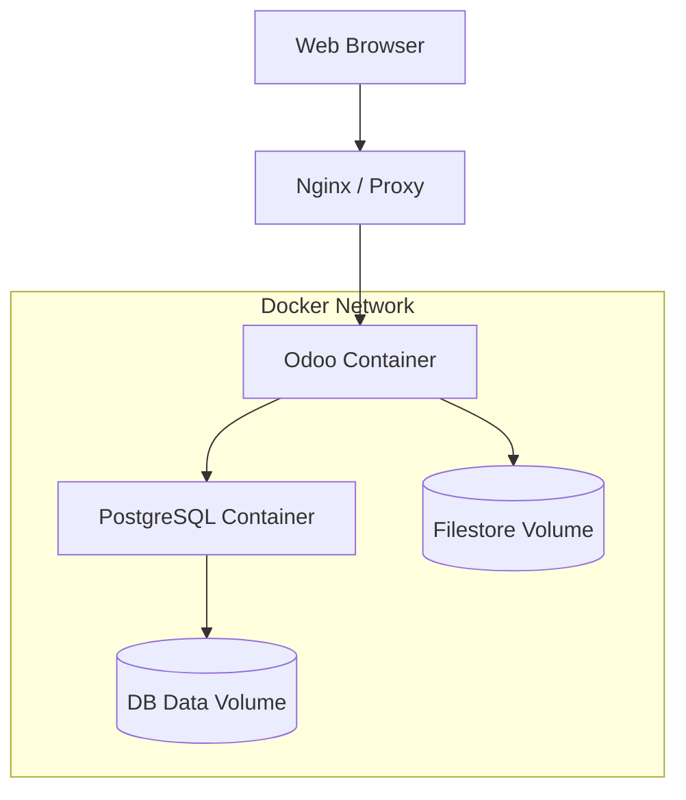

# Containerizing Odoo 19

Docker is the industry standard for ensuring Odoo runs identically in development, staging, and production. This guide covers senior-grade container orchestration.

## Multi-Stage Dockerfile

A multi-stage build allows us to compile assets or install build dependencies without bloating the final production image.

```dockerfile
# Stage 1: Build dependencies
FROM python:3.12-slim-bookworm as builder
RUN apt-get update && apt-get install -y \
    build-essential \
    libpq-dev \
    libldap2-dev \
    libsasl2-dev
COPY requirements.txt .
RUN pip install --user --no-cache-dir -r requirements.txt

# Stage 2: Final image
FROM python:3.12-slim-bookworm
RUN apt-get update && apt-get install -y \
    libpq5 \
    postgresql-client \
    fontconfig \
    xfonts-75dpi \
    && rm -rf /var/lib/apt/lists/*

COPY --from=builder /root/.local /root/.local
ENV PATH=/root/.local/bin:$PATH

WORKDIR /opt/odoo
COPY . .

USER odoo
EXPOSE 8069 8072
ENTRYPOINT ["odoo"]
```

!!! tip "Architect Tip: Image Size"
    Using `python:slim` instead of the full image reduces the footprint from ~900MB to ~200MB. This speeds up CI/CD pipelines and reduces the attack surface for security vulnerabilities.

## Docker Compose Orchestration



For production, we run Odoo behind a containerized **Nginx reverse proxy** to handle SSL termination, buffer static files, and forward WebSocket traffic correctly.

### 1. Production `docker-compose.yml`
This compose file sets up a secure network with:
*   `db`: PostgreSQL database.
*   `web`: The Odoo application instance.
*   `nginx`: Web server routing ports 80/443 and handling SSL certificates.
*   `certbot`: Automatic SSL updates using Let's Encrypt.

```yaml
version: '3.8'

services:
  db:
    image: postgres:16-alpine
    restart: always
    environment:
      - POSTGRES_PASSWORD=odoo_secure_pass
      - POSTGRES_USER=odoo
      - POSTGRES_DB=postgres
    volumes:
      - odoo-db-data:/var/lib/postgresql/data
    networks:
      - odoo-net

  web:
    build: .
    restart: always
    depends_on:
      - db
    environment:
      - HOST=db
      - USER=odoo
      - PASSWORD=odoo_secure_pass
    volumes:
      - odoo-data:/var/lib/odoo
      - ./addons:/opt/odoo/additional_addons
    expose:
      - "8069"
      - "8072"
    networks:
      - odoo-net

  nginx:
    image: nginx:alpine
    restart: always
    ports:
      - "80:80"
      - "443:443"
    volumes:
      - ./nginx.conf:/etc/nginx/nginx.conf:ro
      - ./certbot/conf:/etc/letsencrypt:ro
      - ./certbot/www:/var/www/certbot:ro
    depends_on:
      - web
    networks:
      - odoo-net

  certbot:
    image: certbot/certbot
    restart: always
    volumes:
      - ./certbot/conf:/etc/letsencrypt
      - ./certbot/www:/var/www/certbot
    entrypoint: "/bin/sh -c 'trap exit TERM; while :; do certbot renew; sleep 12h & wait $${!}; done;'"

volumes:
  odoo-db-data:
  odoo-data:

networks:
  odoo-net:
    driver: bridge
```

---

### 2. Production Nginx Configuration (`nginx.conf`)

This configuration routes traffic, handles websocket handshakes on `/websocket`, and serves SSL:

```nginx
events { worker_connections 1024; }

http {
    include /etc/nginx/mime.types;
    
    # Upstreams mapping to docker services
    upstream odoo-backend { server web:8069; }
    upstream odoo-gevent { server web:8072; }

    # Redirect all HTTP traffic to HTTPS
    server {
        listen 80;
        server_name auction.example.com;

        location /.well-known/acme-challenge/ {
            root /var/www/certbot;
        }

        location / {
            return 301 https://$host$request_uri;
        }
    }

    # HTTPS Server
    server {
        listen 443 ssl;
        server_name auction.example.com;

        # SSL Certificates (managed by certbot)
        ssl_certificate /etc/letsencrypt/live/auction.example.com/fullchain.pem;
        ssl_certificate_key /etc/letsencrypt/live/auction.example.com/privkey.pem;

        # Proxy parameters
        proxy_read_timeout 720s;
        proxy_connect_timeout 720s;
        proxy_send_timeout 720s;

        # Route standard HTTP/RPC
        location / {
            proxy_pass http://odoo-backend;
            proxy_set_header Host $host;
            proxy_set_header X-Real-IP $remote_addr;
            proxy_set_header X-Forwarded-For $proxy_add_x_forwarded_for;
            proxy_set_header X-Forwarded-Proto $scheme;
        }

        # Route Websockets (Chat/Live timers)
        location /websocket {
            proxy_pass http://odoo-gevent;
            proxy_set_header Upgrade $http_upgrade;
            proxy_set_header Connection "upgrade";
            proxy_set_header Host $host;
            proxy_set_header X-Real-IP $remote_addr;
            proxy_set_header X-Forwarded-For $proxy_add_x_forwarded_for;
            proxy_set_header X-Forwarded-Proto $scheme;
        }
    }
}
```

---

### 3. Persistent Volumes

Odoo stores data in two primary locations:
1.  **PostgreSQL Database:** All structured data (records, configuration).
2.  **Filestore:** Binary files (PDFs, images, attachments) usually stored in `/var/lib/odoo/filestore`.

!!! tip "Architect Tip: UID/GID Mapping"
    Ensure the user inside the container has the same UID as the owner of the mounted host folders. If your host user is `1000`, run the container with `user: "1000:1000"` to avoid permission denied errors on the filestore.

---

## 🏁 Senior Checkpoint
*   **Key Concept:** Docker Production Deployment wraps Odoo, Postgres, Nginx, and Certbot into a secure containerized network.
*   **Architect Insight:** Ensure `proxy_mode = True` is set in the Odoo config inside the container, otherwise Odoo will ignore Nginx's `X-Forwarded-Proto` header, causing browser security loop errors.
*   **Verify Your Knowledge:** Why do we separate upstream routes for `/websocket` in Nginx? (Answer: Because standard HTTP workers cannot maintain persistent websocket connections; they must be forwarded to the Gevent loop on port 8072).

!!! success "Next Step"
    Containerized. Now learn to [Scale Horizontally](scaling.md) for enterprise loads.

---

<div class="feedback-container">
    <span class="feedback-label">Was this page helpful?</span>
    <div class="feedback-buttons">
        <button class="feedback-btn" onclick="sendFeedback(true)">👍 Yes</button>
        <button class="feedback-btn" onclick="sendFeedback(false)">👎 No</button>
    </div>
</div>
