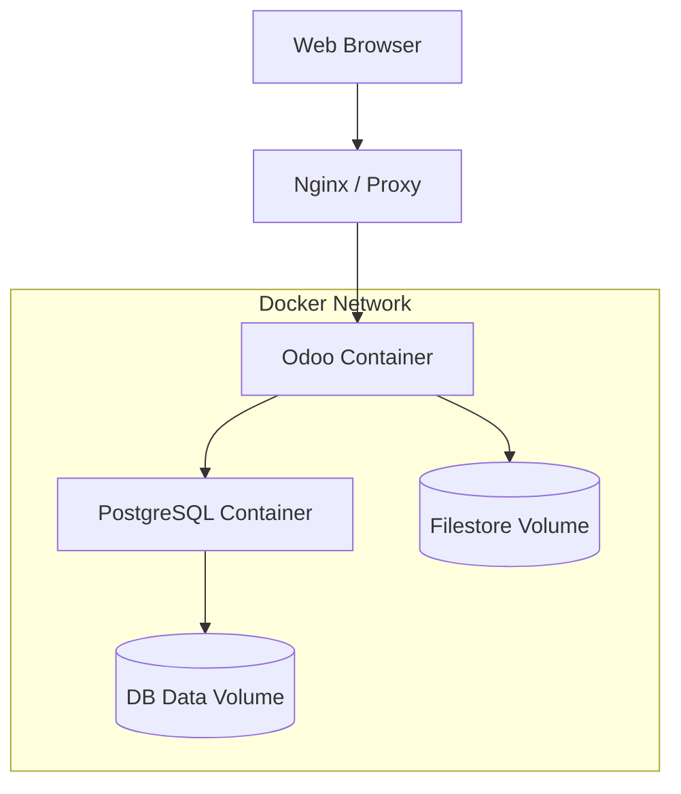

# Containerizing Odoo 19

Docker is the industry standard for ensuring Odoo runs identically in development, staging, and production. This guide covers senior-grade container orchestration.

## Multi-Stage Dockerfile

A multi-stage build allows us to compile assets or install build dependencies without bloating the final production image.

```dockerfile
# Stage 1: Build dependencies
FROM python:3.12-slim-bookworm as builder
RUN apt-get update && apt-get install -y \
    build-essential \
    libpq-dev \
    libldap2-dev \
    libsasl2-dev
COPY requirements.txt .
RUN pip install --user --no-cache-dir -r requirements.txt

# Stage 2: Final image
FROM python:3.12-slim-bookworm
RUN apt-get update && apt-get install -y \
    libpq5 \
    postgresql-client \
    fontconfig \
    xfonts-75dpi \
    && rm -rf /var/lib/apt/lists/*

COPY --from=builder /root/.local /root/.local
ENV PATH=/root/.local/bin:$PATH

WORKDIR /opt/odoo
COPY . .

USER odoo
EXPOSE 8069 8072
ENTRYPOINT ["odoo"]
```

!!! tip "Architect Tip: Image Size"
    Using `python:slim` instead of the full image reduces the footprint from ~900MB to ~200MB. This speeds up CI/CD pipelines and reduces the attack surface for security vulnerabilities.

## Docker Compose Orchestration



For most deployments, a two-service setup (Odoo + PostgreSQL) is sufficient.

### `docker-compose.yml`

```yaml
services:
  db:
    image: postgres:16-alpine
    environment:
      - POSTGRES_PASSWORD=odoo
      - POSTGRES_USER=odoo
      - POSTGRES_DB=postgres
    volumes:
      - odoo-db-data:/var/lib/postgresql/data

  web:
    build: .
    depends_on:
      - db
    ports:
      - "8069:8069"
      - "8072:8072"
    environment:
      - HOST=db
      - USER=odoo
      - PASSWORD=odoo
    volumes:
      - ./addons:/opt/odoo/additional_addons
      - odoo-data:/var/lib/odoo

volumes:
  odoo-db-data:
  odoo-data:
```

## Persistent Volumes

Odoo stores data in two primary locations:
1.  **PostgreSQL Database:** All structured data (records, configuration).
2.  **Filestore:** Binary files (PDFs, images, attachments) usually stored in `~/.local/share/Odoo/filestore`.

!!! tip "Architect Tip: UID/GID Mapping"
    Ensure the user inside the container has the same UID as the owner of the mounted host folders. If your host user is `1000`, run the container with `user: "1000:1000"` to avoid permission denied errors on the filestore.

---

## 🏁 Senior Checkpoint
*   **Key Concept:** Docker ensures environmental consistency across Dev, Staging, and Production.
*   **Architect Insight:** Multi-stage builds are critical for production security; they remove build-tools (compilers, headers) from the final image, reducing the attack surface.
*   **Verify Your Knowledge:** Why use `python:slim`? (Answer: To reduce image size and improve deployment speed).

!!! success "Next Step"
    Containerized. Now learn to [Scale Horizontally](scaling.md) for enterprise loads.

---

<div class="feedback-container">
    <span class="feedback-label">Was this page helpful?</span>
    <div class="feedback-buttons">
        <button class="feedback-btn" onclick="sendFeedback(true)">👍 Yes</button>
        <button class="feedback-btn" onclick="sendFeedback(false)">👎 No</button>
    </div>
</div>
