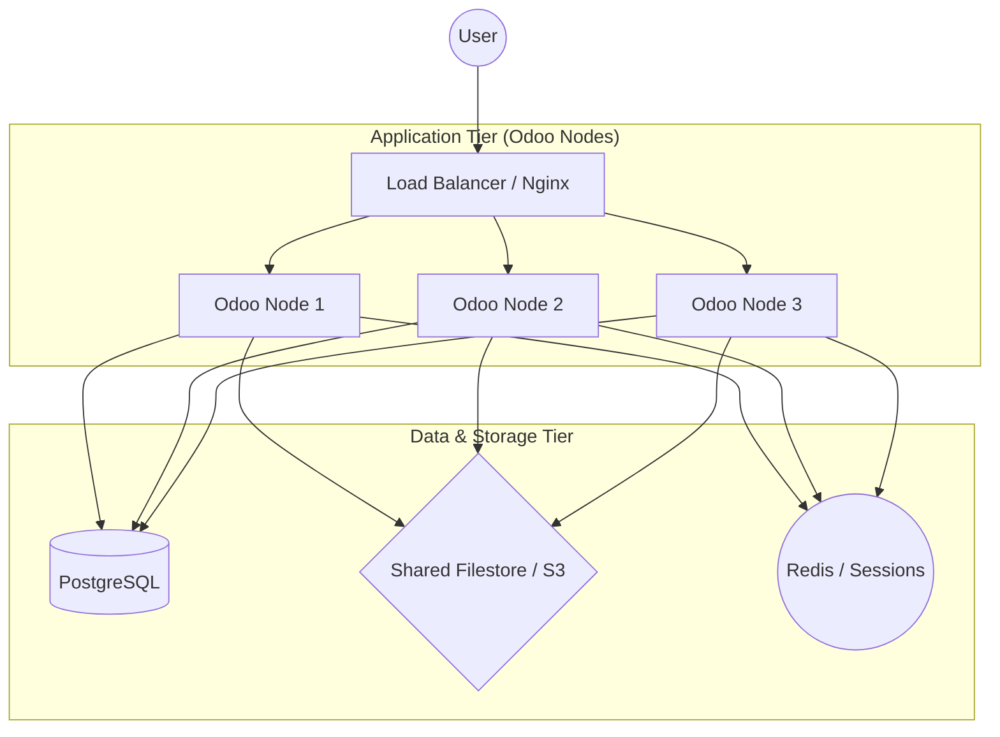

# Scaling Odoo Horizontally

When a single server can no longer handle the load (CPU or RAM bottleneck), you must scale horizontally. This involves running multiple Odoo instances behind a load balancer.

## Architecture for Scale

A scalable Odoo environment requires a "Stateless" application tier.

1.  **Separate DB Server:** PostgreSQL should run on a dedicated, tuned instance (e.g., AWS RDS or a bare-metal server).
2.  **Shared Filestore:** Since Odoo stores attachments on disk, all instances must share the same `/filestore`. Use NFS, AWS EFS, or an S3 wrapper.
3.  **Load Balancer:** Nginx or HAProxy distributes traffic across Odoo nodes.

### Visualizing the Flow

## Handling State

### Session Management
Odoo sessions are stored on the filesystem by default. In a multi-node setup, you have two choices:
*   **Sticky Sessions:** Configure the Load Balancer to send the same user to the same node (e.g., `ip_hash` in Nginx).
*   **Shared Sessions:** Mount the `/sessions` directory via NFS so any node can read any session.

!!! tip "Architect Tip: Sticky Sessions"
    Sticky sessions are generally preferred as they reduce NFS overhead. However, if a node goes down, users assigned to it will be logged out.

## Long-Polling and ImBus

The `long-polling` (port 8072) is used for real-time notifications and chat. 

*   In a single server, Odoo uses `gevent`.
*   In a scaled environment, you must ensure the Load Balancer correctly routes `/websocket` or `/longpolling` requests.

### Redis for Bus (Advanced)
By default, Odoo uses the database to poll for messages. For extremely high-concurrency chat applications, architects often implement a Redis-based bus to reduce DB load.

## Database Scaling

As you add more Odoo nodes, the Database becomes the new bottleneck.
*   **Connection Pooling:** Use `pgbouncer` between Odoo and PostgreSQL. This allows Odoo to maintain thousands of virtual connections with only a few hundred real ones.
*   **Read Replicas:** Use read-only replicas for heavy reporting tasks, though this requires custom code or specific Odoo Enterprise features to direct traffic.

!!! tip "Architect Tip: Pgbouncer"
    Always deploy `pgbouncer` in "Transaction Mode" for Odoo. This is the single most effective way to improve DB performance in a multi-node environment.

---

## 🏁 Senior Checkpoint
*   **Key Concept:** Horizontal scaling requires a stateless application tier and shared storage.
*   **Architect Insight:** `pgbouncer` in Transaction Mode is the mandatory bridge between Odoo nodes and PostgreSQL for large-scale concurrency.
*   **Verify Your Knowledge:** What are the two ways to handle session state in multi-node? (Answer: Sticky Sessions in Load Balancer or Shared Sessions via NFS/Redis).

!!! success "Next Step"
    Scaling mastered. Now learn about [Migration Scripts](../migration/scripts.md).

---

    Was this page helpful?
    

        <button class="feedback-btn" onclick="sendFeedback(true)">👍 Yes</button>
        <button class="feedback-btn" onclick="sendFeedback(false)">👎 No</button>
    

