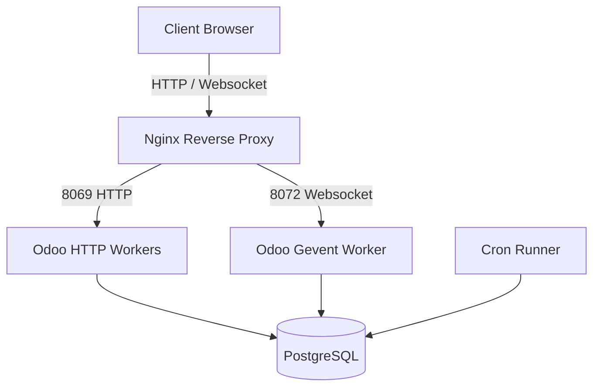

# Odoo 19 Production Scaling: Workers, Longpolling & Crons

In a local development environment, Odoo runs in **single-process mode** (all HTTP requests, websocket polling, and scheduled actions run in a single Python thread). In production, this setup will crash under load. 

For enterprise environments, you must configure Odoo in **multi-process mode** by allocating worker processes and separating HTTP traffic from asynchronous web sockets (longpolling) and scheduled tasks (crons).



---

## 1. Calculating Worker Configuration

When `workers > 0`, Odoo spawns a master process that manages a pool of worker processes. 

### The Worker Formula
To maximize CPU utilization without causing thread thrashing, use the standard formula:
$$\text{Workers} = (\text{CPU Cores} \times 2) + 1$$

*   **Example**: For a virtual machine with 4 CPU cores, set `workers = 9` in `odoo.conf`.

### RAM Resource Allocation
Each worker process consumes about 150MB of RAM at idle and can grow to 600MB+ under heavy loads (like reporting or exports). If Odoo exceeds these limits, memory leaks can crash the OS. You must enforce limits in `odoo.conf`:

```ini
[options]
workers = 9
# 640MB soft limit - recycled after request finishes
limit_memory_soft = 671088640
# 2048MB hard limit - killed immediately by master if exceeded
limit_memory_hard = 2147483648
```

---

## 2. Gevent & Websocket Longpolling

In Odoo 19, real-time communications (chat, live notifications, timer syncs) utilize HTML5 WebSockets. In multi-process mode, standard worker threads cannot hold persistent socket connections open.

To handle persistent socket connections, Odoo runs a dedicated **Gevent** event loop worker listening on the `gevent_port` (Default: `8072`, formerly known as `longpolling_port`).

*   **Master Worker**: Dispatches standard HTTP/RPC requests (port `8069`) to the HTTP worker pool.
*   **Gevent Worker**: Dispatches websocket requests (path `/websocket` on port `8072`) to the gevent loop.

### odoo.conf Configuration
```ini
[options]
proxy_mode = True
# Odoo 19 parameters
http_port = 8069
gevent_port = 8072
```

---

## 3. Dedicated Cron Threads (`max_cron_threads`)

Scheduled actions (crons) run background maintenance (like automated email syncs or vacuuming databases). In a multi-worker setup, you must ensure that cron executions do not block standard HTTP workers.

This is controlled by `max_cron_threads` in `odoo.conf`.

```ini
[options]
# Set the maximum number of concurrent threads dedicated to executing crons
max_cron_threads = 2
```

### Best Practice: Dedicated Cron Instances
For high-traffic enterprise architectures, we dedicate an entire Odoo container/instance solely to executing crons, while completely disabling crons on the HTTP-facing servers.

#### 1. On HTTP Servers:
Disable cron execution so HTTP processes only serve user traffic:
```ini
# odoo.conf
workers = 8
max_cron_threads = 0
```

#### 2. On Asynchronous Cron Servers:
Enable crons and disable standard HTTP worker pools:
```ini
# odoo.conf
workers = 0
max_cron_threads = 2
```

---

## 🏁 Senior Checkpoint

*   **Key Concept**: production-scaling requires shifting from single-thread mode to a multi-process architecture with distinct HTTP, Gevent, and Cron processes.
*   **Architect Insight**: Ensure your PostgreSQL database `max_connections` limit is configured to be at least $(\text{Odoo Workers} \times 2) + 5$ to prevent "Too many connections" failures.
*   **Verify Your Knowledge**: Why should you set `max_cron_threads = 0` on HTTP-serving app nodes? (Answer: To prevent heavy background tasks from consuming CPU cycles that should be allocated to responding to HTTP user requests).
