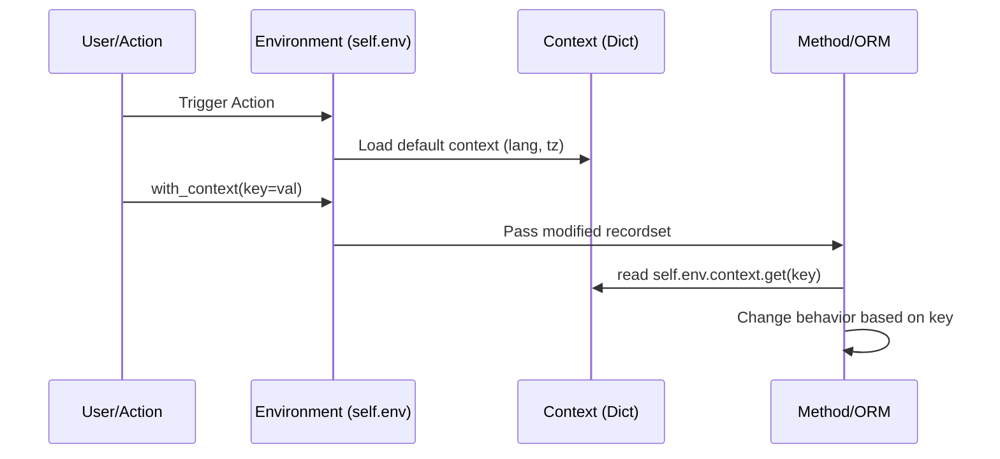

# Odoo 19 Context and with_context()

## Definition and Usage



The **Context** is a python dictionary containing shared data such as the user's timezone, language, and custom flags. 

### 💡 Analogy: The Developer's Backpack
Think of the Context as a **Backpack** that Odoo carries through every function, from the UI down to the database.

*   **Standard Tools**: Inside the backpack are tools everyone needs: the current user's language (`lang`), their timezone (`tz`), and their active company.
*   **Custom Flags**: You can slip a **Note** into the backpack (e.g., `{'skip_validation': True}`) at the start of a function. Every subsequent function that Odoo calls can "open the backpack" and see your note to change its behavior.
*   **with_context()**: This is like **swapping backpacks** for a specific mission. You give Odoo a new backpack with different tools, but once the mission is over, Odoo goes back to using the original one.

The `with_context()` method is used to create a new recordset with a modified context.
 This is useful for passing "hints" or "flags" to other methods or downstream logic without changing the method signature.

## Reading the Context
You can access the current context via `self.env.context` or `self._context`. It behaves like a standard Python dictionary.

---

## Syntax
```python
# Create a new recordset with a specific context key
new_self = self.with_context(my_key='my_value')

# Accessing a value
value = self.env.context.get('my_key')
```

---

## Examples

### Passing a Key to Another Method
In this example, we pass a flag `skip_validation` to a creation method to bypass certain checks.

```python
def create_listing_fast(self):
    # Pass 'skip_validation' to the create method
    return self.with_context(skip_validation=True).create({
        'name': 'Antique Vase',
        'initial_price': 100,
    })
```

### Reading a Key in a Method
Here is how you would check for that flag in the destination method.

```python
@api.model
def create(self, vals):
    if not self.env.context.get('skip_validation'):
        # Perform complex validation only if flag is NOT set
        self._check_auction_rules(vals)
    return super().create(vals)
```

### Passing Multiple Values
You can pass multiple keys at once or use a dictionary.

```python
self.with_context(lang='fr_FR', tz='Europe/Paris').do_something()
```

---

## 🚀 Odoo 19: Environment Utilities

### 1. The `env.tz` Helper
Dealing with timezones in Python is notoriously difficult. Odoo 19 introduces `env.tz`, which automatically detects the user's timezone from the context and provides a helper for converting UTC timestamps.

```python
# Get user's local time from a UTC field
local_time = record.create_date.astimezone(self.env.tz)
```

### 2. The `_register_hook` Method
If your model needs to perform some global setup (like registering a specific service or modifying a global registry) when the server starts, use `_register_hook`.

```python
class MyModel(models.Model):
    _name = 'my.model'

    @api.model
    def _register_hook(self):
        # Called once when the module is loaded
        _logger.info("Initializing MyModel Global Hooks...")
        return super()._register_hook()
```

---

## 🏁 Senior Checkpoint
*   **Key Concept:** The Context is a dictionary passed through the Environment to share metadata (lang, tz) and custom flags.
*   **Architect Insight:** Context is **immutable**; `with_context()` returns a new recordset. Always capture the result!
*   **Verify Your Knowledge:** How do you pass a flag that bypasses validation? (Answer: `self.with_context(skip_validation=True)`).

!!! success "Next Step"
    You can pass flags. Now ensure safety using [ensure_one()](ensure_one.md).

---

## Technical Note
In Odoo 19, the context is immutable. Methods like `with_context()` do not modify the existing context but return a **new recordset** with the updated context. Always ensure you use the returned object!

---

<div class="feedback-container">
    <span class="feedback-label">Was this page helpful?</span>
    <div class="feedback-buttons">
        <button class="feedback-btn" onclick="sendFeedback(true)">👍 Yes</button>
        <button class="feedback-btn" onclick="sendFeedback(false)">👎 No</button>
    </div>
</div>
