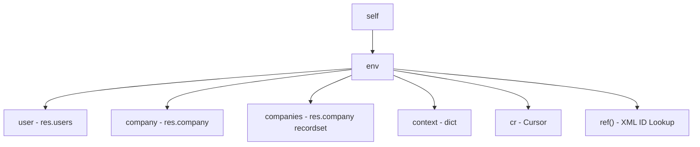

# Odoo 19 Environment Deep Dive (env)

## 1. What is it?
The **Environment** (`self.env`) is the central orchestrator of the Odoo ORM session. It is a read-only, immutable context manager that bundles database transactional records, active session parameters, user preferences, security modifiers, and utility registries into a single unified object.



---

## 2. Why does it exist?
Without an Environment, a stateless database system would require passing transactional handlers, user credentials, localized languages, active company rules, and timezone offsets explicitly into every single function call. 

`self.env` solves this by encapsulating all execution state metadata in one place, allowing Odoo's business logic methods to remain clean, concise, and context-aware.

---

## 3. When should I use it?
Use `self.env` whenever you need to:
*   **Query the Database**: Spawn recordsets for other models (e.g. `self.env['res.partner'].search([])`).
*   **Identify the User**: Retrieve settings, privileges, or profiles of the logged-in user (`self.env.user`).
*   **Enforce Multi-Company Scopes**: Access active company limits (`self.env.company`).
*   **Extract Metadata**: Read dynamic flags inside the context (`self.env.context`).
*   **Resolve XML IDs**: Load pre-defined configuration records securely (`self.env.ref()`).

---

## 4. When should I NOT use it?
*   **Avoid raw database queries** via `self.env.cr.execute()` for standard operations. Direct SQL bypasses Odoo's row-level record security, compute-fields recalculations, and memory caches. Only use raw cursor queries for high-performance data processing or analytical aggregates.
*   **Do not use integer IDs** for database records configuration lookups; use `self.env.ref()` with XML IDs instead.

---

## 5. Syntax
The environment is accessed via `self.env` on any model recordset.

```python
# Accessing session properties
current_user = self.env.user         # Returns res.users recordset (current user)
current_company = self.env.company   # Returns res.company record (active company)
allowed_companies = self.env.companies # Returns res.company recordset (selected list)
active_context = self.env.context   # Returns immutable dictionary
db_cursor = self.env.cr             # Returns database transaction cursor

# Instantiating a new recordset
partner_model = self.env['res.partner']

# Resolving External XML IDs
admin_partner = self.env.ref('base.partner_admin')
```

---

## 6. Multiple Examples

### Beginner: Welcome Banner Logger
Log a welcome statement based on the logged-in user's name when they load the dashboard.
```python
from odoo import api, models
import logging

_logger = logging.getLogger(__name__)

class AuctionDashboard(models.TransientModel):
    _name = 'auction.dashboard'
    _description = 'Auction Welcome Dashboard'

    def log_welcome(self):
        # Fetch current user name
        user_name = self.env.user.name
        _logger.info("Welcome back %s! Session initialized.", user_name)
```

### Intermediate: Multi-Company Check
Verify if the current user has access to check inventory values under their active company.
```python
from odoo import api, models, fields
from odoo.exceptions import UserError

class AuctionListing(models.Model):
    _name = 'auction.listing'
    _description = 'Auction Listing'

    company_id = fields.Many2one('res.company', default=lambda self: self.env.company)

    def validate_company_access(self):
        # Ensure active company matches the record's company scope
        if self.company_id and self.company_id != self.env.company:
            raise UserError(
                f"You cannot process this listing under company '{self.env.company.name}'. "
                f"Please switch to '{self.company_id.name}'."
            )
```

### Real-World: XML ID Sequence Loader
Automatically load and format sequences during record confirmation using `env.ref()`.
```python
from odoo import api, models, fields

class AuctionListing(models.Model):
    _name = 'auction.listing'
    _description = 'Auction Listing'
    
    reference = fields.Char("Reference", readonly=True)

    def action_confirm(self):
        for record in self:
            if not record.reference:
                # 1. Resolve sequence record via External XML ID
                sequence = self.env.ref('pways_auction.seq_auction_listing')
                # 2. Generate and assign next sequential code
                record.reference = sequence.next_by_id()
```

---

## 7. Common Mistakes

### ❌ Hardcoding Database IDs
Hardcoding IDs will crash when your addon is installed on a fresh or multi-company system where the target database ID is different.
```python
# Wrong: High risk of failure across environments
gold_tier_group = self.env['res.groups'].browse(4) # ID 4 might not exist or be different
```

### ✅ Using XML IDs via `env.ref()`
XML IDs are mapped consistently across databases, guaranteeing safety.
```python
# Better: Safe, consistent lookup
gold_tier_group = self.env.ref('pways_auction.group_gold_bidder')
```

---

## 8. Performance Notes
*   **Properties are ORM Lookups**: While accessing `self.env` itself is instantaneous, properties like `self.env.user` or `self.env.company` return active recordsets. If you need to access properties of the user repeatedly inside a long loop, store them in a local variable outside the loop to bypass unnecessary cache lookups.
*   **Database Cursor Safety**: Avoid calling `self.env.cr.commit()` manually in standard methods. Odoo manages transaction lifecycles automatically; manually committing blocks queries and risks data corruption if an error occurs later in the thread.

---

## 9. Senior Notes
*   **Immutability Policy**: The Environment is completely immutable. If you need to alter properties (such as executing an action as a different user or company), do not write to the environment attributes directly. Instead, use recordset helpers (like `with_user()`) to instantiate a fresh, cloned environment context.
*   **Memory Overhead**: Instantiating custom models repeatedly via `self.env['model.name']` is light, but it seeds Odoo's local registry references. Cache instances when designing heavy backend imports.

---

## 10. Related Topics
*   **Previous Lesson**: [XPath & View Overrides](../foundation/xpath.md)
*   **Next Lesson**: [Security Modifiers (sudo)](security_modifiers.md)
*   **See Also**: [Context & Flags](context.md), [Recordset Helpers](recordset_helpers.md)
