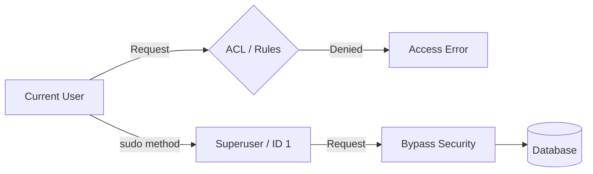

# Odoo 19 sudo() Method

## Definition and Usage



The `sudo()` method returns a new version of the recordset with a special environment that bypasses access rights (ACLs) and record rules. 

By default, calling `sudo()` switches the user context to the **Superuser** (Administrator). This allows the code to perform actions that the current user might not have permission to do.

## Security Implications
**Warning:** `sudo()` should be used sparingly. 
- **Bypasses Security:** It ignores all security restrictions defined in `ir.model.access.csv` and Record Rules.
- **Data Risk:** Improper use can lead to unauthorized data modification or exposure.
- **Best Practice:** Always use `sudo()` for the smallest possible scope of work and only when absolutely necessary (e.g., system-level logging or automated background processes).

---

## Syntax
```python
# Returns self with superuser rights
self.sudo()

# Returns self with specific user rights (Odoo 19 style)
self.with_user(user_id)
```

---

## Examples

### Performing Actions as Superuser
In this example, a portal user (who cannot normally create Sales Orders) triggers a process that creates a Sales Order for an auction winner.

```python
def action_auction_win(self):
    self.ensure_one()
    # Switch to sudo to create the order regardless of portal permissions
    order = self.env['sale.order'].sudo().create({
        'partner_id': self.winner_id.id,
        'auction_id': self.id,
    })
    return order
```

### Chaining with Other Methods
You can chain `sudo()` with searches to find records the user normally couldn't see.

```python
# Search all listings, even those restricted by record rules
all_listings = self.env['auction.listing'].sudo().search([])
```

---

## 🏁 Senior Checkpoint
*   **Key Concept:** `sudo()` creates a new recordset in the Superuser environment, bypassing all security.
*   **Architect Insight:** Only use `sudo()` for targeted reads/writes; never use it to wrap an entire method unless you want to lose all security tracking.
*   **Verify Your Knowledge:** What is the difference between `sudo()` and `with_user()`? (Answer: `sudo()` escalates to Admin, while `with_user()` switches context to a specific user).

!!! success "Next Step"
    Security handled. Now learn to [Pass Flags](context.md) using the Odoo Context.

---

## Technical Note
In Odoo 19, `sudo()` is often used in controllers or portal-facing methods where the system needs to perform "administrative" tasks on behalf of a restricted user.

---

<div class="feedback-container">
    <span class="feedback-label">Was this page helpful?</span>
    <div class="feedback-buttons">
        <button class="feedback-btn" onclick="sendFeedback(true)">👍 Yes</button>
        <button class="feedback-btn" onclick="sendFeedback(false)">👎 No</button>
    </div>
</div>
