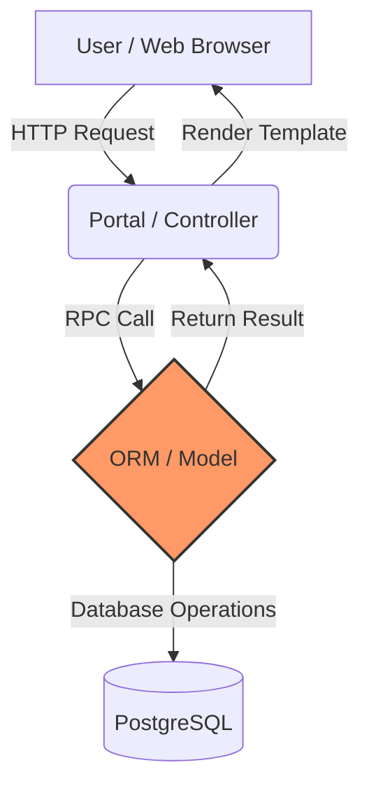

# Odoo 19: Architecture Overview

To master Odoo, you must understand the 3-Tier Architecture.

### Master Project Challenge: Architecture
1.  **Task**: Diagram the interaction of your `auction.listing` model.
2.  **Goal**: Identify the Controller route that will handle the "Bid" action.
