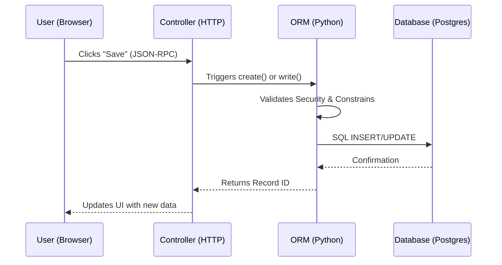

# Odoo 19 Architecture: The 3-Tier System

Understanding Odoo's architecture is the first step toward becoming a Senior Developer. Odoo follows a classic **3-Tier Architecture** that separates data, logic, and presentation.

---

## 🍽️ The Restaurant Analogy (Easy Understanding)

To remember Odoo's architecture, think of it as a **Professional Restaurant**:

1.  **The Dining Area (Frontend/OWL):** This is where the **User** sits. They see the menu (UI) and place orders (Clicks). They don't see the stove or the ingredients.
2.  **The Waiter (Controller/RPC):** The waiter takes the order from the customer and carries it to the kitchen. This is the **JSON-RPC** link that bridges the gap.
3.  **The Kitchen (Server/Python):** This is where the **Chef (ORM)** lives. The Chef takes the raw ingredients (Data), follows the recipe (Business Logic), and prepares the meal.
4.  **The Pantry (Database/PostgreSQL):** This is where all the **Ingredients (Records)** are stored. The Chef goes here to get what they need.

---

## 1. The Three Tiers

Odoo is designed to be scalable and modular. Each tier handles a specific responsibility:

### Tier 1: Presentation (The Web Client)
- **Technology:** JavaScript, OWL (Odoo Web Library), HTML5, CSS3.
- **Role:** This is the browser-side application. It communicates with the server via **JSON-RPC**.
- **Key Feature:** Odoo 19 uses a Single Page Application (SPA) approach where the UI is rendered dynamically using OWL components.

### Tier 2: Logic (The Odoo Server)
- **Technology:** Python.
- **Role:** The heart of Odoo. It handles the **ORM (Object-Relational Mapping)**, business logic, security (ACLs), and coordinates between the UI and the Database.
- **Key Feature:** Highly modular. You extend functionality by "inheriting" existing Python classes.

### Tier 3: Data (The Database)
- **Technology:** PostgreSQL.
- **Role:** Stores all persistent data. Odoo handles the SQL generation, so you rarely need to write raw SQL.
- **Key Feature:** Odoo uses a schema where each Python Model corresponds to a Database Table.

---

## 2. The Request/Response Cycle

How does a "Click" in the browser become a "Record" in the database?

### 1. The Request (JSON-RPC)
When you click a button, the browser sends a JSON-RPC request to a specific URL (e.g., `/web/dataset/call_kw`). It includes:
- **Model:** The model to act on (e.g., `auction.listing`).
- **Method:** The Python method to call (e.g., `action_confirm`).
- **Arguments:** Any data the method needs.

### 2. The Dispatcher
The Odoo server receives the request. The **Dispatcher** identifies the correct database and environment (`self.env`), then routes the call to the appropriate Python model.

### 3. Business Logic (ORM)
The Python method executes. This is where your code lives!
- It might calculate prices.
- It might trigger an email.
- It might update related records.

### 4. Database Commitment
Finally, the ORM translates your Python objects into SQL commands. PostgreSQL executes the SQL and persists the data.

### 5. The Response
The server sends back a JSON response. The OWL components in the browser catch this response and update the UI instantly without a full page reload.

---

## 3. Why this matters?

| Concept | Benefit |
| :--- | :--- |
| **Separation of Concerns** | You can change the UI (XML) without touching the Database (SQL). |
| **Scalability** | You can run multiple Logic servers (Tier 2) connected to a single Database (Tier 3). |
| **Security** | The Logic tier ensures that the User (Tier 1) can never bypass security rules to access the Data (Tier 3). |

---

## 📝 Knowledge Check

  
1. What are the three tiers in Odoo's architecture?

  <input type="text" class="quiz-input" placeholder="Type your answer here...">
  <button class="quiz-check" data-answer="Presentation (Web Client), Logic (Odoo Server), and Data (PostgreSQL Database)." onclick="checkQuiz(this)">Check Answer</button>
  

  
2. How does the Web Client communicate with the Odoo Server?

  <input type="text" class="quiz-input" placeholder="Type your answer here...">
  <button class="quiz-check" data-answer="Via JSON-RPC requests." onclick="checkQuiz(this)">Check Answer</button>
  

  
3. Which technology is primarily used for the Logic tier in Odoo?

  <input type="text" class="quiz-input" placeholder="Type your answer here...">
  <button class="quiz-check" data-answer="Python." onclick="checkQuiz(this)">Check Answer</button>
  

  
4. What is the role of the ORM in Odoo?

  <input type="text" class="quiz-input" placeholder="Type your answer here...">
  <button class="quiz-check" data-answer="The ORM (Object-Relational Mapping) handles business logic, security, and translates Python objects into SQL commands for the database." onclick="checkQuiz(this)">Check Answer</button>
  

---

## 🏁 Senior Checkpoint
*   **Key Concept:** Odoo is a **stateful** application server communicating via **JSON-RPC**.
*   **Architect Insight:** The boundary between the Frontend (OWL) and Backend (Python) is bridged by the **Bus Service**, enabling real-time WebSocket updates.
*   **Verify Your Knowledge:** Can you explain why Odoo rarely requires raw SQL? (Answer: Because the ORM handles SQL generation and security automatically).

!!! success "Next Step"
    Now that you understand the big picture, let's [Set up your Environment](setup.md) to start coding.

---

    Was this page helpful?
    

        <button class="feedback-btn" onclick="sendFeedback(true)">👍 Yes</button>
        <button class="feedback-btn" onclick="sendFeedback(false)">👎 No</button>
    

