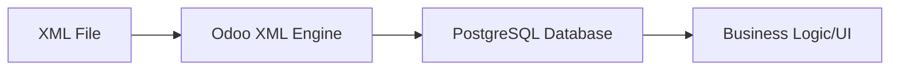

# Data Files (XML)

Odoo is a data-driven framework. Much of its configuration—including views, menus, security rules, and even initial data—is loaded via **XML Data Files**.

## The XML Data Engine

When you install or update a module, Odoo reads the XML files listed in the `data` section of your `__manifest__.py`. The XML engine converts these tags into database records.



### The `<record>` Tag
The most fundamental tag in Odoo XML is `<record>`. It tells Odoo to create or update a specific entry in a model.

**Syntax:**
```xml
<record id="xml_id" model="model.name">
    <field name="field_name">value</field>
</record>
```

---

## External IDs (xml_id)

An **External ID** (also called `xml_id`) is a unique string that identifies a record. It allows you to refer to the same record across different files or modules without knowing its database ID (integer).

- **Format:** `module_name.identifier`
- **Purpose:** Prevents duplicate records. If you update an XML file, Odoo uses the ID to find and update the existing record instead of creating a new one.

!!! info "Pro Tip"
    You can find a record's External ID in the backend by enabling **Developer Mode** and checking the **View Metadata** option in the "Debug" menu.

---

## The `noupdate` Attribute

The `<odoo>` tag often contains a `<data>` tag with a `noupdate` attribute.

```xml
<odoo>
    <data noupdate="1">
        <!-- Records here will only be created once -->
    </data>
</odoo>
```

| Attribute | Behavior | Use Case |
| :--- | :--- | :--- |
| `noupdate="0"` (Default) | Records are updated every time the module is upgraded. | Views, Menus, Actions, Security Groups. |
| `noupdate="1"` | Records are created during installation but **never** overwritten during upgrades. | Settings, Sequences, Demo Data, User-editable records. |

!!! warning "Why not use noupdate for Views?"
    If you set `noupdate="1"` for a view, your bug fixes or UI improvements in the XML file will never reach the database after the first installation.

---

## Practical Example: Creating a Category

Here is how we create a simple category record in the `auction.listing.category` model:

```xml
<odoo>
    <record id="category_electronics" model="auction.listing.category">
        <field name="name">Electronics</field>
        <field name="description">Gadgets and tech items</field>
    </record>
</odoo>
```

To reference this record elsewhere (e.g., in a bid or listing), you simply use:
`ref="pways_auction.category_electronics"`

---

## Senior: Using `eval` in XML

The `eval` attribute allows you to execute Python code directly within an XML field tag to compute dynamic values.

### 1. Dynamic Dates
Useful for demo data or configuration that should be relative to "now".
```xml
<field name="start_date" eval="datetime.now().strftime('%Y-%m-%d %H:%M:%S')"/>
```

### 2. Passing Complex Types (List/Dict)
When a field expects a non-string value.
```xml
<field name="context" eval="{'show_auction_details': True, 'default_type': 'out_invoice'}"/>
```

### 3. Record References via `ref()`
```xml
<field name="parent_id" eval="ref('pways_auction.category_electronics')"/>
```

!!! danger "Security Warning"
    `eval` has access to the standard Python libraries (like `datetime`, `time`) and Odoo's `ref()` and `obj()`. Never use it for user-provided input, as it can be a security risk if misused.

---

## 🏁 Senior Checkpoint
*   **Key Concept:** XML Data files are the "Hydration" engine for Odoo, converting text to database records.
*   **Architect Insight:** `noupdate="1"` is essential for user-editable records (like settings) to prevent upgrades from overwriting local changes.
*   **Verify Your Knowledge:** What is the difference between an ID and an External ID? (Answer: An ID is an integer in Postgres; an External ID is a string in XML that Odoo maps to that integer).

!!! success "Next Step"
    Data is loaded. Now learn to [Secure it](../business/security.md) using ACLs.

---

## 💻 Code Challenge

**Create a new record for the 'auction.listing' model with the unique ID 'listing_vintage_car'.**

<div class="code-challenge">
<pre><code>&lt;<input type="text" class="quiz-input-inline w-60" data-answer="record"> id="<input type="text" class="quiz-input-inline w-160" data-answer="listing_vintage_car">" <input type="text" class="quiz-input-inline w-60" data-answer="model">="auction.listing"&gt;
    &lt;field name="name"&gt;Vintage Car&lt;/field&gt;
&lt;/<input type="text" class="quiz-input-inline w-60" data-answer="record">&gt;
</code></pre>
<button class="quiz-check" onclick="checkCodeChallenge(this)">Check Code</button>
<div class="quiz-result"></div>
</div>


---

## 📝 Knowledge Check

<div class="quiz-container">
  <div class="quiz-question">1. What is the purpose of the `<record>` tag in Odoo XML files?</div>
  <input type="text" class="quiz-input" placeholder="Type your answer here...">
  <button class="quiz-check" data-answer="It is used to create or update a specific record in a database model." onclick="checkQuiz(this)">Check Answer</button>
  <div class="quiz-result"></div>
</div>

<div class="quiz-container">
  <div class="quiz-question">2. What is an External ID and why is it useful?</div>
  <input type="text" class="quiz-input" placeholder="Type your answer here...">
  <button class="quiz-check" data-answer="It's a unique string identifier that allows referring to a record without knowing its database integer ID, and it prevents duplicate records during module updates." onclick="checkQuiz(this)">Check Answer</button>
  <div class="quiz-result"></div>
</div>

<div class="quiz-container">
  <div class="quiz-question">3. How does the `noupdate=&quot;1&quot;` attribute affect records during a module upgrade?</div>
  <input type="text" class="quiz-input" placeholder="Type your answer here...">
  <button class="quiz-check" data-answer="Records with `noupdate=&quot;1&quot;` are created during the initial installation but are not overwritten or updated during subsequent module upgrades." onclick="checkQuiz(this)">Check Answer</button>
  <div class="quiz-result"></div>
</div>

<div class="quiz-container">
  <div class="quiz-question">4. When should you use the `eval` attribute in a `<field>` tag?</div>
  <input type="text" class="quiz-input" placeholder="Type your answer here...">
  <button class="quiz-check" data-answer="Use `eval` when you need to execute Python code to compute a dynamic value for a field, such as a current date or a complex dictionary." onclick="checkQuiz(this)">Check Answer</button>
  <div class="quiz-result"></div>
</div>


---


<div class="feedback-container">
    <span class="feedback-label">Was this page helpful?</span>
    <div class="feedback-buttons">
        <button class="feedback-btn" onclick="sendFeedback(true)">👍 Yes</button>
        <button class="feedback-btn" onclick="sendFeedback(false)">👎 No</button>
    </div>
</div>
