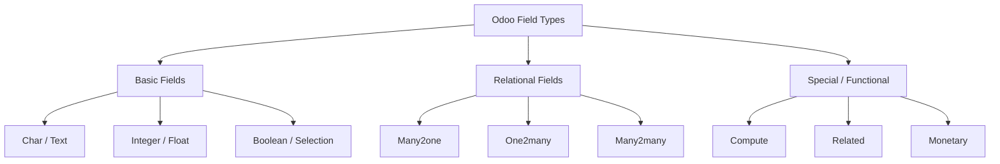

# Odoo 19 Fields: Master Reference

In Odoo, fields are used to define the data structure of a model. They determine how data is stored in the database and how it is presented in the user interface.

## Field Summary Table



| Field Name | Description | Example |
| :--- | :--- | :--- |
| **Char** | Single-line text string | `name = fields.Char("Name")` |
| **Text** | Multi-line text string | `note = fields.Text("Notes")` |
| **Integer** | Whole number | `age = fields.Integer("Age")` |
| **Float** | Decimal number | `price = fields.Float("Price")` |
| **Monetary** | Currency amount | `total = fields.Monetary("Total")` |
| **Boolean** | True or False | `active = fields.Boolean("Active")` |
| **Selection** | Dropdown list | `state = fields.Selection([('a','A')])` |
| **Date** | Date without time | `start = fields.Date("Start Date")` |
| **Datetime** | Date with time | `created = fields.Datetime("Created")` |
| **Many2one** | Relation to one record | `partner_id = fields.Many2one('res.partner')` |
| **One2many** | Relation to many records | `line_ids = fields.One2many('my.line', 'inv_id')` |
| **Many2many** | Multiple to multiple | `tag_ids = fields.Many2many('res.tag')` |

---

## Basic Field Types

### Char
**Simple Definition:** A string of characters with a limited length (usually 255).
**Syntax:**
```python
name = fields.Char(string="Name", size=64, required=True)
```
**Common Parameters:**
- `string`: The label of the field.
- `required`: If `True`, the field cannot be empty.
- `index`: If `True`, Odoo creates a database index for faster searching.
- `help`: Tooltip text for the UI.

### Text
**Simple Definition:** A string of characters with no length limit, used for long descriptions.
**Syntax:**
```python
description = fields.Text(string="Description", help="Internal notes")
```
**Common Parameters:**
- `string`: The label.
- `translate`: If `True`, allows translating the content.

### Integer
**Simple Definition:** A standard integer number (no decimals).
**Syntax:**
```python
priority = fields.Integer(string="Priority", default=10)
```
**Common Parameters:**
- `default`: The initial value for new records.
- `readonly`: If `True`, the user cannot edit this field.

### Float
**Simple Definition:** A floating-point number for precise decimals.
**Syntax:**
```python
weight = fields.Float(string="Weight", digits=(12, 3))
```
**Common Parameters:**
- `digits`: A tuple `(total, decimal)` or a string name of a decimal accuracy record.

### Monetary
**Simple Definition:** A special float used for financial amounts. It automatically formats based on a currency.
**Syntax:**
```python
amount = fields.Monetary(string="Amount", currency_field='currency_id')
```
**Common Parameters:**
- `currency_field`: The name of the Many2one field holding the `res.currency` record.

### Boolean
**Simple Definition:** A checkbox representing a True or False value.
**Syntax:**
```python
is_verified = fields.Boolean(string="Verified", default=False)
```

### Selection
**Simple Definition:** A dropdown menu where the user picks one value from a predefined list.
**Syntax:**
```python
status = fields.Selection([
    ('draft', 'Draft'),
    ('open', 'Open'),
    ('closed', 'Closed'),
], string="Status", default='draft')
```

---

## Date and Time Fields

### Date
**Simple Definition:** Stores only the date (Year, Month, Day).
**Syntax:**
```python
deadline = fields.Date(string="Deadline", default=fields.Date.context_today)
```

### Datetime
**Simple Definition:** Stores both date and precise time.
**Syntax:**
```python
scheduled_date = fields.Datetime(string="Scheduled At", default=fields.Datetime.now)
```

---

## Relational Fields

### Many2one
**Simple Definition:** Links the current record to exactly one record in another model (a Foreign Key).
**Syntax:**
```python
seller_id = fields.Many2one('res.partner', string="Seller", ondelete='restrict')
```
**Common Parameters:**
- `comodel_name`: The name of the related model (e.g., 'res.partner').
- `ondelete`: Behavior when the related record is deleted ('cascade', 'set null', 'restrict').

### One2many
**Simple Definition:** The inverse of a Many2one. It shows all records that link back to this one.
**Syntax:**
```python
bid_ids = fields.One2many('auction.bid', 'listing_id', string="Bids")
```
**Required Parameters:**
- `comodel_name`: The related model.
- `inverse_name`: The field in the related model that points back to this record.

### Many2many
**Simple Definition:** Multiple records in the current model can be linked to multiple records in another model.
**Syntax:**
```python
category_ids = fields.Many2many('product.category', string="Categories")
```

---

## Special Parameters

### Compute
Used to make a field calculated based on other fields. Computed fields are **not** stored in the database by default.

```mermaid
graph TD
    Change[Dependent field changed] --> Depends[@api.depends dependency trigger]
    Depends --> Compute[Compute method executed]
    Compute --> Stored{Is store=True set?}
    Stored -- Yes --> DB[Saved to PostgreSQL Database]
    Stored -- No --> Cache[Retained in Environment Cache memory only]
```

```python
total_price = fields.Float(compute="_compute_total_price", store=True)

@api.depends('price', 'tax')
def _compute_total_price(self):
    for record in self:
        record.total_price = record.price + record.tax
```

### onchange vs. compute (The Senior Choice)
Developers often ask: *"Should I use @api.onchange or @api.depends (compute)?"*

| Feature | `@api.onchange` | `@api.depends` (Compute) |
| :--- | :--- | :--- |
| **Persistence** | Only UI (not stored) | Can be stored in DB (`store=True`) |
| **Trigger** | When user modifies a field in UI | When any dependent field changes (UI, API, or CSV) |
| **Reliability** | Low (doesn't trigger for backend calls) | **High** (triggers for all data changes) |
| **Use Case** | UI Warnings / Domain updates | **Business Logic / Calculations** |

**Senior Rule**: Always prefer **Compute Fields** (`@api.depends`) over `onchange` for any logic that affects data integrity. `onchange` should only be used for UI-only enhancements.

### Related
Used to mirror a field from a linked record. It "reaches through" a Many2one relation.
```python
seller_email = fields.Char(related="seller_id.email", string="Seller Email", readonly=True)
```

### Tracking
Used to log changes in the "Chatter" (log section at the bottom of the form).
```python
price = fields.Float("Price", tracking=True)
```
*Note: The model must inherit from `mail.thread` for tracking to work.*

---

## Senior: Advanced Field Logic

To build professional, secure, and performant Odoo apps, you must master these advanced field properties that govern calculation security, database tracking, and company dependency.

### 1. `company_dependent=True`
In multi-company Odoo databases, you often need a field to hold different values depending on which company is currently active. Setting `company_dependent=True` instructs Odoo to store these values in the `ir.property` table (or via company-dependent fields under the hood in newer Odoo versions) per company, instead of in the model's main table column.
```python
# The cost of the product can vary between Company A and Company B
cost_price = fields.Float("Cost Price", company_dependent=True)
```

### 2. `tracking=True` (and Tracking Priorities)
Enables logging changes to this field in the Chatter (requires the model to inherit from `mail.thread`).
*   **Priority Ordering**: If you pass an integer instead of `True` (e.g. `tracking=10`, `tracking=20`), Odoo uses this integer to order the logs in the Chatter when multiple fields are modified in a single transaction (lowest numbers are displayed first).
```python
state = fields.Selection(..., tracking=10)
price = fields.Monetary(..., tracking=20)
```

### 3. `groups` (Field-Level Permissions)
Restricts access to specific fields directly at the ORM level. If a user does not belong to the specified XML group, they cannot see or write to this field. The field is physically omitted from the recordset returned to the browser client.
```python
# Only the ERP Manager can view or edit the financial margin field
margin = fields.Float("Margin", groups="base.group_erp_manager")
```

### 4. `copy=False` (Duplicate Exclusion)
Specifies whether the field value should be copied when duplicating a record.
*   **Use Cases**: Unique numbers, reference codes, state variables, or timestamps should always set `copy=False` to prevent data pollution during duplication.
```python
invoice_number = fields.Char("Invoice Number", copy=False)
```

### 5. `compute_sudo=True`
By default, Odoo computes fields using the current user's security permissions. If the computation needs to read fields that the user has no access to (e.g. calculating a user's total sales history by reading invoices they don't own), setting `compute_sudo=True` forces Odoo to run the compute method as the Superuser.
```python
sales_total = fields.Monetary(compute="_compute_sales", compute_sudo=True, store=True)
```

### 6. `recursive=True` (Hierarchical Computations)
If a computed field's calculation relies on the value of the same computed field in a parent or child record (creating a recursive tree evaluation), you **must** specify `recursive=True` to prevent Odoo from hitting recursion depth limit errors or cache lookup errors.
```python
# Computing the full path of a category (e.g. "Electronics > Computers > Laptops")
complete_name = fields.Char(compute="_compute_complete_name", recursive=True, store=True)

@api.depends('name', 'parent_id.complete_name')
def _compute_complete_name(self):
    for category in self:
        if category.parent_id:
            category.complete_name = f"{category.parent_id.complete_name} > {category.name}"
        else:
            category.complete_name = category.name
```

### 7. `related_sudo=True`
By default, `related` fields are fetched using the current user's privileges. If the current user does not have permission to read the related model, a security exception is raised. Setting `related_sudo=True` bypasses this, fetching the related value using superuser permissions.
```python
# Fetch the partner's credit limit even if the current portal user cannot access res.partner records
seller_credit = fields.Float(related="seller_id.credit_limit", related_sudo=True, readonly=True)
```

---

## ⚠️ Odoo 19 Breaking Changes

As a Senior Developer, you must be aware of these fundamental shifts in Odoo 19:

1.  **Removal of `@api.returns`**: In previous versions, this decorator was used to ensure a method returned a recordset of a specific model. In Odoo 19, this is **deprecated**. Simply return the recordset directly; the ORM now handles type-safety internally.
2.  **HTML Builder Refactor**: The `web_editor` module has been renamed to `html_builder`. If you are inheriting from or using assets from the old editor, you must update your references.
3.  **Removal of `odoo.osv`**: The legacy `osv` (OpenObject Service) module has been officially removed. All code must now use the modern `odoo.models` API.

---

## 💻 Code Challenge

**Define a Many2one field that links to the 'res.partner' model and deletes the record if the partner is removed.**

<div class="code-challenge">
<pre><code>partner_id = fields.<input type="text" class="quiz-input-inline w-80" data-answer="Many2one">('<input type="text" class="quiz-input-inline w-100" data-answer="res.partner">', string="Partner", ondelete='<input type="text" class="quiz-input-inline w-70" data-answer="cascade">')
</code></pre>
<button class="quiz-check" onclick="checkCodeChallenge(this)">Check Code</button>
<div class="quiz-result"></div>
</div>

---

## 📝 Knowledge Check

<div class="quiz-container">
  <div class="quiz-question">1. What is the difference between `Char` and `Text` fields?</div>
  <input type="text" class="quiz-input" placeholder="Type your answer here...">
  <button class="quiz-check" data-answer="`Char` is for single-line text with a limited length (usually 255), while `Text` is for multi-line text with no length limit." onclick="checkQuiz(this)">Check Answer</button>
  <div class="quiz-result"></div>
</div>

<div class="quiz-container">
  <div class="quiz-question">2. How do you make a field required in Odoo?</div>
  <input type="text" class="quiz-input" placeholder="Type your answer here...">
  <button class="quiz-check" data-answer="By setting the `required=True` parameter in the field definition." onclick="checkQuiz(this)">Check Answer</button>
  <div class="quiz-result"></div>
</div>

<div class="quiz-container">
  <div class="quiz-question">3. What are the three types of relational fields in Odoo?</div>
  <input type="text" class="quiz-input" placeholder="Type your answer here...">
  <button class="quiz-check" data-answer="`Many2one`, `One2many`, and `Many2many`." onclick="checkQuiz(this)">Check Answer</button>
  <div class="quiz-result"></div>
</div>

<div class="quiz-container">
  <div class="quiz-question">4. What is the purpose of the `compute` attribute on a field?</div>
  <input type="text" class="quiz-input" placeholder="Type your answer here...">
  <button class="quiz-check" data-answer="It is used to define a field whose value is calculated by a Python method rather than being directly stored in the database." onclick="checkQuiz(this)">Check Answer</button>
  <div class="quiz-result"></div>
</div>

---

## 🏁 Senior Checkpoint
*   **Key Concept:** Relational fields (`Many2one`, `One2many`, `Many2many`) define the graph of your database.
*   **Architect Insight:** `compute_sudo=True` is a powerful tool for bypassing security in controlled calculations, but it must be balanced against multi-company isolation.
*   **Verify Your Knowledge:** What is the difference between `related` and `compute` fields? (Answer: Related fields mirror data from another record, while compute fields execute Python logic).

!!! success "Next Step"
    You've defined the structure. Now learn how to [Load Initial Data](data_files.md) using XML.

---

<div class="senior-note">
  <strong>Senior Tip:</strong> When using a <strong>Monetary</strong> field, Odoo 19 requires you to have a <code>currency_id</code> field (Many2one to 'res.currency') on the same model. If your field is named <code>currency_id</code>, Odoo finds it automatically. If you use a different name, you must specify it using <code>currency_field='your_field_name'</code>.
</div>

---

<div class="feedback-container">
    <span class="feedback-label">Was this page helpful?</span>
    <div class="feedback-buttons">
        <button class="feedback-btn" onclick="sendFeedback(true)">👍 Yes</button>
        <button class="feedback-btn" onclick="sendFeedback(false)">👎 No</button>
    </div>
</div>
