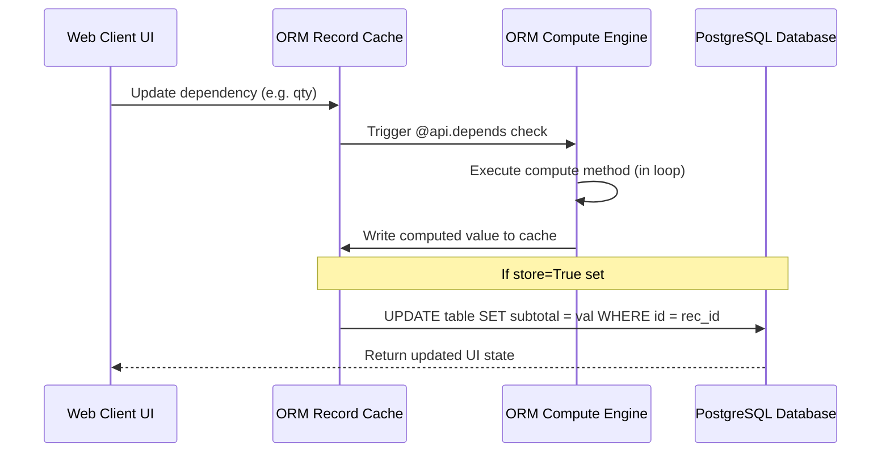

# Odoo 19 Advanced Field Logic: Compute, Related & Security Attributes

Advanced fields allow developers to calculate values dynamically, mirror relational data, restrict access dynamically, and store values on a per-company basis.

---

## 1. What is it
Advanced fields are functional or attribute-driven configurations (like `compute`, `related`, `company_dependent`, and `groups`) that extend basic fields with custom Python calculations, security filters, or multi-company variations.

---

## 2. Why
Modern ERP applications require complex calculations and automated workflows. Advanced fields allow fields to respond to user input dynamically while preserving database consistency, security constraints, and performance parameters.

---

## 3. When
*   Use **Compute** for calculations that depend on other field values (e.g., Subtotal = Price * Qty).
*   Use **Related** to display data from a parent record without duplicate writes (e.g., display Customer Email on an Invoice form).
*   Use **`company_dependent=True`** when the field value must differ depending on the user's active company.
*   Use **`groups="..."`** to restrict field access to specific user categories at the ORM layer.
*   Use **`compute_sudo=True`** when calculation logic requires reading records that the current user does not have permission to view.
*   Use **`recursive=True`** for hierarchical calculations, such as parent-child tree traversals.

---

## 4. When Not
*   **Do not** use compute fields without `store=True` if you need to search or group by that field frequently, as unstored fields require full table memory scans to filter.
*   **Do not** abuse `company_dependent=True` for configuration parameters that are universal across the system.
*   **Do not** write `@api.onchange` methods for calculation logic; use compute fields with `@api.depends` instead (onchange does not trigger during API or backend operations).

---

## 5. Syntax
Here is the python configuration syntax for advanced fields:

```python
from odoo import models, fields, api

class SaleOrderLine(models.Model):
    _name = 'sale.order.line'
    _description = 'Sales Order Line'

    price_unit = fields.Float("Unit Price")
    qty = fields.Float("Quantity")
    
    # 1. Stored Compute Field
    subtotal = fields.Float(
        compute="_compute_subtotal", 
        store=True,
        index=True
    )
    
    # 2. Related Field
    order_id = fields.Many2one('sale.order', string="Order Reference")
    partner_id = fields.Many2one(
        related="order_id.partner_id", 
        string="Customer", 
        store=True,
        readonly=True
    )
    
    # 3. Company Dependent Field
    cost_price = fields.Float("Cost Price", company_dependent=True)
    
    # 4. Field level security group
    margin = fields.Float("Margin", groups="sales_team.group_sale_manager")

    @api.depends('price_unit', 'qty')
    def _compute_subtotal(self):
        for line in self:
            line.subtotal = line.price_unit * line.qty
```

---

## 6. Examples
The following example demonstrates a multi-company catalog hierarchy with recursive naming, privileged calculations, and permission restrictions:

```python
from odoo import models, fields, api

class CatalogCategory(models.Model):
    _name = 'catalog.category'
    _description = 'Catalog Category'

    name = fields.Char("Name", required=True)
    parent_id = fields.Many2one('catalog.category', string="Parent Category")
    company_id = fields.Many2one('res.company', string="Company", default=lambda self: self.env.company)

    # Recursive naming (e.g. "Hardware > Laptops > SSD")
    complete_name = fields.Char(
        compute="_compute_complete_name", 
        recursive=True, 
        store=True
    )

    # Privileged calculations (calculates items count bypassing user rules)
    items_count = fields.Integer(
        compute="_compute_items_count", 
        compute_sudo=True
    )

    # Company dependent default account code
    default_account_code = fields.Char(
        string="Accounting Code", 
        company_dependent=True
    )

    @api.depends('name', 'parent_id.complete_name')
    def _compute_complete_name(self):
        for category in self:
            if category.parent_id:
                category.complete_name = f"{category.parent_id.complete_name} > {category.name}"
            else:
                category.complete_name = category.name

    def _compute_items_count(self):
        for category in self:
            # We run as sudo to count items user might not have access to read
            category.items_count = self.env['catalog.item'].search_count([
                ('category_id', '=', category.id)
            ])
```

### 📝 Knowledge Check

<div class="quiz-container">
  <div class="quiz-question">1. What is the purpose of the `compute` attribute on a field?</div>
  <input type="text" class="quiz-input" placeholder="Type your answer here...">
  <button class="quiz-check" data-answer="It is used to define a field whose value is calculated by a Python method rather than being directly stored in the database." onclick="checkQuiz(this)">Check Answer</button>
  <div class="quiz-result"></div>
</div>

<div class="quiz-container">
  <div class="quiz-question">2. What is the difference between `related` and `compute` fields?</div>
  <input type="text" class="quiz-input" placeholder="Type your answer here...">
  <button class="quiz-check" data-answer="Related fields mirror data from another record, while compute fields execute Python logic." onclick="checkQuiz(this)">Check Answer</button>
  <div class="quiz-result"></div>
</div>

---

## 7. Common Mistakes
1.  **Forgetting loops (`for record in self`) inside computes**: Writing compute logic assuming `self` is a single record. If multiple records are updated at once, Odoo will pass a multi-record set, triggering an `Expected singleton` error.
2.  **Missing Field Dependencies**: Omitting dependent fields from `@api.depends`. If `price_unit` changes but is not in `@api.depends('price_unit')`, Odoo will not trigger the compute function, leaving the stored column with outdated values.
3.  **Unstored Compute Fields in Search domains**: Attempting to search/filter records using an unstored compute field. Because the value is not in the database table, Odoo has to fetch all records and compute their values in memory, causing severe performance drops.

---

## 8. Performance
*   **Stored vs Unstored Computes**: Stored compute fields (`store=True`) write to the database and are only recomputed when dependencies change. Unstored computes are calculated on-the-fly *every* time the field is accessed or displayed. Use `store=True` for fields shown in list views.
*   **Company Dependent storage**: Setting `company_dependent=True` moves data storage from the main table column to the `ir.property` table. In Odoo 19, this is highly optimized but still requires additional database joins. Do not use unless multi-company isolation is required.
*   **Cache Splitting with `@api.depends_context`**: Use this decorator to split the ORM cache based on contextual flags (e.g., active currency, language, or company) to prevent cache contamination between users:
    ```python
    @api.depends('price')
    @api.depends_context('company')
    def _compute_local_price(self):
        ...
    ```

---

## 9. Senior
In Odoo 19:
*   **Removal of `@api.returns`**: In previous versions, this decorator was used to ensure a method returned a recordset of a specific model. In Odoo 19, this is **deprecated/removed**. Simply return the recordset directly; the ORM now handles type-safety internally.
*   **HTML Builder Refactor**: The `web_editor` module has been renamed to `html_builder`. If you are inheriting from or using assets from the old editor, you must update your references.
*   **Removal of `odoo.osv`**: The legacy `osv` (OpenObject Service) module has been officially removed. All code must now use the modern `odoo.models` API.
*   **`compute_sudo=True`**: Particularly critical for computing metrics in portal views (such as customer dashboard summaries) where the public user lacks ACL access to underlying system tables.
*   **`related_sudo=True`**: Bypasses security restrictions to fetch fields from related records (like billing settings) that the logged-in portal or base user does not have permission to view.

---

## 10. Diagrams

This diagram shows Odoo's execution flow when a dependency changes, triggering a stored compute calculation and database persistence:



---

## 11. Related
*   [Basic Fields](fields_basic.md)
*   [Relational Fields](fields_relational.md)
*   [Decorators (@api)](../advanced/decorators.md)
*   [Record Rules](../business/rules.md)
