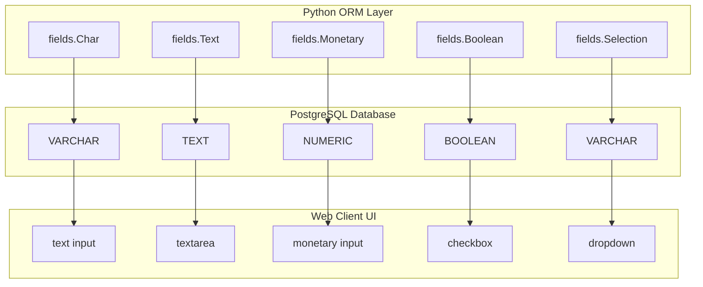

# Odoo 19 Basic Fields: Reference & Implementation

Odoo models represent database tables, and fields represent the columns in those tables. Basic fields are the building blocks of Odoo data schemas, mapping Python attributes to PostgreSQL columns.

---

## Basic Column Data Types (Char, Integer, Float)
Basic fields are static, non-relational data types that store single values (text, numbers, booleans, dates, or selection options). They form the core schema of any model in the Odoo ORM.

---

## Storing Primitive Values in Odoo
Using the correct basic field ensures that data is validated correctly at the Python layer, stored efficiently in the PostgreSQL database, and rendered automatically with appropriate UI widgets in the web client.

---

## Choosing the Correct Basic Field Type
*   Use **Char** for short strings like names, codes, or URLs.
*   Use **Text** for multi-line details, descriptions, or logs.
*   Use **Integer** for counts, sequences, or order values.
*   Use **Float** for measurements, weights, or percentages.
*   Use **Monetary** for any financial amounts, prices, or taxes.
*   Use **Boolean** for toggles or true/false flags.
*   Use **Selection** for static dropdown menus.
*   Use **Date** / **Datetime** for temporal tracking.

---

## When to Avoid Char (Using Relational or Selection)
*   **Do not** use `Float` for money; always use `Monetary` to avoid rounding errors and handle multi-currency formatting automatically.
*   **Do not** use `Char` for long descriptions; use `Text` to avoid database size limits (usually 255 characters).
*   **Do not** use `Selection` if the options need to be edited dynamically by users; use a `Many2one` relation instead.

---

## Defining Basic Fields & Field Attributes
Here is the core Python syntax for defining basic fields in Odoo 19:

```python
from odoo import models, fields

class AuctionItem(models.Model):
    _name = 'auction.item'
    _description = 'Auction Item'

    # String Fields
    name = fields.Char(string="Title", size=100, required=True, index=True)
    description = fields.Text(string="Description", translate=True)
    
    # Numeric Fields
    quantity = fields.Integer(string="Quantity", default=1)
    weight = fields.Float(string="Weight (kg)", digits=(6, 2))
    
    # Monetary Fields (requires a currency_id field on the same model)
    currency_id = fields.Many2one('res.currency', string="Currency")
    reserve_price = fields.Monetary(string="Reserve Price", currency_field='currency_id')
    
    # Boolean & Selection
    is_taxable = fields.Boolean(string="Taxable", default=True)
    condition = fields.Selection([
        ('new', 'New/Mint'),
        ('used', 'Used'),
        ('damaged', 'Damaged'),
    ], string="Condition", default='used', required=True)
    
    # Date & Datetime
    received_date = fields.Date(string="Received Date", default=fields.Date.context_today)
    auction_start = fields.Datetime(string="Auction Start", default=fields.Datetime.now)
```

---

## Text, Numeric, and Binary Configuration
Below is a complete Odoo 19 Python model demonstrating basic fields configuration options like default values, translated strings, and read-only attributes:

```python
from odoo import models, fields

class ProductWarranty(models.Model):
    _name = 'product.warranty'
    _description = 'Product Warranty Details'

    serial_number = fields.Char(
        string="Serial Number", 
        required=True, 
        copy=False, 
        index=True
    )
    terms_conditions = fields.Text(
        string="Terms & Conditions", 
        translate=True, 
        help="Translated terms shown to portal users"
    )
    duration_months = fields.Integer(
        string="Duration (Months)", 
        default=12, 
        readonly=True
    )
    is_extended = fields.Boolean(
        string="Extended Warranty", 
        default=False
    )
    purchase_date = fields.Date(
        string="Purchase Date", 
        default=fields.Date.context_today
    )
    expiration_datetime = fields.Datetime(
        string="Expiration Date & Time", 
        default=fields.Datetime.now
    )
```

---

## Precision Errors & Binary File Bloat
1.  **Direct Function Call in Default Arguments**: Forgetting that `default=fields.Datetime.now()` sets the default to the server start time. Always pass the callable `default=fields.Datetime.now` or `default=fields.Date.context_today`.
2.  **Missing `currency_id` for Monetary Fields**: Using `fields.Monetary` without defining a companion `Many2one('res.currency')` field named `currency_id` (or specifying `currency_field` explicitly).
3.  **Unindexed Search Fields**: Leaving fields like `serial_number` unindexed (`index=True`) when they are frequently queried in search bars, leading to sequential table scans.

---

## PostgreSQL Column Size & Write Speeds
*   **Indexing (`index=True`)**: Adds a database-level B-tree index. Do this for code, reference, or name columns. Never index high-write columns with low cardinality (like Booleans).
*   **Char Size Limit (`size=100`)**: Forces database validation and matches field lengths.
*   **Text Field Storage**: PostgreSQL stores short text in-line, but long text (>2KB) is compressed and stored in the toast table, which requires extra disk seeks when read. Avoid reading description fields in list views.

---

## Senior Architect: Monitored Changes & Field Groups
In Odoo 19:
*   `translate=True` uses the new translation JSONB fields in PostgreSQL where available. This makes searching translations extremely fast without joining separate tables.
*   `Date.context_today` and `Datetime.context_timestamp` are preferred for defaults because they automatically handle the user's timezone from the environment context, preventing offset issues.

<div class="senior-note">
  <strong>Senior Tip:</strong> When using a <strong>Monetary</strong> field, Odoo 19 requires you to have a <code>currency_id</code> field (Many2one to 'res.currency') on the same model. If your field is named <code>currency_id</code>, Odoo finds it automatically. If you use a different name, you must specify it using <code>currency_field='your_field_name'</code>.
</div>

---

## Field Architecture: UI to Database Mapping

This diagram shows how Odoo Python basic fields map to PostgreSQL column types and user interface inputs:



---

## 📝 Knowledge Check & Code Challenge

<div class="quiz-container">
  <div class="quiz-question">1. What is the difference between `Char` and `Text` fields?</div>
  <input type="text" class="quiz-input" placeholder="Type your answer here...">
  <button class="quiz-check" data-answer="`Char` is for single-line text with a limited length (usually 255), while `Text` is for multi-line text with no length limit." onclick="checkQuiz(this)">Check Answer</button>
  <div class="quiz-result"></div>
</div>

<div class="quiz-container">
  <div class="quiz-question">2. How do you make a field required in Odoo?</div>
  <input type="text" class="quiz-input" placeholder="Type your answer here...">
  <button class="quiz-check" data-answer="By setting the `required=True` parameter in the field definition." onclick="checkQuiz(this)">Check Answer</button>
  <div class="quiz-result"></div>
</div>


---

## Related Fields Guides
*   [Relational Fields](fields_relational.md)
*   [Advanced Field Logic](fields_advanced.md)
*   [Defining Models](models.md)
