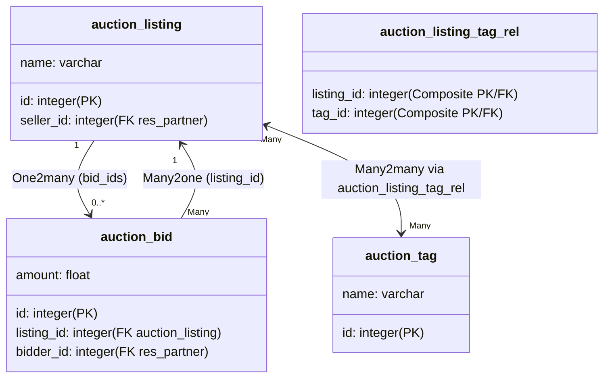

# Odoo 19 Relational Fields: Many2one, One2many, and Many2many

Relational fields link models together, mapping relationships from database tables to Python objects and allowing developers to navigate the data graph seamlessly.

---

## Relational Fields (Many2one, One2many, Many2many)
Relational fields represent SQL relationships (Many-to-One, One-to-Many, Many-to-Many) at the Odoo ORM layer. They map foreign keys, inverse collections, and junction tables into recordset references.

---

## Building Database Relationships & Constraints
Modern database design requires normalization. Relational fields ensure referential integrity, support database constraints (like cascade deletion), and provide a clean API to retrieve and manipulate associated records.

---

## Choosing between Odoo Relational Types
*   Use **Many2one** when the current record belongs to exactly one record in another model (e.g., an Invoice belongs to a Customer).
*   Use **One2many** to represent a collection of child records that belong to the current record (e.g., an Invoice contains many Invoice Lines).
*   Use **Many2many** when multiple records in one model relate to multiple records in another (e.g., an Item can have multiple Tags, and a Tag can apply to multiple Items).

---

## When to Use Selection Fields (Instead of Relations)
*   **Do not** use `One2many` without a corresponding `Many2one` field in the child model.
*   **Do not** use `Many2many` if the link requires additional metadata (like a quantity or price on the connection). In that case, create a middle transactional model with two `Many2one` fields.
*   **Do not** use relational fields for simple, self-contained data. For instance, do not create a model for simple status strings when a `Selection` field works better.

---

## Declaring Relational Fields in Python
Here is the syntax for defining relational fields in Odoo 19:

```python
from odoo import models, fields

# Many2one (Child -> Parent)
parent_id = fields.Many2one(
    comodel_name='res.partner',
    string="Customer",
    ondelete='restrict',  # 'cascade', 'set null', 'restrict'
    index=True            # Odoo indexes Many2one fields automatically by default
)

# One2many (Parent -> Children)
line_ids = fields.One2many(
    comodel_name='account.move.line',
    inverse_name='move_id',  # Points to the Many2one field in the co-model
    string="Journal Lines"
)

# Many2many (N <-> M Relation)
tag_ids = fields.Many2many(
    comodel_name='account.analytic.tag',
    relation='account_move_tag_rel',    # Optional: Custom junction table name
    column1='move_id',                 # Optional: Local column name in table
    column2='tag_id',                  # Optional: Remote column name in table
    string="Analytic Tags"
)
```

---

## Defining Invoices, Bids, and Tags Relationships
The following example defines an Auction Listing system demonstrating all three relationships with bidirectional traversal:

```python
from odoo import models, fields

class AuctionListing(models.Model):
    _name = 'auction.listing'
    _description = 'Auction Listing'

    name = fields.Char("Title", required=True)
    seller_id = fields.Many2one('res.partner', string="Seller", ondelete='restrict')
    
    # One2many: Listing has many Bids
    bid_ids = fields.One2many('auction.bid', 'listing_id', string="Bids")
    
    # Many2many: Listing can have multiple Tags
    tag_ids = fields.Many2many('auction.tag', string="Tags")

class AuctionBid(models.Model):
    _name = 'auction.bid'
    _description = 'Auction Bid'

    listing_id = fields.Many2one('auction.listing', string="Listing", ondelete='cascade', required=True)
    bidder_id = fields.Many2one('res.partner', string="Bidder", ondelete='restrict', required=True)
    amount = fields.Float("Bid Amount", required=True)

class AuctionTag(models.Model):
    _name = 'auction.tag'
    _description = 'Auction Tag'

    name = fields.Char("Tag Name", required=True)
    # Inverse Many2many is optional, but defined here to list items from a tag
    listing_ids = fields.Many2many('auction.listing', string="Listings")
```

---

## Missing Co-model Names & Circular Dependencies
1.  **Forgetting `ondelete` Strategy on Mandatory Fields**: Not setting `ondelete='cascade'` when parent deletion should clean up children. For instance, leaving bids orphaned when listing is deleted will trigger PostgreSQL constraint errors.
2.  **Omitting `inverse_name` in One2many**: Leaving out the target model column name or pointing it to a non-existent `Many2one` field, causing MkDocs strict checks or Odoo boot errors.
3.  **Writing raw ID values instead of Command Namespace helper objects**: In Odoo 19, trying to update a relational field using raw integers `record.write({'tag_ids': [1, 2]})` is bad practice. Always use `Command` objects: `record.write({'tag_ids': [Command.set([1, 2])]})`.

---

## SQL Joins, Inverse Fields, and Relational Indexes
*   **Foreign Key Indexes**: Odoo automatically indexes all `Many2one` fields (`index=True` is the default).
*   **Junction Table Indexing**: For `Many2many`, Odoo creates composite primary keys on the junction table (`(move_id, tag_id)`). This accelerates joins in either direction.
*   **Prefetching & Lazy Loading**: Odoo uses a batch prefetch mechanism to avoid N+1 query loops. Ensure records are processed in recordsets to allow Odoo to batch fetch relations.

---

## Senior Architect: Many2many Relational Table Overrides
In Odoo 19:
*   Dynamic filtering using `domain` parameter:
    ```python
    category_id = fields.Many2one(
        'product.category', 
        string="Category", 
        domain="[('active', '=', True), ('parent_id', '!=', False)]"
    )
    ```
*   You can pass active user information to dynamic domains using context variables: `domain="[('company_id', '=', allowed_company_ids[0])]"`

---

## Relational Database Join Topology

This diagram shows how `Many2one` and `One2many` map to a single database schema, and how `Many2many` uses a junction table in PostgreSQL:



---

## 💻 Code Challenge

**Define a Many2one field that links to the 'res.partner' model and deletes the record if the partner is removed.**

<div class="code-challenge">
<pre><code>partner_id = fields.<input type="text" class="quiz-input-inline w-80" data-answer="Many2one">('<input type="text" class="quiz-input-inline w-100" data-answer="res.partner">', string="Partner", ondelete='<input type="text" class="quiz-input-inline w-70" data-answer="cascade">')
</code></pre>
<button class="quiz-check" onclick="checkCodeChallenge(this)">Check Code</button>
<div class="quiz-result"></div>
</div>


---

## 📝 Knowledge Check

<div class="quiz-container">
  <div class="quiz-question">1. What are the three types of relational fields in Odoo?</div>
  <input type="text" class="quiz-input" placeholder="Type your answer here...">
  <button class="quiz-check" data-answer="`Many2one`, `One2many`, and `Many2many`." onclick="checkQuiz(this)">Check Answer</button>
  <div class="quiz-result"></div>
</div>


---

## Related Database Guides
*   [Basic Fields](fields_basic.md)
*   [Advanced Field Logic](fields_advanced.md)
*   [Relational Commands (Command)](../crud/relational_commands.md)
*   [Recordset Helpers](../env/recordset_helpers.md)
