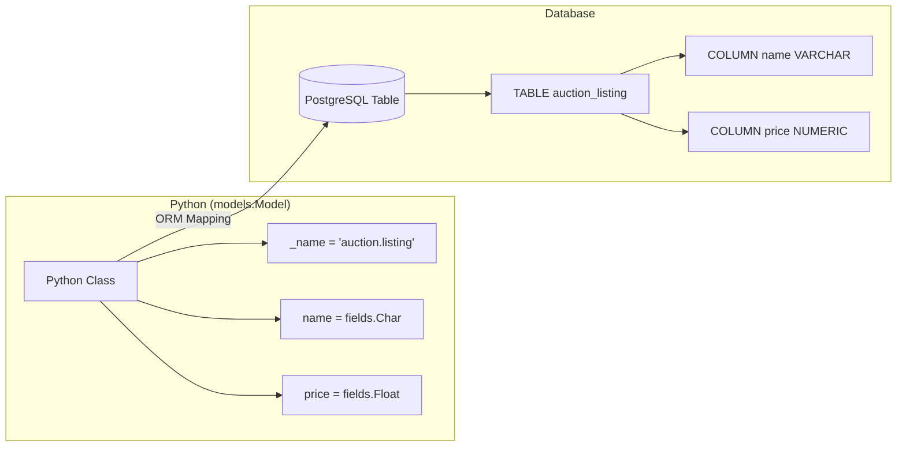

# Odoo 19 Models: The Foundation of Data

In Odoo, **Models** are the backbone of the entire system. They define how data is structured, stored in the PostgreSQL database, and interacted with via the ORM (Object-Relational Mapping).

!!! info "Odoo 19 Modernization"
    Odoo 19 introduces significant simplifications to model definitions, including automatic naming conventions and declarative constraints.

---

## 1. Defining a Model



A model is a Python class that inherits from `models.Model`. When you define a class, Odoo automatically maps it to a database table.

### Model Attributes Deep Dive
Attributes starting with an underscore (`_`) are used to configure the model's behavior.

| Attribute | Description | Default / Example |
| :--- | :--- | :--- |
| **`_name`** | The unique identifier for the model (dot-notation). | `auction.listing` |
| **`_description`** | A user-friendly title for the model. | `Auction Listing` |
| **`_order`** | Defines the default sorting for recordsets. | `'create_date desc, name'` |
| **`_rec_name`** | Specifies which field to use for display (e.g., in Many2one). | Defaults to `name` |
| **`_inherit`** | Name of the model(s) to extend (Classical inheritance). | `['mail.thread']` |
| **`_table`** | The actual SQL table name (rarely changed). | `auction_listing` |

### Odoo 19: Automatic Model Naming
In Odoo 19, the `_name` attribute is now **optional**. If omitted, Odoo derives the model name from the CamelCase class name by inserting dots before capital letters (except the first one) and lowercasing.

!!! tip "Try it Yourself: Auto-Naming"
    ```python
    from odoo import models, fields

    class AuctionListing(models.Model):
        # Odoo 19 automatically sets _name = 'auction.listing'
        _description = 'Auction Listing'
        
        name = fields.Char(string="Title")
    ```

## 2. Model Types

Odoo provides three main types of models, each serving a distinct purpose in the ecosystem.

### Comparison Matrix: Model Types
| Feature | `models.Model` | `models.TransientModel` | `models.AbstractModel` |
| :--- | :--- | :--- | :--- |
| **Persistence** | Permanent (PostgreSQL Table) | Temporary (Vacuumed) | None (Shared Logic) |
| **Primary Use** | Core Business Data | Wizards / Temp UI State | Mixins / Base Classes |
| **Access Rights** | Restricted (CRUD) | Broad (for Wizards) | N/A (Inherited) |
| **Performance** | DB-Heavy | DB-Light | High (No DB Table) |
| **Inherits From** | `models.BaseModel` | `models.BaseModel` | `models.BaseModel` |

### Standard Model (`models.Model`)
The most common type. Data is stored permanently in the database. Use this for anything that needs to persist (e.g., `auction.listing`).

### Transient Model (`models.TransientModel`)
Inherit from this for **Wizards**. Data is stored in the database but is automatically deleted (vacuumed) periodically. 
- **Key Feature:** Perfect for multi-step processes where you need to collect user input before performing an action.
- **Limit:** Access rights are usually broader, but data is not meant for long-term storage.

### Abstract Model (`models.AbstractModel`)
Used as a **template** or **mixin**. It defines fields and methods that other models can inherit, but it **never creates a database table** for itself.

- **Primary Use:** To share code across unrelated models (e.g., adding a "Followers" system or "Archive" logic).
- **Behavior:** When another model inherits from an `AbstractModel`, the abstract fields and methods are added to the *inheritor's* database table and class.

#### Example: Creating a Custom Mixin
```python
class DiscountMixin(models.AbstractModel):
    _name = "auction.discount.mixin"
    _description = "Handles shared discount logic"

    discount_rate = fields.Float(string="Discount %", default=0.0)

    def apply_discount(self, price):
        return price * (1 - (self.discount_rate / 100))

# Usage in a standard model
class AuctionListing(models.Model):
    _name = 'auction.listing'
    _inherit = ['auction.discount.mixin'] # Logic is "mixed in"
    
    name = fields.Char()
    price = fields.Float()
```

!!! tip "Architect Insight"
    Use `AbstractModel` instead of standard inheritance when you want the functionality to be reusable but you don't need a central table that links all the children together.

### Senior: SQL View Models (`_auto = False`)
Sometimes you need to report on data joined from multiple massive tables. Instead of using a standard `Model` or a slow Python compute method, you can tell Odoo to read from a **PostgreSQL View**.

To do this, use a standard `models.Model`, but set `_auto = False` and override the `init()` method to run your custom SQL `CREATE VIEW` statement. Odoo will skip its automatic table creation and use your SQL view instead.

```python
class AuctionReport(models.Model):
    _name = 'auction.report'
    _description = 'Auction Statistics'
    _auto = False # Do not create a table!

    # Define fields to match the SQL view columns
    seller_id = fields.Many2one('res.users', readonly=True)
    total_bids = fields.Integer(readonly=True)

    def init(self):
        # Create the SQL view
        self.env.cr.execute("""
            CREATE OR REPLACE VIEW auction_report AS (
                SELECT seller_id, COUNT(id) as total_bids 
                FROM auction_bid 
                GROUP BY seller_id
            )
        """)
```

---

## 3. Field Types Deep Dive
Fields define the "columns" of your database table. Odoo provides a rich set of field types to handle different data formats.

### Basic Fields
*   **`Char`**: A single line of text (e.g., a name).
*   **`Text`**: Multiple lines of text (e.g., a description).
*   **`Integer`**: Whole numbers.
*   **`Float`**: Decimal numbers. Use `digits` to control precision.
*   **`Boolean`**: A simple checkbox (True/False).

### Advanced Fields
*   **`Monetary`**: Handles currency-aware amounts. **Requires** a `currency_id` field on the model.
*   **`Selection`**: A dropdown menu with static choices.
*   **`Binary`**: Stores files (PDFs, images, etc.).
*   **`Image`**: Optimized for images (provides resizing and thumbnailing).

!!! example "Try it Yourself: Field Definitions"
    ```python
    from odoo import models, fields

    class AuctionListing(models.Model):
        _name = 'auction.listing'

        # Basic Fields
        name = fields.Char(string="Product Name", required=True)
        description = fields.Text(string="Condition Report")
        
        # Numeric & Choice
        start_price = fields.Monetary(string="Starting Price", currency_field='currency_id')
        currency_id = fields.Many2one('res.currency', string="Currency")
        condition = fields.Selection([
            ('new', 'Brand New'),
            ('used', 'Used - Excellent'),
            ('fair', 'Used - Fair')
        ], string="Condition", default='used')

        # Advanced
        document = fields.Binary(string="PDF Certificate")
        photo = fields.Image(string="Main Image", max_width=1024)
    ```

---

## 4. Common Field Parameters
You can customize how fields behave using several parameters:

| Parameter | Purpose |
| :--- | :--- |
| **`string`** | The label shown to the user in the UI. |
| **`required`** | If `True`, the field cannot be empty. |
| **`readonly`** | If `True`, the user cannot edit the field in the UI. |
| **`index`** | If `True`, creates a database index for faster searching. |
| **`tracking`** | If `True`, changes to this field are logged in the Chatter. |
| **`default`** | Sets a static value or a function to compute the initial value. |

!!! warning "Tracking Requirement"
    To use `tracking=True`, your model **must** inherit from `mail.thread` and include the `<chatter/>` component in the XML view.

---

## 5. Special Odoo 19 Attributes
Odoo 19 introduces cleaner ways to handle database-level configurations.

### `models.Constraint` (New)
Replaces the old `_sql_constraints` list for database-level validation.
```python
class AuctionBid(models.Model):
    _name = 'auction.bid'

    amount = fields.Monetary(string="Bid Amount")
    
    _check_amount = models.Constraint(
        'CHECK(amount > 0)',
        'The bid amount must be strictly positive!'
    )
```

### `models.Index` (New)
Allows defining complex or composite database indexes declaratively.
```python
class AuctionListing(models.Model):
    _name = 'auction.listing'
    
    date_end = fields.Datetime()
    state = fields.Selection(...)

    # Composite index for faster dashboard queries
    _state_date_idx = models.Index('(state, date_end DESC)')
```

---

## 🏁 Senior Checkpoint
*   **Key Concept:** Python classes map 1:1 to Database tables via the `models.Model` inheritance.
*   **Architect Insight:** Odoo 19's `models.Constraint` and `models.Index` are declarative, making inheritance and maintenance significantly cleaner than the old list-based style.
*   **Verify Your Knowledge:** Why is `_name` now optional in Odoo 19? (Answer: Because Odoo can derive it automatically from the class name).

!!! success "Next Step"
    Data needs types. Let's explore [Advanced Fields](fields.md) to define your data structure.

---

## 💻 Code Challenge

**Fill in the missing parts to define a new Odoo 19 model:**

<div class="code-challenge">
<pre><code>from odoo import models, fields

class AuctionListing(<input type="text" class="quiz-input-inline w-120" data-answer="models.Model">):
    <input type="text" class="quiz-input-inline w-60" data-answer="_name"> = 'auction.listing'
    _description = 'Auction Listing'
    
    name = fields.Char(string="Title", <input type="text" class="quiz-input-inline w-120" data-answer="required=True">)
</code></pre>
<button class="quiz-check" onclick="checkCodeChallenge(this)">Check Code</button>
<div class="quiz-result"></div>
</div>

---

## 📝 Knowledge Check

<div class="quiz-container">
  <div class="quiz-question">1. Which attribute is used to define the user-friendly title of a model?</div>
  <input type="text" class="quiz-input" placeholder="Type your answer here...">
  <button class="quiz-check" data-answer="The `_description` attribute." onclick="checkQuiz(this)">Check Answer</button>
  <div class="quiz-result"></div>
</div>

<div class="quiz-container">
  <div class="quiz-question">2. In Odoo 19, what happens if you define a class `AuctionBid(models.Model)` without a `_name`?</div>
  <input type="text" class="quiz-input" placeholder="Type your answer here...">
  <button class="quiz-check" data-answer="Odoo automatically sets `_name = 'auction.bid'`." onclick="checkQuiz(this)">Check Answer</button>
  <div class="quiz-result"></div>
</div>

<div class="quiz-container">
  <div class="quiz-question">3. Which field type is best suited for handling currency-aware amounts in Odoo?</div>
  <input type="text" class="quiz-input" placeholder="Type your answer here...">
  <button class="quiz-check" data-answer="`fields.Monetary`. Note that it requires a `currency_id` field on the same model." onclick="checkQuiz(this)">Check Answer</button>
  <div class="quiz-result"></div>
</div>

<div class="quiz-container">
  <div class="quiz-question">4. What is the purpose of the `tracking=True` parameter on a field?</div>
  <input type="text" class="quiz-input" placeholder="Type your answer here...">
  <button class="quiz-check" data-answer="It enables logging of field changes in the Chatter (requires the model to inherit from `mail.thread`)." onclick="checkQuiz(this)">Check Answer</button>
  <div class="quiz-result"></div>
</div>

---

## 🛠️ Master Project Challenge: The Auction Base
Now it's your turn to start building the **Auction Marketplace**.

**Goal:** Define the core model for our auctions.
1.  Create a model named `auction.listing`.
2.  Add a `name` field for the item title.
3.  Add a `description` field for the item condition.
4.  Add a `state` field with options: `draft`, `open`, `closed`.

> **Hint:** Use the CamelCase class name `AuctionListing` to let Odoo 19 automatically set the `_name`.

??? success "Show Solution"
    ```python title="models/auction_listing.py"
    from odoo import models, fields

    class AuctionListing(models.Model):
        _description = 'Auction Listing'

        name = fields.Char(string="Title")
        description = fields.Text(string="Condition")
        state = fields.Selection([
            ('draft', 'Draft'),
            ('open', 'Open'),
            ('closed', 'Closed')
        ], string="State", default='draft')
    ```

---

<div class="feedback-container">
    <span class="feedback-label">Was this page helpful?</span>
    <div class="feedback-buttons">
        <button class="feedback-btn" onclick="sendFeedback(true)">👍 Yes</button>
        <button class="feedback-btn" onclick="sendFeedback(false)">👎 No</button>
    </div>
</div>
