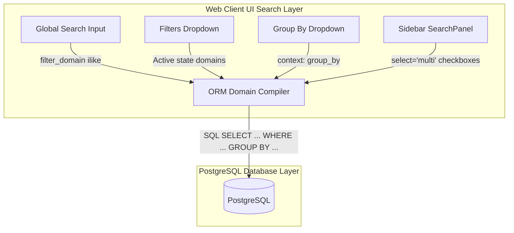

# Search Views & Search Panels: Data Filtering & Sidebar Navigation

Every transactional model in Odoo requires a **Search View**. While list and kanban views layout records, the search view governs how users find, filter, and group that data.

---

## Search Views & Search Panels UI
An Odoo Search View is an XML record containing directives that define the search parameters in the top-right search box, the available toggle filters, standard group-by configurations, and the left-side hierarchical selection panel (Search Panel).

---

## Facilitating Record Filtering & Navigation
Enterprise databases contain thousands of records. Search views allow users to locate specific entries using keyword lookups, pre-defined domain filters, and dynamic grouping pipelines, rendering queries instantly.

---

## Designing Custom Search and Panel Filters
*   Use to define searchable fields on all main menu list and kanban layouts.
*   Use to create logical group-by categories (e.g. group sales by representative).
*   Use to configure date range selection inputs (e.g. filter entries by month).
*   Use left-sidebar `<searchpanel>` lists to categorize records matching key relational nodes (e.g. sorting items by folder category).

---

## When to Rely on Default Search Definitions
*   **Do not** add a `<searchpanel>` sidebar for high-cardinality fields (like `res.partner` or numeric ID fields) because Odoo will attempt to fetch and render all unique options in the sidebar, causing serious view load latency.

---

## Declaring Search Views in XML
Here is the Odoo 19 XML structure for declaring a Search View:

```xml
<record id="view_auction_listing_search" model="ir.ui.view">
    <field name="name">auction.listing.search</field>
    <field name="model">auction.listing</field>
    <field name="arch" type="xml">
        <search string="Auction Search">
            <!-- 1. Searchable fields -->
            <field name="name" string="Title"/>
            <field name="seller_id"/>
            
            <!-- 2. Toggle Filters -->
            <filter string="Open Listings" name="state_open" domain="[('state', '=', 'open')]"/>
            <separator/> <!-- Separator forces AND logic between adjacent filter groups -->
            <filter string="High Value" name="high_value" domain="[('initial_price', '>', 5000)]"/>
            
            <!-- 3. Group By options -->
            <group expand="0" string="Group By">
                <filter string="Seller" name="group_seller" context="{'group_by': 'seller_id'}"/>
            </group>
            
            <!-- 4. Left sidebar search panel -->
            <searchpanel>
                <field name="state" icon="fa-filter" select="multi"/>
            </searchpanel>
        </search>
    </field>
</record>
```

---

## Defining Filters, Group-bys, and Search Panels

### A. Advanced Date and Multi-field Filter Domains
```xml
<search>
    <!-- One search box checking both Listing Name AND Seller Name (OR search) -->
    <field name="name" string="Search Title/Seller" 
           filter_domain="['|', ('name', 'ilike', self), ('seller_id.name', 'ilike', self)]"/>
           
    <!-- Declarative date filter: generates Today, This Month, etc. dropdown options -->
    <filter string="Ending Date" name="end_date" date="date_end"/>
</search>
```

### B. Configuring Default View Filters in Window Actions
To activate specific filters automatically when a user opens a view menu, set context flags in the Action record:

```xml
<record id="action_auction_listings" model="ir.actions.act_window">
    <field name="name">Active Auctions</field>
    <field name="res_model">auction.listing</field>
    <field name="view_mode">list,form</field>
    <!-- Context prefix search_default_ activates the corresponding filter -->
    <field name="context">{'search_default_state_open': 1}</field>
</record>
```

---

## Broken Fields & Invalid Domain Mappings
1.  **Missing Separators in Filters**: Defining toggle filters next to each other without placing a `<separator/>` tag between them. By default, Odoo combines adjacent filters using a logical **OR** (`|`) statement. Adding a `<separator/>` forces a logical **AND** (`&`) operation.
2.  **Referencing fields omitted from models**: Specifying search fields in the XML layout that are not defined in the model’s Python class. This triggers database loading warnings at server boot.

---

## Indexes, Context Filtering, and Database Search Cost
*   **Logical ANDs / ORs**: Keep filter domains simple. Complex OR queries require index scans on multiple keys, increasing database query latency.
*   **Search Panel Select Options**: Setting `select="multi"` on search panels accelerates filtering but queries count groups in background queries. Ensure the groupby field in the search panel is indexed.

---

## Senior Architect: Overriding default_search_for
In Odoo 19:
*   Use `filter_domain` to implement dynamic "Global Search" inputs where a single search box queries across multiple model fields:
    ```xml
    <field name="name" string="Keyword" 
           filter_domain="['|', '|', ('name', 'ilike', self), ('ref', 'ilike', self), ('partner_id.name', 'ilike', self)]"/>
    ```
*   You can extend existing search views using standard XPath inheritance records pointing to parent view identifiers.

---

## Search Panel & Database Filter Pipeline

This diagram shows how search inputs and panels inside Odoo's Web Client UI map to ORM domains and compile into SQL select queries:



---

## 💻 Code Challenge

**Create a filter for the Auction Marketplace that finds all "High Value" listings (start_price > 1000):**

<div class="code-challenge">
<pre><code>&lt;filter string="High Value" name="high_value" <input type="text" class="quiz-input-inline w-150" data-answer="domain=\"[('start_price', '>', 1000)]\"">/&gt;</code></pre>
<button class="quiz-check" onclick="checkCodeChallenge(this)">Check Code</button>
<div class="quiz-result"></div>
</div>


---

## 📝 Knowledge Check

<div class="quiz-container">
  <div class="quiz-question">1. Which XML tag is used to create a sidebar navigation for filtering?</div>
  <input type="text" class="quiz-input" placeholder="Type your answer here...">
  <button class="quiz-check" data-answer="The `<searchpanel>` tag." onclick="checkQuiz(this)">Check Answer</button>
  <div class="quiz-result"></div>
</div>

<div class="quiz-container">
  <div class="quiz-question">2. How do you group records in a search view?</div>
  <input type="text" class="quiz-input" placeholder="Type your answer here...">
  <button class="quiz-check" data-answer="By using a `<filter>` tag inside a `<group>` block with a `context={'group_by': 'field_name'}`." onclick="checkQuiz(this)">Check Answer</button>
  <div class="quiz-result"></div>
</div>

<div class="quiz-container">
  <div class="quiz-question">3. What does `operator="child_of"` do on a search field?</div>
  <input type="text" class="quiz-input" placeholder="Type your answer here...">
  <button class="quiz-check" data-answer="It allows searching for a parent record and automatically includes all its children (hierarchical search)." onclick="checkQuiz(this)">Check Answer</button>
  <div class="quiz-result"></div>
</div>

<div class="quiz-container">
  <div class="quiz-question">4. Where should you place a Search View definition?</div>
  <input type="text" class="quiz-input" placeholder="Type your answer here...">
  <button class="quiz-check" data-answer="Inside an `ir.ui.view` record with the `model` set to the target model." onclick="checkQuiz(this)">Check Answer</button>
  <div class="quiz-result"></div>
</div>


---

## Related View Guides
*   [List Views](views_list.md)
*   [Form Views](views_form.md)
*   [Kanban Views](views_kanban.md)
