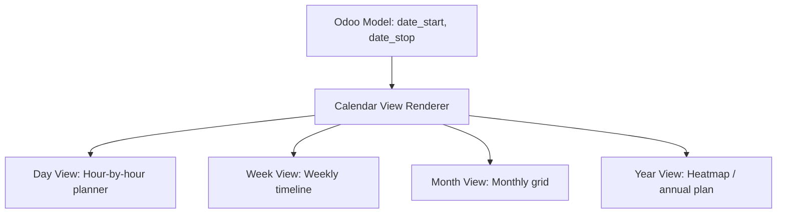

# Calendar Views

## Odoo Calendar View Engine
Calendar views present records on an interactive timeline (day, week, month, or year view). They are critical for managing date-driven business flows such as booking schedules, project deadlines, and auction events.



---

## XML Syntax & Configuration
To define a Calendar view, specify the `<calendar>` tag in the view's architecture. It requires at least the `date_start` attribute:

```xml
<record id="view_auction_listing_calendar" model="ir.ui.view">
    <field name="name">auction.listing.calendar</field>
    <field name="model">auction.listing</field>
    <field name="arch" type="xml">
        <calendar string="Auction Schedule" 
                  date_start="date_begin" 
                  date_stop="date_end" 
                  color="seller_id" 
                  mode="month"
                  quick_add="False"
                  event_open_popup="True">
            <!-- Fields rendered inside the event box/popover card -->
            <field name="name"/>
            <field name="starting_price" widget="monetary"/>
            <field name="seller_id"/>
        </calendar>
    </field>
</record>
```

### Critical Attributes Reference

| Attribute | Required | Description |
| :--- | :--- | :--- |
| **`date_start`** | **Yes** | The model field containing the starting datetime (or date) of the event. |
| **`date_stop`** | No | The model field containing the ending datetime of the event. |
| **`date_delay`** | No | Alternative to `date_stop`. The field containing event duration (as an integer/float representing hours or days). |
| **`color`** | No | Colors events dynamically based on this field (e.g. `seller_id` or `state`). Odoo auto-assigns a color palette. |
| **`mode`** | No | The default timeline zoom: `day`, `week`, `month`, `year` (Default is `month`). |
| **`quick_add`** | No | If `True`, clicking a calendar cell allows creating an event by typing only a name. If `False`, it forces opening the full form view. |
| **`event_open_popup`** | No | If `True`, clicking an existing event opens it in a dialog modal rather than redirecting the whole window. |
| **`all_day`** | No | A Boolean field specifying if the event spans the entire day (omits hours/time). |

---

## Popover Details and Card Customization
Fields declared inside the `<calendar>` element tags are displayed on the event card or within the hover popover. You can format these fields using widgets or standard field parameters:

```xml
<calendar date_start="date_begin" date_stop="date_end">
    <!-- Displays the auction name in bold -->
    <field name="name"/>
    <!-- Displays monetary amount formatted with currency symbols -->
    <field name="starting_price" widget="monetary"/>
    <!-- Displays the category tag -->
    <field name="category_id" filters="1"/>
</calendar>
```

### The `filters` Attribute
Adding `filters="1"` to a field tag inside the calendar view displays a sidebar filter list. Users can toggle checkboxes in this sidebar to hide or show events dynamically based on that field's value (e.g. filtering events by status or manager).

---

## 🏁 Senior Checkpoint
*   **Key Concept**: Calendar views map records onto timelines using start/stop dates. Sidebars are automatically generated for color-coded categories.
*   **Architect Insight**: For clean UX in administrative applications, set `quick_add="False"` and `event_open_popup="True"`. This prevents users from accidentally creating records without required fields and allows rapid editing in modals without leaving the schedule screen.
*   **Verify Your Knowledge**: What happens if the `date_stop` field is left empty or not defined? (Answer: The event defaults to a pre-defined duration, typically 1 hour).

---

## 📝 Knowledge Check

<div class="quiz-container">
  <div class="quiz-question">1. Which XML attribute in the `<calendar>` tag is required to render events on the timeline?</div>
  <input type="text" class="quiz-input" placeholder="Type your answer here...">
  <button class="quiz-check" data-answer="date_start" onclick="checkQuiz(this)">Check Answer</button>
  <div class="quiz-result"></div>
</div>

<div class="quiz-container">
  <div class="quiz-question">2. Which attribute must be set to True on the `<calendar>` tag to display edit views inside a modal overlay instead of loading a new page?</div>
  <input type="text" class="quiz-input" placeholder="Type your answer here...">
  <button class="quiz-check" data-answer="event_open_popup=&quot;True&quot;" onclick="checkQuiz(this)">Check Answer</button>
  <div class="quiz-result"></div>
</div>

---

## 💻 Code Challenge

**Define a calendar view tag that schedules events starting at `date_begin`, ending at `date_end`, colors them by `seller_id`, and defaults to a weekly planning layout:**

<div class="code-challenge">
<pre><code>&lt;calendar <input type="text" class="quiz-input-inline w-450" data-answer="date_start=&quot;date_begin&quot; date_stop=&quot;date_end&quot; color=&quot;seller_id&quot; mode=&quot;week&quot;">&gt;
    &lt;field name="name"/&gt;
&lt;/calendar&gt;</code></pre>
<button class="quiz-check" onclick="checkCodeChallenge(this)">Check Code</button>
<div class="quiz-result"></div>
</div>

---

## Related Reporting Guides
*   [Pivot Views (BI)](views_pivot.md)
*   [Graph Views (BI)](views_graph.md)
*   [Specialized Views (Enterprise & Activity)](views_specialized.md)
*   [QWeb & Reports (v19)](../frontend/reports.md)

<div class="feedback-container">
    <span class="feedback-label">Was this page helpful?</span>
    <div class="feedback-buttons">
        <button class="feedback-btn" onclick="sendFeedback(true)">👍 Yes</button>
        <button class="feedback-btn" onclick="sendFeedback(false)">👎 No</button>
    </div>
</div>
