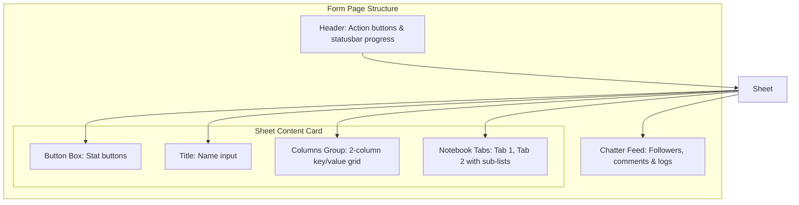

# Odoo 19 Form Views: Syntax & Implementation

Form views provide a rich, structured interface for creating, editing, and displaying single database records. They are the most complex view type in Odoo.

---

## 1. What is it
An Odoo Form View is an XML template that organizes individual fields into structural elements like buttons, state progress statusbars, side-by-side columns (groups), tabbed sections (notebooks), and chatter feeds.

---

## 2. Why
Form views contain the business logic interface. They orchestrate work processes, display lifecycle statuses, enable record modifications, and house sub-records (like order lines or comments) in a single consolidated workspace.

---

## 3. When
*   Use to create or edit records.
*   Use to execute complex processes (e.g., validating an invoice, running a wizard).
*   Use when displaying comprehensive details, notes, activities, and communication logs.

---

## 4. When Not
*   **Do not** use complex form views for simple key-value parameters or settings; use simple setting views.
*   **Do not** use form views for bulk record actions; use list views.

---

## 5. Syntax
Here is the core XML layout structure of an Odoo 19 form view:

```xml
<record id="view_model_name_form" model="ir.ui.view">
    <field name="name">model.name.form</field>
    <field name="model">model.name</field>
    <field name="arch" type="xml">
        <form>
            <!-- 1. Header: Statusbar & buttons -->
            <header>
                <button name="action_approve" string="Approve" type="object" 
                        invisible="state != 'draft'" class="btn-primary"/>
                <field name="state" widget="statusbar" statusbar_visible="draft,done"/>
            </header>
            
            <!-- 2. Sheet: Core Content Card -->
            <sheet>
                <!-- Smart Button Box -->
                <div class="oe_button_box" name="button_box">
                    <button name="action_view_lines" type="object" 
                            class="oe_stat_button" icon="fa-list-ul">
                        <field name="line_count" widget="statinfo" string="Lines"/>
                    </button>
                </div>
                
                <!-- Title -->
                <div class="oe_title">
                    <label for="name"/>
                    <h1><field name="name" placeholder="e.g. Vintage Item"/></h1>
                </div>
                
                <!-- Columns Group (2-column layout) -->
                <group>
                    <group string="Primary Info">
                        <field name="partner_id"/>
                        <field name="date"/>
                    </group>
                    <group string="Financials">
                        <field name="price"/>
                        <field name="company_id" groups="base.group_multi_company"/>
                    </group>
                </group>
                
                <!-- Tabbed notebook -->
                <notebook>
                    <page string="General Details" name="general">
                        <field name="description"/>
                    </page>
                </notebook>
            </sheet>
            
            <!-- 3. Chatter Feed -->
            <chatter/>
        </form>
    </field>
</record>
```

---

## 6. Examples
Below is a complete, real-world example of an Auction Listing form view including conditional visibility modifiers, smart buttons, and embedded list views:

```xml
<record id="view_auction_listing_form" model="ir.ui.view">
    <field name="name">auction.listing.form</field>
    <field name="model">auction.listing</field>
    <field name="arch" type="xml">
        <form>
            <header>
                <button name="action_confirm" string="Start Auction" type="object" 
                        invisible="state != 'draft'" class="btn-primary"/>
                <button name="action_cancel" string="Cancel" type="object" 
                        invisible="state in ('done', 'cancel')"/>
                <field name="state" widget="statusbar" statusbar_visible="draft,open,done" 
                       options="{'clickable': '1'}"/>
            </header>
            <sheet>
                <div class="oe_button_box" name="button_box">
                    <button name="action_view_bids" type="object" class="oe_stat_button" icon="fa-gavel">
                        <field name="bid_count" widget="statinfo" string="Bids"/>
                    </button>
                </div>
                <div class="oe_title">
                    <label for="name" class="oe_edit_only"/>
                    <h1><field name="name" placeholder="e.g. Antique Pocket Watch"/></h1>
                </div>
                <group>
                    <group string="Pricing Details">
                        <field name="initial_price" widget="monetary"/>
                        <field name="current_price" widget="monetary" readonly="1"/>
                        <field name="currency_id" invisible="1"/>
                    </group>
                    <group string="Timeline & Ownership">
                        <field name="seller_id" widget="many2one_avatar_user"/>
                        <field name="date_end"/>
                    </group>
                </group>
                <notebook>
                    <page string="Description" name="description">
                        <field name="description" placeholder="Describe the item condition..."/>
                    </page>
                    <page string="Bids Log" name="bids">
                        <field name="bid_ids">
                            <list editable="bottom" decoration-bf="amount &gt; 5000">
                                <field name="bidder_id"/>
                                <field name="amount"/>
                                <field name="date"/>
                            </list>
                        </field>
                    </page>
                </notebook>
            </sheet>
            <chatter/>
        </form>
    </field>
</record>
```

---

## 7. Common Mistakes
1.  **Placing Fields Outside `<group>` tags**: Putting input fields directly under `<sheet>` without nesting them inside `<group>`. This breaks the grid layout, leaving the label and field unaligned.
2.  **Using Deprecated `attrs` attributes**: Odoo 19 has completely removed the legacy `attrs` attribute (e.g., `attrs="{'invisible': [('state', '=', 'draft')]}"`). Always use direct boolean logic attributes: `invisible="state == 'draft'"` or `readonly="state in ('done', 'cancel')"`.
3.  **Missing companion fields**: Using monetary fields without including the `currency_id` field in the form view (even as `invisible="1"`), which breaks currency rendering.

---

## 8. Performance
*   **Notebook Lazy Loading**: Odoo only fetches and renders data for active notebooks tabs. If a form has massive sub-lists, place them in secondary tabs to avoid loading them during initial page loads.
*   **Invisible Fields Processing**: Fields marked `invisible="1"` are still loaded in the recordset cache. Limit the number of hidden fields to keep request payloads lightweight.

---

## 9. Senior
In Odoo 19:
*   The `get_views()` method hook can be overridden in Python to dynamically modify the form's structure based on groups or companies before loading the page.
*   Modifiers logic: Direct expressions like `readonly="state == 'done'"` are processed on-the-fly inside OWL views, reducing rendering delays compared to legacy client engines.

---

## 10. Diagrams

This diagram shows the structural elements layout of a standard Odoo Form view:



---

## 11. Related
*   [List Views](views_list.md)
*   [Kanban Views](views_kanban.md)
*   [XPath & View Overrides](xpath.md)
*   [Security & ACLs](../business/security.md)
