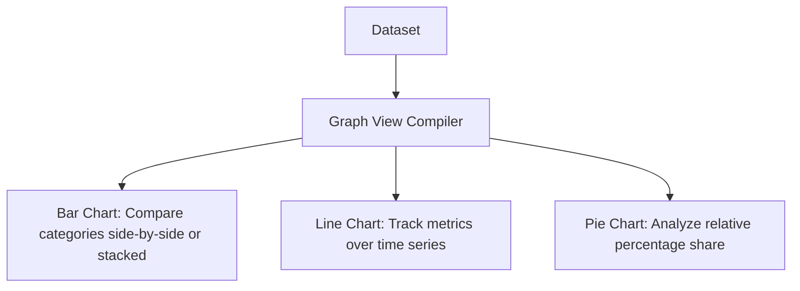

# Graph Views

## Odoo Graph View Engine
Graph views visualize trends, distributions, and comparisons in your datasets. They offer interactive visual analysis using bar charts, line graphs, and pie charts.



---

## XML Syntax & Configuration
To define a Graph view, write a `<graph>` element within the view architecture:

```xml
<record id="view_auction_bid_graph" model="ir.ui.view">
    <field name="name">auction.bid.graph</field>
    <field name="model">auction.bid</field>
    <field name="arch" type="xml">
        <graph string="Bid Trends" type="line" sample="1">
            <!-- Grouping Dimension 1: Create Date grouped by Month -->
            <field name="create_date" interval="month"/>
            <!-- Grouping Dimension 2 (Optional): Group by listing -->
            <field name="listing_id"/>
            <!-- Aggregated Measure Field -->
            <field name="amount" type="measure"/>
        </graph>
    </field>
</record>
```

### Critical Attributes Reference

| Attribute | Type | Values | Description |
| :--- | :--- | :--- | :--- |
| **`type`** | `string` | `bar`, `line`, `pie` | Specifies the default chart representation (Default is `bar`). |
| **`stacked`** | `boolean` | `True` or `False` | (Only for `bar` charts) Stacks sub-group data vertically instead of rendering columns side-by-side. |
| **`sample`** | `boolean` | `1` or `0` | Displays demo/blurred chart layouts if the active recordset is empty. |
| **`disable_linking`** | `boolean` | `1` or `0` | Prevents clicking graph nodes to drill down into the list of records. |
| **`order`** | `string` | `asc` or `desc` | Determines the sorting order of the graph categories. |

---

## Date Intervals and Groupings
When grouping by date or datetime fields, you should specify the time bucket interval using the `interval` attribute:

```xml
<!-- Group bids by day to track intra-day fluctuations -->
<field name="create_date" interval="day"/>

<!-- Group auctions by year for multi-year trends -->
<field name="date_end" interval="year"/>
```

### Supported Intervals
*   `day`: Groups by daily segments.
*   `week`: Groups by week (Monday-Sunday).
*   `month`: Groups by calendar month (Default).
*   `quarter`: Groups by calendar quarter.
*   `year`: Groups by calendar year.

---

## Working with Multiple Measures
Odoo allows users to toggle active measures inside the graph interface. You can set which fields are available as measures by declaring them inside the XML using `type="measure"`:

```xml
<graph string="Listing Operations">
    <field name="seller_id" type="row"/>
    <!-- Starting price and final sold price both enabled as measures -->
    <field name="starting_price" type="measure"/>
    <field name="sold_price" type="measure"/>
</graph>
```

---

## 🏁 Senior Checkpoint
*   **Key Concept**: Graph views represent tabular groupings graphically. You can group by up to two dimensions (row fields) and plot multiple measures.
*   **Architect Insight**: Combine graph views with pivot views inside the action definitions (e.g., `view_mode="kanban,list,form,graph,pivot"`) to provide users with direct analytical interfaces.
*   **Verify Your Knowledge**: What happens if you define a Pie chart with multiple grouping dimensions? (Answer: Odoo defaults to showing only the first grouping dimension, as pie charts cannot render nested sub-groups natively).

---

## 📝 Knowledge Check

<div class="quiz-container">
  <div class="quiz-question">1. What attribute value should you set on the `<graph>` element to default the view to a Pie Chart?</div>
  <input type="text" class="quiz-input" placeholder="Type your answer here...">
  <button class="quiz-check" data-answer="type=&quot;pie&quot;" onclick="checkQuiz(this)">Check Answer</button>
  <div class="quiz-result"></div>
</div>

<div class="quiz-container">
  <div class="quiz-question">2. Which attribute must be added to a date field tag inside a graph view to aggregate data by quarters instead of months?</div>
  <input type="text" class="quiz-input" placeholder="Type your answer here...">
  <button class="quiz-check" data-answer="interval=&quot;quarter&quot;" onclick="checkQuiz(this)">Check Answer</button>
  <div class="quiz-result"></div>
</div>

---

## 💻 Code Challenge

**Create a graph view XML snippet for a model that defaults to a stacked bar chart of bid counts (using quantity) grouped by listing:**

<div class="code-challenge">
<pre><code>&lt;graph string="Bids by Listing" <input type="text" class="quiz-input-inline w-260" data-answer="type=&quot;bar&quot; stacked=&quot;1&quot;">&gt;
    &lt;field name="listing_id"/&gt;
&lt;/graph&gt;</code></pre>
<button class="quiz-check" onclick="checkCodeChallenge(this)">Check Code</button>
<div class="quiz-result"></div>
</div>

---

## Related Reporting Guides
*   [Pivot Views (BI)](views_pivot.md)
*   [Calendar Views (Scheduling)](views_calendar.md)
*   [Specialized Views (Enterprise & Activity)](views_specialized.md)
*   [QWeb & Reports (v19)](../frontend/reports.md)

<div class="feedback-container">
    <span class="feedback-label">Was this page helpful?</span>
    <div class="feedback-buttons">
        <button class="feedback-btn" onclick="sendFeedback(true)">👍 Yes</button>
        <button class="feedback-btn" onclick="sendFeedback(false)">👎 No</button>
    </div>
</div>
