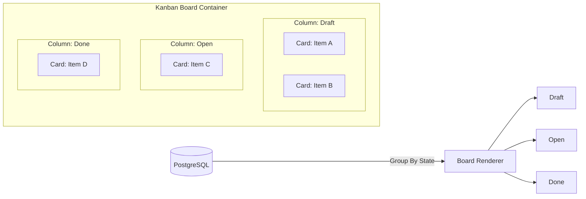

# Odoo 19 Kanban Views: Syntax & Implementation

Kanban views display records as visual cards, organized in columns by stage or status, enabling drag-and-drop workflow tracking.

---

## Odoo Kanban Board Views
An Odoo Kanban view is an XML configuration compiled by OWL into a card board interface. In Odoo 19, the legacy `<kanban-box>` has been replaced by the structured `<card>` element, simplifying styling and improving rendering speeds.

---

## Visualizing Workflow Pipelines & Columns
Kanban views provide visual pipeline management (e.g., CRM opportunities, project tasks, or item statuses). They offer a clear summary of record states, priority markers, deadlines, and ownership avatars.

---

## Implementing Custom Kanban Column Dashboards
*   Use to track stages in business processes (e.g., Draft -> In Progress -> Validated).
*   Use as visual grids for image-heavy records (e.g., Employees, Contacts, Products).

---

## When to Avoid Kanban (Using Structured Lists)
*   **Do not** use Kanban views for rapid inline numerical data editing (use List views).
*   **Do not** use Kanban when you need to inspect extensive columns of values simultaneously.

---

## Kanban XML Layout & QWeb Templating
Here is the core XML syntax for Odoo 19's new `<card>` based Kanban view:

```xml
<record id="view_model_name_kanban" model="ir.ui.view">
    <field name="name">model.name.kanban</field>
    <field name="model">model.name</field>
    <field name="arch" type="xml">
        <kanban default_group_by="state" class="o_kanban_small_column">
            <!-- Explicitly load fields referenced in QWeb templates -->
            <field name="name"/>
            <field name="price"/>
            <field name="currency_id"/>
            <field name="user_id"/>
            
            <templates>
                <!-- Odoo 19 uses t-name="card" to build cards -->
                <t t-name="card">
                    <div class="d-flex mb-1">
                        <field name="name" class="fw-bold fs-5"/>
                        <field name="price" widget="monetary" class="ms-auto fw-bold"/>
                    </div>
                    <div class="text-muted text-truncate mb-2">
                        <!-- Card body content -->
                    </div>
                    <footer class="d-flex align-items-center mt-2">
                        <field name="user_id" widget="many2one_avatar_user"/>
                    </footer>
                </t>
            </templates>
        </kanban>
    </field>
</record>
```

---

## Examples: Project Stages & Custom Cards
Below is a complete Odoo 19 Kanban view for Auction Listings grouped by state, featuring currency formatting, seller avatars, and bid counts:

```xml
<record id="view_auction_listing_kanban" model="ir.ui.view">
    <field name="name">auction.listing.kanban</field>
    <field name="model">auction.listing</field>
    <field name="arch" type="xml">
        <kanban default_group_by="state" class="o_kanban_small_column">
            <field name="name"/>
            <field name="current_price"/>
            <field name="currency_id"/>
            <field name="seller_id"/>
            <field name="bid_count"/>
            <templates>
                <t t-name="card">
                    <div class="d-flex mb-1">
                        <field name="name" class="fw-bold fs-5"/>
                        <field name="current_price" widget="monetary" class="ms-auto fw-bold"/>
                    </div>
                    <footer class="d-flex align-items-center mt-2">
                        <field name="seller_id" widget="many2one_avatar_user"/>
                        <div class="ms-auto text-muted small">
                            <field name="bid_count"/> Bids
                        </div>
                    </footer>
                </t>
            </templates>
        </kanban>
    </field>
</record>
```

---

## Invalid Card Loops & Broken XML Elements
1.  **Using Legacy `<kanban-box>` Syntax**: Developing new views with `t-name="kanban-box"` or classes like `oe_kanban_global_click` instead of using the new `<card>` pattern.
2.  **Referencing Unloaded Fields**: Trying to display fields inside the card template without declaring them under the main `<kanban>` tag first. Undeclared fields will not be loaded into the template environment.
3.  **Complex QWeb Logic in Cards**: Writing massive javascript templates within card tags, which degrades rendering performance. Keep card logic thin.

---

## Pagination, Column Fetching, and Card Load Times
*   **OWL-Powered `<card>` Engine**: The new card tag allows OWL to compile and render records faster, avoiding old virtual DOM translation steps.
*   **Column Column-Count Limits**: Grouping by high-cardinality fields (like `partner_id`) results in too many columns and slows down SQL fetches. Group by Status or Stages instead.
*   **Wizards/Limit settings**: Set limits (`limit="40"`) to prevent loading too many records per column at once.

---

## Senior Architect: Custom JS Kanban Controller Patches
In Odoo 19:
*   **Dynamic Column Progress**: Add column summaries directly inside Kanban headers using progressbar configurations:
    ```xml
    <progressbar field="activity_state" 
                 colors='{"planned": "success", "today": "warning", "overdue": "danger"}' 
                 sum_field="current_price"/>
    ```
*   **Quick Create Options**: Configure column headers to allow quick card addition without opening form pages using `quick_create="true"`.

---

## Kanban Columns to Database Mapping

This diagram shows how Kanban board columns represent database groups, containing templated cards built via QWeb:



---

## 📝 Knowledge Check

<div class="quiz-container">
  <div class="quiz-question">1. What is the main advantage of the new `<card>` element in Kanban views?</div>
  <input type="text" class="quiz-input" placeholder="Type your answer here...">
  <button class="quiz-check" data-answer="It provides a structured layout without the need for complex custom DIV nesting or QWeb logic, resulting in cleaner code and better performance." onclick="checkQuiz(this)">Check Answer</button>
  <div class="quiz-result"></div>
</div>


---

## Related View Guides
*   [List Views](views_list.md)
*   [Form Views](views_form.md)
*   [OWL Basics](../frontend/owl.md)
*   [Search Views](search_view.md)
