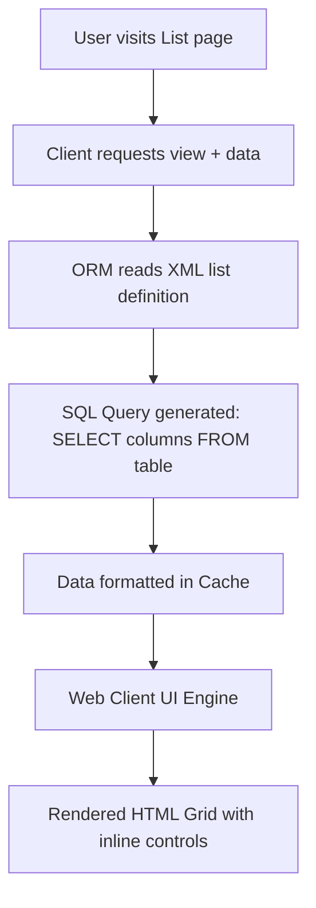

# Odoo 19 List Views: Syntax & Implementation

List views (formerly known as tree views) present multiple database records in a structured grid or tabular format. In Odoo 19, the tag `<list>` is the standard.

---

## List (Tree) View Foundations
An Odoo List View is an XML description that the web client compiles into a tabular interface, supporting inline editing, sorting, column-level mathematical aggregation, and dynamic visual styling based on field values.

---

## High-Density Multi-Record Management
List views are the primary entry point for managing records in bulk. They allow users to search, filter, select, and modify multiple items quickly without opening individual form views.

---

## Configuring Interactive Lists & Tables
*   Use to show search results, model catalogs, and logs.
*   Use as embedded sub-grids (e.g., Order Lines) inside parent Form views.
*   Use with `editable="bottom"` or `editable="top"` to support fast, spreadsheet-like data entry.

---

## When to Avoid Editable Lists (Forcing Forms)
*   **Do not** use list views when you need to display large, multi-line descriptions or rich media (use Form views).
*   **Do not** use list views when the workflow is primarily pipeline-based or structured around stages (use Kanban views).

---

## List View XML Syntax and Column Attributes
Here is the core XML syntax for defining list views in Odoo 19:

```xml
<record id="view_model_name_list" model="ir.ui.view">
    <field name="name">model.name.list</field>
    <field name="model">model.name</field>
    <field name="arch" type="xml">
        <list string="Items" 
              editable="bottom"
              default_order="date_start desc, name asc"
              decoration-success="state == 'done'"
              decoration-danger="state == 'cancelled'"
              decoration-info="state == 'draft'">
            
            <!-- Handle widget for drag-and-drop reordering -->
            <field name="sequence" widget="handle"/>
            
            <!-- Standard fields -->
            <field name="name"/>
            <field name="partner_id" widget="many2one_avatar"/>
            
            # Numeric fields with aggregations
            <field name="amount" widget="monetary" sum="Total Amount"/>
            <field name="state" widget="badge"/>
        </list>
    </field>
</record>
```

### Master Widget Catalogue

Widgets change how a field is rendered in the UI without altering the underlying database structure. Odoo 19 provides dozens of built-in widgets. Here is a catalogue of common widgets used across views:

| Widget | Compatible Fields | UI Result | Example Use Case |
| :--- | :--- | :--- | :--- |
| **`monetary`** | Float, Monetary | Adds currency symbol & formatting. | `amount` ($100.00) |
| **`statusbar`** | Selection, Many2one | Clickable horizontal progress bar. | `state` (Draft > Open > Closed) |
| **`priority`** | Selection | Star-based rating widget (0-5). | `priority` (High/Medium/Low) |
| **`badge`** | Selection, Many2one | Rounded, colored pill (badge). | `status` (Active / Archived) |
| **`handle`** | Integer | Drag-and-drop icon for reordering rows. | `sequence` in List views |
| **`html`** | Html, Text | Rich text editor (WYSIWYG). | `description` |
| **`many2many_tags`** | Many2many | Colored tag chips. | `category_ids` |
| **`many2one_avatar`** | Many2one | Shows user profile picture. | `seller_id` |
| **`progressbar`** | Float, Integer | Visual progress bar (0-100%). | `completion_rate` |
| **`percentage_pie`** | Float | Small circular pie chart. | `win_probability` |
| **`radio`** | Selection, Many2one | Radio button list instead of dropdown. | `gender` |
| **`boolean_toggle`** | Boolean | iOS-style toggle switch. | `is_published` |
| **`char_domain`** | Char | Advanced domain builder widget. | Dynamic rules |
| **`image`** | Binary | Renders an uploaded image. | `photo` |

---

## Declaring Editable & Nested Record Grid Views
Below is a complete, real-world example of an Auction Bids list view utilizing dynamic state decorations, user avatars, and drag handles:

```xml
<record id="view_auction_bid_list" model="ir.ui.view">
    <field name="name">auction.bid.list</field>
    <field name="model">auction.bid</field>
    <field name="arch" type="xml">
        <list string="Bids" 
              editable="bottom"
              decoration-success="state == 'won'"
              decoration-muted="state == 'draft'"
              decoration-danger="state == 'void'"
              decoration-bf="amount &gt; 10000">
            <field name="sequence" widget="handle"/>
            <field name="bidder_id" widget="many2one_avatar"/>
            <field name="amount" widget="monetary" sum="Total Bid Amount"/>
            <field name="date"/>
            <field name="state" widget="badge" 
                   decoration-success="state == 'won'" 
                   decoration-warning="state == 'pending'"/>
        </list>
    </field>
</record>
```

### 💻 Code Challenge

**Complete the XML definition for a simple Odoo 19 list view:**

<div class="code-challenge">
<pre><code>&lt;<input type="text" class="quiz-input-inline w-50" data-answer="list">&gt;
    &lt;field name="name"/&gt;
    &lt;field name="amount" widget="monetary"/&gt;
    &lt;field name="state" <input type="text" class="quiz-input-inline w-60" data-answer="widget">="badge"/&gt;
&lt;/<input type="text" class="quiz-input-inline w-50" data-answer="list">&gt;
</code></pre>
<button class="quiz-check" onclick="checkCodeChallenge(this)">Check Code</button>
<div class="quiz-result"></div>
</div>

### 📝 Knowledge Check

<div class="quiz-container">
  <div class="quiz-question">1. Which XML tag is the Odoo 19 standard for defining a table-style list view?</div>
  <input type="text" class="quiz-input" placeholder="Type your answer here...">
  <button class="quiz-check" data-answer="The `<list>` tag." onclick="checkQuiz(this)">Check Answer</button>
  <div class="quiz-result"></div>
</div>

---

## Broken Aggregation Fields & Invalid Colors
1.  **Using the Legacy `<tree>` Tag**: Although Odoo 19 maintains backward compatibility, using `<tree>` in new modules goes against coding guidelines. Always use `<list>`.
2.  **Adding Too Many Columns**: Packing more than 7–8 fields in a list view triggers horizontal scrollbars, breaking the UI flow.
3.  **Aggregating Non-numeric Columns**: Attempting to put `sum="..."` or `avg="..."` attributes on fields that are not Floats, Integers, or Monetary fields, which crashes the SQL query generation.

---

## Pagination (limit), Field Fetches, and Scroll Loading
*   **SQL-Layer Aggregations**: The `sum` and `avg` attributes compile directly into PostgreSQL aggregations (`SELECT SUM(amount)...`), which is fast and does not load recordsets into Python memory.
*   **Avoid Unstored Computes**: Displaying unstored computed fields in a list view forces Odoo to run the calculation method on *every* rendered row sequentially. Always set `store=True` for computed columns shown in lists.

---

## Senior Architect: Dynamic Column Rendering via JS
In Odoo 19:
*   You can dynamically modify columns inside list views using the `get_views()` Python hook, injecting specific fields or hiding columns based on the current user's profile permissions before the XML is transmitted to the JS client.
*   Use `optional="show"` or `optional="hide"` to allow users to toggle column visibility dynamically in their browsers.

---

## Grid View UI rendering to SQL Columns

This diagram shows how the Odoo client requests, processes, and displays a `<list>` view layout:



---

## Related View Guides
*   [Form Views](views_form.md)
*   [Kanban Views](views_kanban.md)
*   [Search Views](search_view.md)
*   [Master Widget Catalogue](#master-widget-catalogue)
