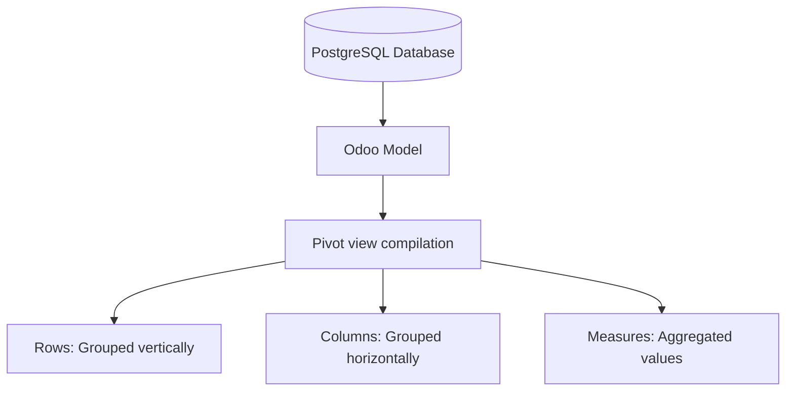

# Pivot Views

## Odoo Pivot View Engine
The Pivot view is Odoo's built-in "Excel-style" reporting and business intelligence tool. It allows users to perform real-time, multi-dimensional data analysis directly from the web client.



---

## XML Syntax & Structural Properties
To define a Pivot view, use the `<pivot>` tag inside the XML architecture. You define which fields serve as row headers, column headers, or measures:

```xml
<record id="view_auction_listing_pivot" model="ir.ui.view">
    <field name="name">auction.listing.pivot</field>
    <field name="model">auction.listing</field>
    <field name="arch" type="xml">
        <pivot string="Auction Analysis" sample="1" display_quantity="1">
            <!-- Group vertically by date (default grouping by month) -->
            <field name="date" type="row"/>
            <!-- Group horizontally by category -->
            <field name="category_id" type="col"/>
            <!-- Aggregate the total starting price -->
            <field name="starting_price" type="measure"/>
        </pivot>
    </field>
</record>
```

### Critical Attributes Reference

| Attribute | Type | Description |
| :--- | :--- | :--- |
| **`display_quantity`** | `0` or `1` | Set to `1` to automatically add a "Count" column displaying the number of grouped records. |
| **`disable_linking`** | `0` or `1` | Set to `1` to prevent users from clicking a cell to drill down to the list of underlying records. |
| **`sample`** | `0` or `1` | Set to `1` to show a blurred mockup pivot report if no real database records match current search filters. |
| **`default_order`** | `string` | Sort rows by a specific field (e.g. `date desc`). |

---

## Python Model-Level Configurations
By default, Odoo aggregates numeric measure fields using the SQL `SUM` operator. You can customize this behavior at the Python model field definition level using the `group_operator` attribute:

```python
class AuctionBid(models.Model):
    _name = 'auction.bid'
    _description = 'Auction Bid'

    amount = fields.Float("Bid Amount", group_operator="sum")
    # Calculate the average duration of the bid process
    bid_duration = fields.Float("Bid Processing Time", group_operator="avg")
```

### Supported Group Operators
*   `sum`: Sums all values (Default).
*   `avg`: Calculates the average value.
*   `max`: Displays the maximum value.
*   `min`: Displays the minimum value.

---

## Performance Optimization: SQL Database Views
When reporting on tables containing millions of rows, generating dynamic pivot aggregations can overload the PostgreSQL database. 

To solve this, Senior Architects design a read-only Odoo model backing a **PostgreSQL View** instead of a table.

=== "Python Model (`_auto = False`)"
    ```python
    from odoo import api, fields, models, tools

    class AuctionReport(models.Model):
        _name = 'auction.report'
        _description = 'Auction Performance Report'
        _auto = False  # Tells Odoo not to create a physical table
        _rec_name = 'date'

        date = fields.Date("Auction Date", readonly=True)
        category_id = fields.Many2one("auction.category", "Category", readonly=True)
        total_revenue = fields.Float("Total Revenue", readonly=True)
        bid_count = fields.Integer("Number of Bids", readonly=True)

        def init(self):
            # Drop existing view if it exists
            tools.drop_view_if_exists(self.env.cr, self._table)
            
            # Create the SQL view
            self.env.cr.execute(f"""
                CREATE or REPLACE VIEW {self._table} AS (
                    SELECT 
                        min(l.id) as id,
                        l.date as date,
                        l.category_id as category_id,
                        sum(b.amount) as total_revenue,
                        count(b.id) as bid_count
                    FROM auction_listing l
                    LEFT JOIN auction_bid b ON l.id = b.listing_id
                    GROUP BY l.date, l.category_id
                )
            """)
    ```

=== "XML Pivot Definition"
    ```xml
    <pivot string="High Performance Auction Report">
        <field name="category_id" type="row"/>
        <field name="total_revenue" type="measure"/>
        <field name="bid_count" type="measure"/>
    </pivot>
    ```

---

## 🏁 Senior Checkpoint
*   **Key Concept**: Pivot views enable multi-dimensional grid analysis. Fields are mapped as rows, cols, or measures.
*   **Architect Insight**: For massive reporting datasets, avoid rendering pivots directly on transactional models. Use `_auto = False` models combined with custom database views to offload computations to optimized SQL structures.
*   **Verify Your Knowledge**: What is the difference between `type="row"` and `type="col"` in a Pivot view? (Answer: Row is vertical grouping; Col is horizontal grouping).

---

## 📝 Knowledge Check

<div class="quiz-container">
  <div class="quiz-question">1. What attribute of the `<pivot>` tag prevents users from clicking cells to view the underlying records?</div>
  <input type="text" class="quiz-input" placeholder="Type your answer here...">
  <button class="quiz-check" data-answer="disable_linking=&quot;1&quot;" onclick="checkQuiz(this)">Check Answer</button>
  <div class="quiz-result"></div>
</div>

<div class="quiz-container">
  <div class="quiz-question">2. Which Python field attribute changes the aggregation method from standard summation (sum) to average (avg)?</div>
  <input type="text" class="quiz-input" placeholder="Type your answer here...">
  <button class="quiz-check" data-answer="group_operator" onclick="checkQuiz(this)">Check Answer</button>
  <div class="quiz-result"></div>
</div>

---

## 💻 Code Challenge

**Define a performance-optimized reporting Python model class header that bypasses table creation and maps to an SQL View:**

<div class="code-challenge">
<pre><code>class AuctionReport(models.Model):
    _name = 'auction.report'
    _description = 'Auction Report'
    <input type="text" class="quiz-input-inline w-180" data-answer="_auto = False">
    
    def init(self):
        # View creation SQL goes here
        pass</code></pre>
<button class="quiz-check" onclick="checkCodeChallenge(this)">Check Code</button>
<div class="quiz-result"></div>
</div>

---

## Related Reporting Guides
*   [Graph Views (BI)](views_graph.md)
*   [Calendar Views (Scheduling)](views_calendar.md)
*   [Specialized Views (Enterprise & Activity)](views_specialized.md)
*   [QWeb & Reports (v19)](../frontend/reports.md)

<div class="feedback-container">
    <span class="feedback-label">Was this page helpful?</span>
    <div class="feedback-buttons">
        <button class="feedback-btn" onclick="sendFeedback(true)">👍 Yes</button>
        <button class="feedback-btn" onclick="sendFeedback(false)">👎 No</button>
    </div>
</div>
