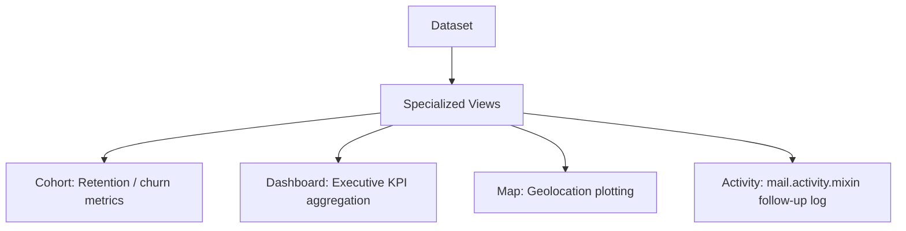

# Specialized Views

## Odoo Specialized Views Overview
For complex business operations, Odoo provides specialized reporting and interaction views. These include Cohort retention analysis, executive Dashboards, geolocation Mapping, and scheduling Activities.



---

## 1. Activity View (`<activity>`)
The Activity view organizes scheduling and follow-up activities from the chatter system (`mail.activity.mixin`). It acts as a kanban board for scheduled phone calls, meetings, or document signs.

### Requirements & Setup
1.  The Python model must inherit from `mail.activity.mixin`:
    ```python
    class AuctionListing(models.Model):
        _name = 'auction.listing'
        _inherit = ['mail.thread', 'mail.activity.mixin']
    ```
2.  Define the `<activity>` view with a template parser:
    ```xml
    <record id="view_auction_listing_activity" model="ir.ui.view">
        <field name="name">auction.listing.activity</field>
        <field name="model">auction.listing</field>
        <field name="arch" type="xml">
            <activity string="Auction Activities">
                <templates>
                    <div t-name="activity-box">
                        <field name="name" display="full"/>
                        <div class="text-muted">
                            <field name="activity_type_id"/>
                        </div>
                    </div>
                </templates>
            </activity>
        </field>
    </record>
    ```

---

## 2. Cohort View (`<cohort>`)
The Cohort view is an **Enterprise Edition** view used to track user retention or churn rates over time (e.g. "How many bidders return to place a bid within 3 months of registration?").

### XML Syntax
```xml
<record id="view_bidder_cohort" model="ir.ui.view">
    <field name="name">auction.bidder.cohort</field>
    <field name="model">auction.bidder</field>
    <field name="arch" type="xml">
        <cohort string="Bidder Retention" 
                date_start="create_date" 
                date_stop="last_bid_date" 
                interval="month" 
                mode="retention" 
                sample="1"/>
    </field>
</record>
```

### Key Attributes
*   **`date_start`**: Start date for cohort analysis groupings (e.g. registration date).
*   **`date_stop`**: Target action date (e.g. last purchase date).
*   **`interval`**: Time periods: `day`, `week`, `month`, `year`.
*   **`mode`**: Either `retention` (tracks users who remained active) or `churn` (tracks users who dropped off).

---

## 3. Dashboard View (`<dashboard>`)
The Dashboard view (available in **Enterprise Edition**) acts as an executive cockpit, combining multiple Graph and Pivot views into a single, cohesive interface containing high-level KPIs and calculations.

### XML Syntax
```xml
<record id="view_auction_dashboard" model="ir.ui.view">
    <field name="name">auction.dashboard</field>
    <field name="model">auction.listing</field>
    <field name="arch" type="xml">
        <dashboard>
            <!-- 1. Embedded Graph Sub-view -->
            <view type="graph" ref="pways_auction.view_auction_listing_graph"/>
            
            <!-- 2. High-level KPIs and Aggregate Formulas -->
            <group>
                <aggregate name="total_revenue" field="sold_price" string="Total Revenue" group_operator="sum"/>
                <aggregate name="listing_count" field="id" string="Active Listings" group_operator="count"/>
                <formula name="avg_listing_revenue" value="total_revenue / listing_count" string="Average Revenue per Listing"/>
            </group>
        </dashboard>
    </field>
</record>
```

---

## 4. Map View (`<map>`)
The Map view (**Enterprise Edition**) plots records geographically on a street map. It is commonly used for route planning, tracking field technicians, or visualizing salesperson territories.

### XML Syntax
```xml
<record id="view_seller_map" model="ir.ui.view">
    <field name="name">auction.seller.map</field>
    <field name="model">auction.listing</field>
    <field name="arch" type="xml">
        <!-- Must reference a partner field with address metadata -->
        <map res_partner="seller_id" routing="True">
            <field name="name" string="Listing Title"/>
            <field name="starting_price"/>
        </map>
    </field>
</record>
```

### Key Attributes
*   **`res_partner`**: A `Many2one` field pointing to `res.partner` containing address data.
*   **`routing`**: If `True`, Odoo plots lines connecting the map markers to display optimized travel routes.

---

## 🏁 Senior Checkpoint
*   **Key Concept**: Specialized views handle domain-specific reporting. Activity views manage thread items, Cohort tracks churn, Dashboard structures KPIs, and Map routes coordinates.
*   **Architect Insight**: Note that Cohort, Dashboard, and Map views require the `web_cohort`, `web_dashboard`, and `web_map` modules (standard in Odoo Enterprise Edition). Bypassing Enterprise views in Community modules is done by configuring custom web client controllers or OWL dashboard widgets.
*   **Verify Your Knowledge**: What mixin model is required to support an Activity view in Odoo? (Answer: `mail.activity.mixin`).

---

## 📝 Knowledge Check

<div class="quiz-container">
  <div class="quiz-question">1. Which Enterprise view is configured to analyze customer retention and drop-off rates over time?</div>
  <input type="text" class="quiz-input" placeholder="Type your answer here...">
  <button class="quiz-check" data-answer="cohort" onclick="checkQuiz(this)">Check Answer</button>
  <div class="quiz-result"></div>
</div>

<div class="quiz-container">
  <div class="quiz-question">2. Which QWeb template name (`t-name`) must be defined inside the activity view structure to define the card layout?</div>
  <input type="text" class="quiz-input" placeholder="Type your answer here...">
  <button class="quiz-check" data-answer="activity-box" onclick="checkQuiz(this)">Check Answer</button>
  <div class="quiz-result"></div>
</div>

---

## 💻 Code Challenge

**Complete the dashboard formula view syntax that computes the "Average Deal Value" by dividing "total_sales" by "sales_count":**

<div class="code-challenge">
<pre><code>&lt;group&gt;
    &lt;aggregate name="total_sales" field="price_subtotal" group_operator="sum"/&gt;
    &lt;aggregate name="sales_count" field="id" group_operator="count"/&gt;
    &lt;formula name="avg_deal" <input type="text" class="quiz-input-inline w-450" data-answer="value=&quot;total_sales / sales_count&quot; string=&quot;Average Deal Value&quot;">/&gt;
&lt;/group&gt;</code></pre>
<button class="quiz-check" onclick="checkCodeChallenge(this)">Check Code</button>
<div class="quiz-result"></div>
</div>

---

## Related Reporting Guides
*   [Pivot Views (BI)](views_pivot.md)
*   [Graph Views (BI)](views_graph.md)
*   [Calendar Views (Scheduling)](views_calendar.md)
*   [QWeb & Reports (v19)](../frontend/reports.md)

<div class="feedback-container">
    <span class="feedback-label">Was this page helpful?</span>
    <div class="feedback-buttons">
        <button class="feedback-btn" onclick="sendFeedback(true)">👍 Yes</button>
        <button class="feedback-btn" onclick="sendFeedback(false)">👎 No</button>
    </div>
</div>
