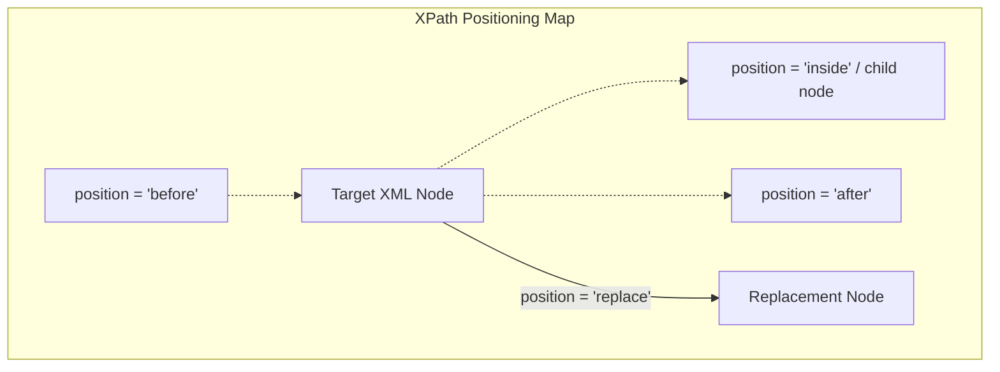

# View Inheritance: XPath XML Traversals & Positioning

Odoo allows developers to extend or modify existing user interface views without changing the original base module source code. This is achieved using view inheritance and XPath syntax.

---

## 1. What is it
XPath (XML Path Language) is a query language used to select nodes inside an XML document. In Odoo, inheritance uses XPath expressions to locate elements in base UI records (like forms, lists, or kanbans) and surgically inject modifications.

---

## 2. Why
Modern modules must be highly customizable. By writing XPath rules, a custom module can add tabs, relocate buttons, or hide fields on core Odoo views. This keeps modifications modular and prevents system upgrade conflicts.

---

## 3. When
*   Use to append custom fields after or before core fields.
*   Use to make fields read-only or invisible dynamically under specific user roles.
*   Use to add new tabs (`<page>`) inside tab notebooks.
*   Use to customize header button operations.

---

## 4. When Not
*   **Do not** use `position="replace"` to delete elements you only want to hide. Replacing nodes breaks any other installed modules that reference those nodes, causing database loading crashes. Use `position="attributes"` to set `invisible="1"` instead.
*   **Do not** write massive, long XPath paths matching layout containers (like `//div/div/div/group/field`) as they easily break with minor updates to the base template.

---

## 5. Syntax
Here is the core XML layout for inheriting views and executing XPath actions in Odoo 19:

```xml
<record id="view_custom_model_form_inherit" model="ir.ui.view">
    <field name="name">custom.model.form.inherit</field>
    <field name="model">custom.model</field>
    <field name="inherit_id" ref="base_module.view_original_model_form"/>
    <field name="arch" type="xml">
        
        # 1. XPath targeting a field by name attribute
        <xpath expr="//field[@name='target_field']" position="after">
            <field name="my_new_field"/>
        </xpath>
        
        # 2. Modifying properties using position="attributes"
        <xpath expr="//field[@name='other_field']" position="attributes">
            <attribute name="readonly">1</attribute>
            <attribute name="invisible">state == 'done'</attribute>
        </xpath>
        
    </field>
</record>
```

---

## 6. Examples

### A. Surgical Attribute Modification
```xml
<xpath expr="//field[@name='list_price']" position="attributes">
    <attribute name="readonly">1</attribute>
    <attribute name="invisible">0</attribute>
</xpath>
```

### B. Product Template Form Extension
This example injects a starting bid field directly after the list price inside the standard Product Form view:

```xml
<record id="product_template_auction_form" model="ir.ui.view">
    <field name="name">product.template.auction.form</field>
    <field name="model">product.template</field>
    <field name="inherit_id" ref="product.product_template_form_view"/>
    <field name="arch" type="xml">
        <!-- Locate target field anywhere in the document -->
        <xpath expr="//field[@name='list_price']" position="after">
            <field name="is_auction_item" invisible="1"/>
            <field name="starting_bid" 
                   invisible="not is_auction_item" 
                   required="is_auction_item"/>
        </xpath>
    </field>
</record>
```

### 💻 Code Challenge

**Use XPath to insert a new field named 'expiry_date' immediately after the 'list_price' field.**

<div class="code-challenge">
<pre><code>&lt;xpath <input type="text" class="quiz-input-inline w-50" data-answer="expr">="//field[@name='list_price']" <input type="text" class="quiz-input-inline w-80" data-answer="position">="<input type="text" class="quiz-input-inline w-60" data-answer="after">"&gt;
    &lt;field name="expiry_date"/&gt;
&lt;/xpath&gt;
</code></pre>
<button class="quiz-check" onclick="checkCodeChallenge(this)">Check Code</button>
<div class="quiz-result"></div>
</div>

### 📝 Knowledge Check

<div class="quiz-container">
  <div class="quiz-question">1. What is the purpose of the <code>inherit_id</code> field in a view record?</div>
  <input type="text" class="quiz-input" placeholder="Type your answer here...">
  <button class="quiz-check" data-answer="It is used to specify the XML ID of the original view that you want to inherit and modify." onclick="checkQuiz(this)">Check Answer</button>
  <div class="quiz-result"></div>
</div>

<div class="quiz-container">
  <div class="quiz-question">2. Name four possible values for the <code>position</code> attribute in an XPath expression.</div>
  <input type="text" class="quiz-input" placeholder="Type your answer here...">
  <button class="quiz-check" data-answer="before, after, inside, replace, and attributes." onclick="checkQuiz(this)">Check Answer</button>
  <div class="quiz-result"></div>
</div>

<div class="quiz-container">
  <div class="quiz-question">3. How do you modify a field's attributes (like making it readonly) using XPath?</div>
  <input type="text" class="quiz-input" placeholder="Type your answer here...">
  <button class="quiz-check" data-answer="Use position='attributes' and then use the &lt;attribute&gt; tag to set the desired attribute value." onclick="checkQuiz(this)">Check Answer</button>
  <div class="quiz-result"></div>
</div>

<div class="quiz-container">
  <div class="quiz-question">4. What is the benefit of using direct paths instead of deep searches (<code>//</code>) in XPath expressions?</div>
  <input type="text" class="quiz-input" placeholder="Type your answer here...">
  <button class="quiz-check" data-answer="Direct paths are faster for the XML engine to process, especially in large and complex views, leading to better performance." onclick="checkQuiz(this)">Check Answer</button>
  <div class="quiz-result"></div>
</div>

---

## 7. Common Mistakes
1.  **Using Numeric Child Index Elements**: Locating columns using positional indexes (e.g. `//group[1]/field[3]`). If other modules insert columns prior to yours, index positions shift, causing your XPath to apply to the wrong field or fail entirely. Always match fields using naming attributes: `//field[@name='target_name']`.
2.  **Using Deprecated Modifier Attributes in attributes overrides**: Writing overrides like `<attribute name="attrs">{'invisible': [('state', '=', 'draft')]}</attribute>`. Odoo 19 has completely removed `attrs` styling logic. Use direct modifier names instead: `<attribute name="invisible">state == 'draft'</attribute>`.

---

## 8. Performance
*   **Deep Search Cost (`//`)**: Using double slashes forces Odoo's view XML parser to scan the entire tree layout recursively. In large files (like complex sales order templates), this adds loading latency at registry boot.
*   **Direct Pathing Acceleration**: Using direct paths (e.g. `/form/sheet/group/field[@name='x']`) allows immediate element matching, speeding up server compilation times.

---

## 9. Senior
In Odoo 19:
*   **`mode="inner"` Overrides**: You can specify `mode="inner"` inside your inherited view record block. This creates a local override scope, applying modifications only to specific view references rather than altering the parent view layout globally across the entire database.
*   **Anchor Matches**: Avoid matching HTML divisions directly. Anchor your selectors on persistent backend XML elements (like notebook tabs page names, form sheet groups, or fields).

---

## 10. Diagrams

This diagram shows how XPath position parameters insert new code blocks relative to a targeted base node inside Odoo's XML parser tree:



---

## 11. Related
*   [Form Views](views_form.md)
*   [List Views](views_list.md)
*   [Record Rules (Row-level Security)](../business/rules.md)
