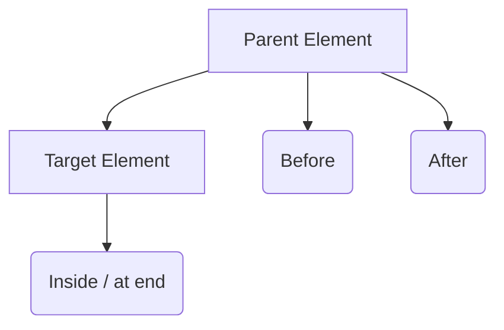

# View Inheritance (XPath)

Odoo allows you to modify existing views without changing the original source code. This is achieved using **Inheritance** and **XPath** expressions.

## How Inheritance Works

To inherit a view, you create a new record and use the `inherit_id` field to point to the original view's XML ID.

```xml
<record id="my_custom_view" model="ir.ui.view">
    <field name="name">my.custom.view</field>
    <field name="model">target.model</field>
    <field name="inherit_id" ref="base_module.original_view_id"/>
    <field name="arch" type="xml">
        <!-- XPath expressions go here -->
    </field>
</record>
```

---

## XPath Positions

The `position` attribute determines *where* and *how* your changes are applied relative to the target element.

| Position | Description |
| :--- | :--- |
| `after` | Adds the new content immediately after the target element. |
| `before` | Adds the new content immediately before the target element. |
| `inside` | (Default) Adds content as a new child at the end of the target element. |
| `replace` | Replaces the target element entirely with your new content. |
| `attributes` | Modifies the attributes of the target element (e.g., adding a CSS class or making it invisible). |



---

## Modifying Attributes

Use `position="attributes"` to change properties like `invisible`, `readonly`, or `string`.

```xml
<xpath expr="//field[@name='list_price']" position="attributes">
    <attribute name="readonly">1</attribute>
    <attribute name="invisible">0</attribute>
</xpath>
```

---

## Complex Example: Extending Product Template

Let's add a "Starting Bid" field to the standard Product Form, right after the "List Price".

!!! example "Inheriting product.product_template_form_view"
    ```xml
    <record id="product_template_auction_form" model="ir.ui.view">
        <field name="name">product.template.auction.form</field>
        <field name="model">product.template</field>
        <field name="inherit_id" ref="product.product_template_form_view"/>
        <field name="arch" type="xml">
            <!-- 1. Locate the list_price field -->
            <xpath expr="//field[@name='list_price']" position="after">
                <!-- 2. Insert the new field -->
                <field name="is_auction_item" invisible="1"/>
                <field name="starting_bid" 
                       invisible="not is_auction_item" 
                       required="is_auction_item"/>
            </xpath>
        </field>
    </record>
    ```

The `//` syntax is a "deep search". It tells Odoo to find the field anywhere in the XML tree, regardless of how many nested `<group>` or `<div>` tags it is inside.

---

## Senior: Odoo 19 Advanced Inheritance

### 1. The `mode="inner"` Attribute (New)
In Odoo 19, you can use `mode="inner"` when inheriting views. This allows you to define a "local" override that only applies to the current view record, rather than modifying the parent view globally. This is extremely useful for specialized dashboards or portal views.

### 2. Surgical XPath: Avoiding `//field`
While `//field[@name='x']` is common, it is slow on very large XML views (like the Sales Order form). A senior developer uses **direct paths** or **anchor attributes** to speed up the XML engine.

**Instead of:**
`<xpath expr="//field[@name='partner_id']" position="after">`

**Use (if possible):**
`<xpath expr="/form/sheet/group/group[1]/field[@name='partner_id']" position="after">`

!!! tip "Architect Tip: Robustness"
    Always use `@name` in your expressions rather than indices (e.g., `group[1]`) because other modules might insert their own groups, shifting your index and breaking your inheritance.

---

## 💻 Code Challenge

**Use XPath to insert a new field named 'expiry_date' immediately after the 'list_price' field.**

<div class="code-challenge">
<pre><code>&lt;xpath <input type="text" class="quiz-input-inline" data-answer="expr" style="width: 50px">="//field[@name='list_price']" <input type="text" class="quiz-input-inline" data-answer="position" style="width: 80px">="<input type="text" class="quiz-input-inline" data-answer="after" style="width: 60px">"&gt;
    &lt;field name="expiry_date"/&gt;
&lt;/xpath&gt;
</code></pre>
<button class="quiz-check" onclick="checkCodeChallenge(this)">Check Code</button>
<div class="quiz-result"></div>
</div>

---

## 📝 Knowledge Check

<div class="quiz-container">
  <div class="quiz-question">1. What is the purpose of the <code>inherit_id</code> field in a view record?</div>
  <input type="text" class="quiz-input" placeholder="Type your answer here...">
  <button class="quiz-check" data-answer="It is used to specify the XML ID of the original view that you want to inherit and modify." onclick="checkQuiz(this)">Check Answer</button>
  <div class="quiz-result"></div>
</div>

<div class="quiz-container">
  <div class="quiz-question">2. Name four possible values for the <code>position</code> attribute in an XPath expression.</div>
  <input type="text" class="quiz-input" placeholder="Type your answer here...">
  <button class="quiz-check" data-answer="before, after, inside, replace, and attributes." onclick="checkQuiz(this)">Check Answer</button>
  <div class="quiz-result"></div>
</div>

<div class="quiz-container">
  <div class="quiz-question">3. How do you modify a field's attributes (like making it readonly) using XPath?</div>
  <input type="text" class="quiz-input" placeholder="Type your answer here...">
  <button class="quiz-check" data-answer="Use position='attributes' and then use the &lt;attribute&gt; tag to set the desired attribute value." onclick="checkQuiz(this)">Check Answer</button>
  <div class="quiz-result"></div>
</div>

<div class="quiz-container">
  <div class="quiz-question">4. What is the benefit of using direct paths instead of deep searches (<code>//</code>) in XPath expressions?</div>
  <input type="text" class="quiz-input" placeholder="Type your answer here...">
  <button class="quiz-check" data-answer="Direct paths are faster for the XML engine to process, especially in large and complex views, leading to better performance." onclick="checkQuiz(this)">Check Answer</button>
  <div class="quiz-result"></div>
</div>

---

## 🏁 Senior Checkpoint
*   **Key Concept:** XPath allows surgical modification of XML views by locating elements and defining a `position`.
*   **Architect Insight:** Avoid `//` (deep search) in high-performance views like Sales Orders; use direct paths to reduce XML compilation time.
*   **Verify Your Knowledge:** What does `mode="inner"` do in Odoo 19? (Answer: It allows local view overrides that don't affect the parent view globally).

!!! success "Next Step"
    You can extend views. Now learn to [Secure Data](../business/rules.md) at the row level using Record Rules.

---

<div class="feedback-container">
    <span class="feedback-label">Was this page helpful?</span>
    <div class="feedback-buttons">
        <button class="feedback-btn" onclick="sendFeedback(true)">👍 Yes</button>
        <button class="feedback-btn" onclick="sendFeedback(false)">👎 No</button>
    </div>
</div>
