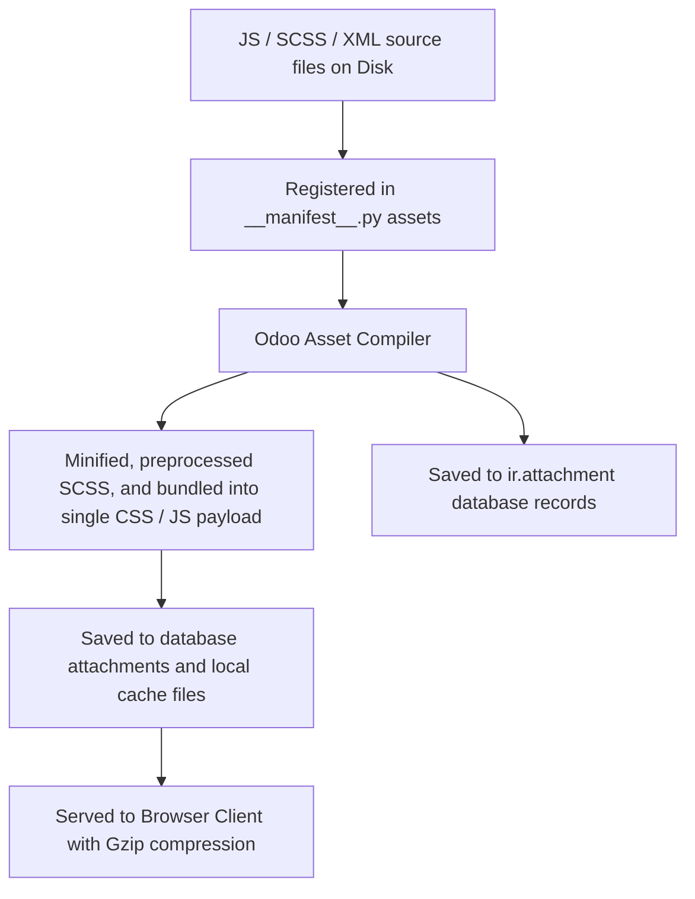

# Assets & Static Files

## Odoo Asset Bundle System
In Odoo 19, static files such as JavaScript (ES6 modules), stylesheets (CSS, SCSS), and XML templates are compiled, minified, and delivered to the browser client through a centralized **Assets Bundle System**. You register these files inside the module's `__manifest__.py` file under the `assets` dictionary key.



---

## Efficient Loading & Delivery of JS, CSS, and Templates
Modern web applications require hundreds of separate JavaScript modules and stylesheets. If a browser loaded every file individually, it would trigger hundreds of HTTP requests, blocking rendering pipelines and slowing page loads. 

Odoo's assets bundle compiler resolves this by:
*   Preprocessing SCSS files into standard CSS.
*   Resolving ES6 import-exports via a custom module loader.
*   Minifying and combining all static files into a single CSS payload and a single JS payload.
*   Adding cache-busting hashes to filenames (e.g., `/web/assets/123-abc/web.assets_backend.min.js`) to force clients to download updates only when changes are made.

---

## Adding Custom Code to Standard Bundles
Use the `assets` key inside the manifest whenever you add:
*   **Custom styles** (CSS/SCSS) to Odoo's backend apps or public portal website.
*   **OWL Javascript components** (`static/src/**/*.js`).
*   **XML templates** for OWL components (`static/src/**/*.xml`).
*   **Custom libraries** (JS/CSS) to extend Odoo's web client capabilities.

---

## When to Load Files Inline (Avoiding Bundle Pollution)
*   Do not register **standard backend XML views** (like lists, forms, or actions) in the `assets` key; register them under the `'data'` key in `__manifest__.py`.
*   Do not place raw binary assets like images, logos, fonts, or PDFs in the `assets` bundle list. Simply save them inside your module's `/static/` folder (e.g. `/static/description/icon.png`) and reference them directly via URL.

---

## Declaring Assets in the Manifest File

Asset files are declared in your `__manifest__.py` under the `'assets'` dictionary, categorized by **Asset Bundle Target Names**:

```python
'assets': {
    # 1. Target Backend Bundle
    'web.assets_backend': [
        'your_module/static/src/scss/custom_styles.scss',
        'your_module/static/src/components/**/*.js',
        'your_module/static/src/components/**/*.xml',
    ],
    # 2. Target Public Website/Portal Bundle
    'web.assets_frontend': [
        'your_module/static/src/scss/portal_styles.scss',
    ],
}
```

### Bundle Modifiers (Inheritance & Overrides)
You can manipulate existing Odoo assets bundles (such as injecting a script before another module, or excluding files):

| Operation | Syntax | Description |
| :--- | :--- | :--- |
| **Append** | `'path/to/file.js'` | Appends the file to the end of the bundle (Default). |
| **Prepend** | `('prepend', 'path/to/file.js')` | Inserts the file at the very beginning of the bundle. |
| **Before** | `('before', 'target_path.js', 'my_path.js')` | Inserts `my_path.js` right before `target_path.js`. |
| **After** | `('after', 'target_path.js', 'my_path.js')` | Inserts `my_path.js` right after `target_path.js`. |
| **Replace** | `('replace', 'target_path.js', 'my_path.js')` | Replaces `target_path.js` with `my_path.js`. |
| **Remove** | `('remove', 'target_path.js')` | Removes `target_path.js` from the bundle. |
| **Include** | `('include', 'other_bundle')` | Includes an entire other bundle's assets list. |

---

## Injecting Custom OWL Components & CSS Assets

### Beginner: Injecting Custom CSS/SCSS Styles
Apply a global orange color layout to the headers in the Odoo backend.
```css title="static/src/css/header_override.css"
.o_main_navbar {
    background-color: #E27221 !important;
}
```
Register the style sheet in `__manifest__.py`:
```python title="__manifest__.py"
'assets': {
    'web.assets_backend': [
        'pways_auction/static/src/css/header_override.css',
    ],
}
```

### Intermediate: Registering an OWL Component
Create a dynamic bidding component with JavaScript logic and an XML view template.

=== "static/src/components/bid.js"
    ```javascript
    /** @odoo-module **/
    import { Component } from "@odoo/owl";
    import { registry } from "@web/core/registry";

    export class AuctionBidWidget extends Component {
        static template = "pways_auction.AuctionBidWidget";
        setup() {
            console.log("Widget initialized!");
        }
    }
    registry.category("view_widgets").add("auction_bid_widget", {
        component: AuctionBidWidget,
    });
    ```

=== "static/src/components/bid.xml"
    ```xml
    <templates xml:space="preserve">
        <t t-name="pways_auction.AuctionBidWidget">
            <div class="p-4 bg-light border rounded">
                <h5>Place Bid</h5>
                <input type="number" class="form-control" placeholder="Amount..."/>
            </div>
        </t>
    </templates>
    ```

=== "__manifest__.py"
    ```python
    'assets': {
        'web.assets_backend': [
            'pways_auction/static/src/components/bid.js',
            'pways_auction/static/src/components/bid.xml',
        ],
    }
    ```

### Real-World: Patching Core Odoo JS (Loading After Base Scripts)
Ensure a custom JavaScript utility loads immediately after Odoo's primary WebClient boots up.
```python title="__manifest__.py"
'assets': {
    'web.assets_backend': [
        ('after', 'web/static/src/webclient/webclient.js', 'pways_auction/static/src/utils/post_load_patch.js'),
    ],
}
```

---

## Defining Custom Asset Bundles
In addition to standard Odoo bundles, you can declare entirely new, custom asset bundles for specific sub-systems or isolated interfaces (e.g., custom kiosk screens, dedicated administrative panels, or external portals).

### 1. Registering a Custom Bundle in the Manifest
```python title="__manifest__.py"
'assets': {
    'pways_auction.assets_kiosk': [
        'pways_auction/static/src/kiosk/kiosk_theme.scss',
        'pways_auction/static/src/kiosk/kiosk_app.js',
        'pways_auction/static/src/kiosk/**/*.xml',
    ],
}
```

### 2. Rendering the Custom Bundle in XML Templates
To inject these assets into a custom controller template, use the `t-call-assets` directive inside the QWeb XML layout definition:
```xml
<template id="kiosk_portal_layout">
    <html>
        <head>
            <title>Kiosk Bidding Portal</title>
            <!-- Render stylesheet links -->
            <t t-call-assets="pways_auction.assets_kiosk" t-css="true"/>
            <!-- Render javascript tags -->
            <t t-call-assets="pways_auction.assets_kiosk" t-js="true"/>
        </head>
        <body>
            <div id="kiosk_root"></div>
        </body>
    </html>
</template>
```

---

## SCSS Customization and CSS Variables
Odoo 19 utilizes modern CSS custom properties (variables) aligned with Bootstrap 5.1+ to control styling tokens (colors, margins, typography) dynamically.

### Overriding Style Tokens
Instead of writing heavy CSS overrides, you can customize the theme by overriding SCSS variables in your styles:
```scss title="static/src/scss/custom_styles.scss"
:root {
    --primary: #875a7b; /* Change primary brand color */
    --body-bg: #f9f9f9;
}

/* Custom utility referencing Odoo style colors */
.o_bid_card_active {
    border-color: var(--primary);
    background-color: rgba(var(--primary-rgb), 0.1);
}
```

---

## Incorrect Asset Paths & Missing OWL Registries

### ❌ Omitting the `/** @odoo-module **/` Header
If you do not include this comment as the first line of your JavaScript files, Odoo's module compiler treats the file as a legacy global script, causing import statements (`import { Component } ...`) to raise syntax errors in the browser.
```javascript
// Wrong: Missing module declaration
import { Component } from "@odoo/owl";
```

### ✅ Adding Module Flag
```javascript
// Right: Tells compiler to translate to Odoo ES module structure
/** @odoo-module **/
import { Component } from "@odoo/owl";
```

---

## Minification, Compression, and Browser Caching
*   **Regenerate Asset Bundles**: While in standard developer mode, Odoo aggressively caches compiled assets. If your CSS or JS updates do not show up, append `?debug=assets` to your browser URL, or click **Regenerate Assets Bundles** in the Developer Debug menu to clear database attachment caches.
*   **Wildcard Performance**: Glob patterns like `static/src/**/*` compile all files in a folder. While clean, this can slow down developer startup speeds in massive projects. For production stability, declare files explicitly or limit recursive search depths.

---

## Senior Architect: Lazy Loading Assets in OWL
To reduce the initial bundle weight, you can dynamically load specific asset bundles only when they are needed (e.g., when a user opens an advanced charting widget or activates a specific wizard).

Odoo provides the `loadAssets` utility service to perform asynchronous dynamic asset injection:

```javascript title="static/src/components/chart_renderer.js"
/** @odoo-module **/
import { Component, onWillStart } from "@odoo/owl";
import { useService } from "@web/core/utils/hooks";

export class ChartRenderer extends Component {
    static template = "pways_auction.ChartRenderer";

    setup() {
        const assets = useService("assets");
        
        onWillStart(async () => {
            // Lazy load highcharts library bundle
            await assets.loadAssets({
                jsLibs: ["/web/static/lib/highcharts/highcharts.js"],
                cssLibs: [],
            });
        });
    }
}
```

### Module Naming and Manifest Dependencies
*   **Module Naming Rules**: Odoo ES modules translate file paths into identifiers. If a file is at `pways_auction/static/src/components/bid.js`, its module path is `@pways_auction/components/bid`. Keep paths predictable.
*   **Manifest Dependencies**: If you inherit or modify files inside another module's bundle (e.g. `web.assets_backend`), your module manifest **must** list that module inside the `'depends'` key to ensure proper loading order.

---

## Troubleshooting Asset Issues
1. **Unresolved ES Module Imports**: If your browser console displays `Mismatched anonymous define() module`, check if the first line of the file is exactly `/** @odoo-module **/`.
2. **Missing Relational Files**: If Odoo fails to load and returns a traceback like `Could not open file`, check if files declared in `__manifest__.py` have typos, or if they are in the wrong folder directory.
3. **Caching Issue**: If CSS styles or templates don't reload, switch to Developer mode (with assets) by adding `?debug=assets` to the URL.

---

## 🏁 Senior Checkpoint
*   **Key Concept**: Odoo 19 assets must be registered in `__manifest__.py`. Files prefixed with `/** @odoo-module **/` are automatically wrapped as ES6 modules.
*   **Architect Insight**: For large portals or administrative interfaces, define custom asset bundles and load them with `t-call-assets` to avoid polluting the core `web.assets_backend` bundle.
*   **Verify Your Knowledge**: What happens if a module defines assets using a path in another module without declaring that module in the `'depends'` key? (Answer: Odoo cannot guarantee the load order, causing random runtime script failures).

---

## 📝 Knowledge Check

<div class="quiz-container">
  <div class="quiz-question">1. Which QWeb directive is used to render script and link tags for a specific asset bundle inside HTML templates?</div>
  <input type="text" class="quiz-input" placeholder="Type your answer here...">
  <button class="quiz-check" data-answer="t-call-assets" onclick="checkQuiz(this)">Check Answer</button>
  <div class="quiz-result"></div>
</div>

<div class="quiz-container">
  <div class="quiz-question">2. What URL query parameter should you append to Odoo's backend to bypass asset minification and load separate uncompressed source files?</div>
  <input type="text" class="quiz-input" placeholder="Type your answer here...">
  <button class="quiz-check" data-answer="?debug=assets" onclick="checkQuiz(this)">Check Answer</button>
  <div class="quiz-result"></div>
</div>

---

## 💻 Code Challenge

**Write a manifest snippet to load a custom styles file `custom_styles.scss` immediately after the base styles module file `base_styles.scss` (assume path `web/static/src/scss/base_styles.scss`):**

<div class="code-challenge">
<pre><code>'assets': {
    'web.assets_backend': [
        <input type="text" class="quiz-input-inline w-450" data-answer="('after', 'web/static/src/scss/base_styles.scss', 'pways_auction/static/src/scss/custom_styles.scss')">
    ]
}</code></pre>
<button class="quiz-check" onclick="checkCodeChallenge(this)">Check Code</button>
<div class="quiz-result"></div>
</div>

---

## Asset Build & Browser Delivery Pipeline
*   **Previous Lesson**: [JS to Python (orm.call)](orm_call.md)
*   **Next Lesson**: [Reactive State (Store)](../advanced_owl/store.md)
*   **See Also**: [Services & Registry](owl_services_registry.md), [Component Patching](../advanced_owl/patching.md)

<div class="feedback-container">
    <span class="feedback-label">Was this page helpful?</span>
    <div class="feedback-buttons">
        <button class="feedback-btn" onclick="sendFeedback(true)">👍 Yes</button>
        <button class="feedback-btn" onclick="sendFeedback(false)">👎 No</button>
    </div>
</div>
