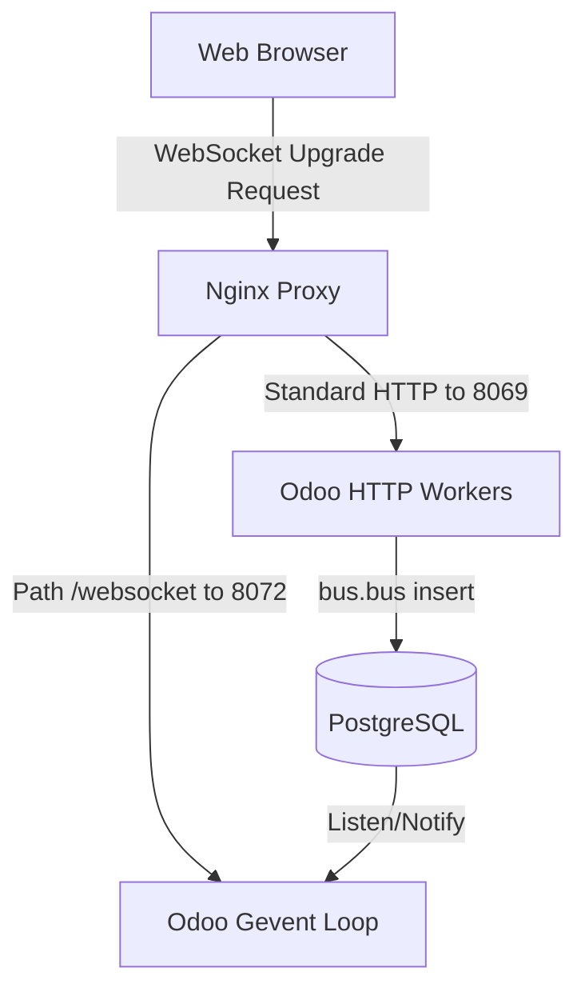

# Odoo 19: Bus and WebSocket Architecture

For real-time features like instant chat, live timers, and push notifications, standard HTTP request-response loops are inadequate. Odoo 19 incorporates a native asynchronous **Bus System** that runs over persistent HTML5 WebSockets.

---

## 1. Under-the-Hood: Gevent & WebSockets

When Odoo is deployed in production (multi-process mode), the master process designates a worker to run an asynchronous **Gevent loop**. 



1.  **Connection**: The web client initiates a WebSocket connection to the server on `/websocket` (routed to the gevent port `8072`).
2.  **Long-polling fallback**: If firewalls or load balancers block WebSocket upgrades, the client automatically falls back to standard HTTP long-polling.
3.  **PostgreSQL LISTEN/NOTIFY**: The Gevent thread pool listens directly to PostgreSQL channels. When an event is inserted into the `bus.bus` database table, PostgreSQL notifies the Gevent worker, which pushes the message down the socket to the client immediately.

---

## 2. Backend: Broadcasting Events (`bus.bus`)

To trigger a real-time update, the Python backend must write an event to the `bus.bus` model. Odoo provides the helper method `_sendone()`.

```python
# Signature: env['bus.bus']._sendone(channel, message_type, payload)
```

*   **`channel`**: A string identifier (can be a record, a group name, or a custom string). Standard convention is to pass recordsets or string paths (e.g. `'auction_channel'`).
*   **`message_type`**: A string key identifying the action type (e.g. `'new_bid'`).
*   **`payload`**: A JSON-serializable dictionary containing the message data.

### Example: Broadcast on New Bid
```python
from odoo import api, models

class AuctionBid(models.Model):
    _name = 'auction.bid'
    _inherit = 'auction.bid'

    @api.model_create_multi
    def create(self, vals_list):
        records = super().create(vals_list)
        for record in records:
            # Broadcast the new bid amount to all clients watching this listing
            self.env['bus.bus']._sendone(
                f"auction_listing_{record.listing_id.id}", # Unique channel per listing
                'new_bid_placed',
                {
                    'bid_id': record.id,
                    'amount': record.amount,
                    'bidder_name': record.bidder_id.name,
                }
            )
        return records
```

---

## 3. Frontend: Subscribing with OWL `bus_service`

In Javascript, you listen to events by injecting the **`bus_service`** utility and subscribing to the target channel.

> [!CAUTION]
> **Memory Leak Warning:** You must remove the event listener in `onWillUnmount`. If you leave it active, the WebSocket handler retains references to the destroyed component, causing massive browser memory inflation.

### JS Component Implementation
```javascript
/** @odoo-module **/

import { Component, onWillUnmount, useState } from "@odoo/owl";
import { useService } from "@web/core/utils/hooks";

export class AuctionLiveDashboard extends Component {
    static template = "pways_auction.LiveDashboard";

    setup() {
        this.busService = useService("bus_service");
        this.state = useState({
            bids: [],
        });

        const channel = `auction_listing_${this.props.listingId}`;

        // 1. Register channel to the WebSocket connection manager
        this.busService.addChannel(channel);

        // 2. Define the notification handler
        const handleNotification = (notifications) => {
            for (const { payload, type } of notifications) {
                if (type === "new_bid_placed") {
                    this.state.bids.unshift(payload);
                }
            }
        };

        // 3. Attach event listener
        this.busService.addEventListener("notification", handleNotification);

        // 4. Clean up listener on destruction to prevent memory leaks
        onWillUnmount(() => {
            this.busService.removeEventListener("notification", handleNotification);
        });
    }
}
```

---

## 4. Under-the-hood: Channel Security

By default, any user can try to subscribe to any custom channel name in Javascript. If you need to restrict channels (e.g. only members of a specific company can subscribe to a company-specific notifications channel), you must define **channel access rules** on the backend.

Odoo checks channel subscriptions by calling `_bus_find_channels` or checking permissions on endpoints.
*   **Public channels**: Strings (like `'public_announcements'`).
*   **Authenticated channels**: Records (like a partner recordset `self.env.user.partner_id`). Odoo automatically allows a user to listen to channels matching their own partner record.

---

## 🏁 Senior Checkpoint

*   **Key Concept**: Python broadcasts notifications via `self.env['bus.bus']._sendone()`; the gevent loop pushes them down to client browsers subscribing via OWL's `bus_service`.
*   **Architect Insight**: Never broadcast huge payloads (like file attachments or full records). Push lightweight notification tags (like IDs), and let the client components fetch the complete data using the standard `orm` service.
*   **Verify Your Knowledge**: What happens to WebSocket notifications if a user is offline? (Answer: Odoo stores events in the `bus.bus` table. When the user reconnects, the client sends the ID of the last received message, and Odoo catches them up).
