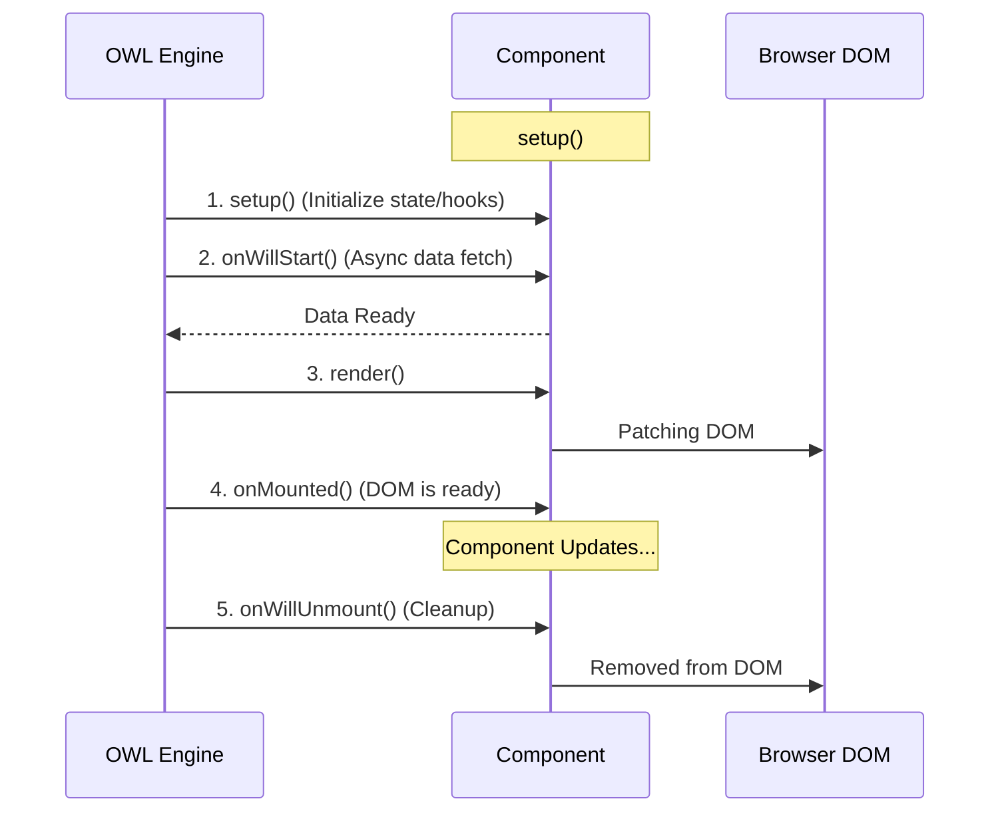

---
tags:
  - Frontend
  - Javascript
  - OWL 2.0
  - Components
---

# Odoo 19 OWL Framework

OWL (Owl Web Library) is the modern JavaScript framework used by Odoo to build fast, reactive, and component-based user interfaces.

---

## Component Lifecycle



---

## What is OWL?

OWL is a declarative component framework, similar to Vue or React, but specifically optimized for the Odoo ecosystem.

- **Component-based**: UI is split into small, reusable pieces.
- **Reactive**: The UI updates automatically when data changes.
- **Templates**: Uses QWeb templates for rendering.
- **Hooks**: Specialized functions for lifecycle and service management.

---

## Basic Component Structure

Every OWL component is a JavaScript class that extends `Component`.

### Simple Example: Counter Component
A basic example showing state management and event handling.

```javascript
import { Component, useState, xml } from "@odoo/owl";

export class Counter extends Component {
    static template = xml`
        <div class="p-4 bg-light border text-center">
            <h3>Count: <t t-out="state.value"/></h3>
            <button class="btn btn-primary" t-on-click="increment">Add +1</button>
        </div>
    `;

    setup() {
        this.state = useState({ value: 0 });
    }

    increment() {
        this.state.value++;
    }
}
```

---

## Senior Example: Data Dashboard
A more advanced example using Odoo services to fetch real-time auction data.

```javascript
import { Component, useState, onWillStart } from "@odoo/owl";
import { useService } from "@web/core/utils/hooks";

export class AuctionDashboard extends Component {
    static template = "pways_auction.Dashboard";
    
    setup() {
        // Services injection
        this.orm = useService("orm");
        this.notification = useService("notification");
        
        // Reactive state
        this.state = useState({
            listings: [],
            loading: true
        });

        // Lifecycle Hook: Fetch data before rendering
        onWillStart(async () => {
            try {
                this.state.listings = await this.orm.searchRead(
                    "auction.listing",
                    [ ["state", "=", "active"] ],
                    ["name", "current_price", "end_date"]
                );
            } catch (error) {
                this.notification.add("Failed to load auctions", { type: "danger" });
            } finally {
                this.state.loading = false;
            }
        });
    }
}
```

---

## Hooks Reference

| Hook | Description |
| :--- | :--- |
| `setup()` | Called when the component is created. Used to initialize state and services. |
| `onWillStart()` | Asynchronous hook called before the first render. Ideal for fetching data. |
| `onMounted()` | Called after the component is added to the DOM. |
| `onWillUnmount()` | Called just before the component is destroyed. Used for cleanup. |
| `onPatched()` | Called after the component has updated its DOM. |

!!! tip "Tip"
    Always use `useService` inside the `setup()` method to ensure services are correctly injected into your component.

---

## Best Practices

- **Keep Components Small**: One component should do one thing well.
- **Use Props for Input**: Pass data from parent to child using `props`.
- **Cleanup in Unmount**: Always clear timers or event listeners in `onWillUnmount` to prevent memory leaks.
- **Declarative UI**: Avoid direct DOM manipulation (like `document.getElementById`). Let OWL handle the rendering via state and templates.

---

## 🚀 Odoo 19: The OWL 2.0 Revolution

Odoo 19 fully embraces **OWL 2.0**, which introduces several breaking improvements over 1.0.

### 1. The Slot System
Slots allow you to pass XML content to a child component, making components much more reusable.
```xml
<MyComponent>
    <t t-set-slot="header">
        <h1>Custom Header</h1>
    </t>
</MyComponent>
```

### 2. Hooks-only Setup
In OWL 2.0, the `setup()` method is the **only** place where you can call hooks like `useState` or `useService`. Calling them in other methods will raise an error.

---

## 🏁 Senior Checkpoint
*   **Key Concept:** OWL is a reactive, component-based framework tailored for Odoo.
*   **Architect Insight:** `onWillStart` is the only hook that supports `async`, making it the mandatory place for initial ORM/RPC data fetching.
*   **Verify Your Knowledge:** Why should you use `useState` instead of a plain object? (Answer: Because `useState` makes the object reactive, triggering re-renders on change).

!!! success "Next Step"
    Components are ready. Now learn to [Register Assets](assets.md) in the Odoo bundle system.

---

<div class="feedback-container">
    <span class="feedback-label">Was this page helpful?</span>
    <div class="feedback-buttons">
        <button class="feedback-btn" onclick="sendFeedback(true)">👍 Yes</button>
        <button class="feedback-btn" onclick="sendFeedback(false)">👎 No</button>
    </div>
</div>
