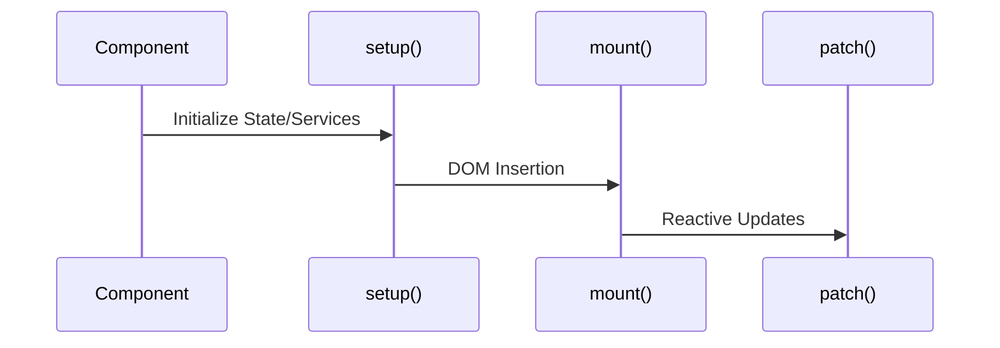

# Odoo 19: OWL Component Lifecycle

OWL components go through a strict lifecycle.

### Master Project Challenge: OWL
1.  **Task**: Add a `useEffect` hook to your `AuctionTimer` component that logs "Component Mounted" on initialization.
2.  **Goal**: Understand when state becomes reactive in the lifecycle.
