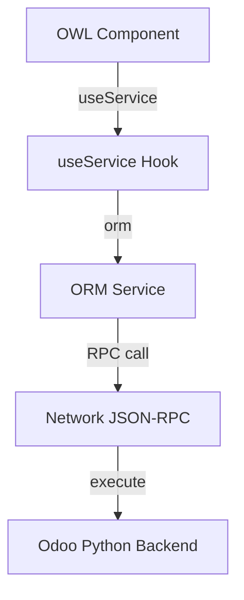

# OWL Services Catalogue

In Odoo's frontend framework (OWL), **Services** are global, long-lived objects that provide utility functions to your components. They are the JavaScript equivalent of Odoo's Python Environment tools.

---

## 1. What is an Odoo Service?

A service in OWL is a piece of logic that runs in the background and can be accessed from any component. They handle cross-cutting concerns like showing notifications, making RPC calls to the server, or triggering window actions.



To use a service, you inject it into your component using the `useService` hook.

```javascript
import { Component } from "@odoo/owl";
import { useService } from "@web/core/utils/hooks";

export class AuctionDashboard extends Component {
    setup() {
        this.notification = useService("notification");
        this.action = useService("action");
    }
}
```

---

## 2. The Core Services Reference

Odoo 19 provides several built-in services. Here are the most critical ones for daily development:

| Service Name | Primary Purpose | Key Methods |
| :--- | :--- | :--- |
| **`orm`** | Talk to Python models. | `call()`, `searchRead()`, `write()` |
| **`notification`** | Show toast alerts (top right). | `add(message, options)` |
| **`dialog`** | Show popup modals. | `add(DialogComponent, props)` |
| **`action`** | Trigger Odoo window actions. | `doAction(action_id_or_dict)` |
| **`rpc`** | Raw HTTP JSON-RPC calls. | `(route, params)` |
| **`user`** | Current user context. | `userId`, `hasGroup()` |
| **`router`** | Manipulate the URL hash. | `pushState()`, `current` |

---

## 3. Common Use Cases

### Showing a Notification
```javascript
// Success toast
this.notification.add("Bid placed successfully!", {
    type: "success", // success, warning, danger, info
    sticky: false,
});
```

### Triggering an Odoo Action
You can simulate a user clicking a menu item by triggering an action dictionary.
```javascript
// Open the "My Bids" list view
this.action.doAction({
    type: 'ir.actions.act_window',
    res_model: 'auction.bid',
    view_mode: 'list,form',
    domain: [['bidder_id', '=', this.user.userId]],
    target: 'current',
});
```

### Calling the ORM Service
The `orm` service allows you to call Python model methods directly from Javascript.

```javascript
// 1. Fetch record data using searchRead
const listings = await this.orm.searchRead(
    "auction.listing",
    [["state", "=", "open"]],
    ["name", "current_price"]
);

// 2. Call a custom Python method (similar to api.model or api.multi)
const success = await this.orm.call(
    "auction.listing",
    "action_confirm_bid",
    [listingId, bidAmount]
);
```

---

## 4. Senior: Building a Custom Service

As an architect, you might need a global state manager (like a WebSocket listener for live bids) that multiple components can share. You do this by registering a custom service.

### Step 1: Define the Service
```javascript
import { registry } from "@web/core/registry";
import { EventBus } from "@odoo/owl";

export const liveBidService = {
    dependencies: ["rpc"], // Requires the RPC service to function
    start(env, { rpc }) {
        const bus = new EventBus();
        
        // Polling loop or WebSocket connection here
        setInterval(async () => {
            const newBids = await rpc("/api/bids/latest");
            if (newBids.length > 0) {
                bus.trigger("new_bids", newBids);
            }
        }, 5000);

        return {
            bus,
        };
    }
};

// Register it
registry.category("services").add("live_bid", liveBidService);
```

### Step 2: Use It
```javascript
setup() {
    this.liveBid = useService("live_bid");
    this.liveBid.bus.addEventListener("new_bids", (ev) => {
        console.log("New bids arrived!", ev.detail);
    });
}
```

---

## 5. Senior Architect: Bus Service & Longpolling

For true real-time applications (like a live auction countdown or instant chat), polling with `setInterval` is highly inefficient. Instead, Odoo provides the `bus_service`, which uses longpolling (and websockets in modern deployments) to push server events to the browser.

### Triggering the Event (Python)
First, the backend must broadcast an event to a specific channel.
```python
# In python (e.g., when a bid is placed)
self.env['bus.bus']._sendone(
    'auction_channel',  # The channel name
    'new_bid_placed',   # The event type
    {'amount': 500}     # The payload
)
```

### Listening to the Event (OWL / JavaScript)
Inject the `bus_service` and subscribe to the channel.

```javascript
import { Component, onWillUnmount } from "@odoo/owl";
import { useService } from "@web/core/utils/hooks";

export class LiveAuction extends Component {
    setup() {
        this.busService = useService("bus_service");

        // 1. Tell the bus we want to listen to this channel
        this.busService.addChannel("auction_channel");

        // 2. Define the handler
        const onNotification = (notifications) => {
            for (const { payload, type } of notifications) {
                if (type === "new_bid_placed") {
                    console.log("Live Bid Received:", payload.amount);
                }
            }
        };

        // 3. Attach the listener
        this.busService.addEventListener("notification", onNotification);

        // 4. Clean up to prevent memory leaks!
        onWillUnmount(() => {
            this.busService.removeEventListener("notification", onNotification);
        });
    }
}
```

---

## 🏁 Senior Checkpoint
*   **Key Concept:** Services are singleton utilities injected into components via `useService()`.
*   **Architect Insight:** Custom services registered in the `services` category are instantiated exactly once when the Odoo web client boots up, making them perfect for persistent connections or shared state.
*   **Verify Your Knowledge:** Which service is used to check if the current user belongs to a specific security group? (Answer: The `user` service using `hasGroup()`).

---

<div class="feedback-container">
    <span class="feedback-label">Was this page helpful?</span>
    <div class="feedback-buttons">
        <button class="feedback-btn" onclick="sendFeedback(true)">👍 Yes</button>
        <button class="feedback-btn" onclick="sendFeedback(false)">👎 No</button>
    </div>
</div>
