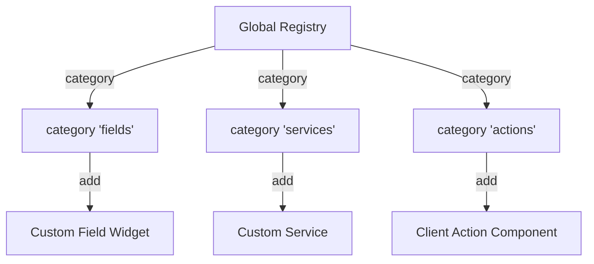

# Odoo 19: OWL Registries Catalogue

In Odoo's OWL frontend architecture, the **Registry** is a global, centralized key-value store. It serves as the primary mechanism for dependency injection and extensibility. 

Instead of import-coupling (directly referencing files), components and services register themselves under specific "categories." The web client then reads these registries dynamically at runtime to build fields, actions, or load components.



---

## 1. Field Registry: `category("fields")`

The field registry maps XML widget names (e.g. `<field name="price" widget="my_custom_widget"/>`) to the actual OWL JavaScript Component class.

### Example: Registering a Custom Numeric Field Widget
Suppose you build an OWL component `AuctionBidVisualizer` to display numbers with gauge bars. To make it usable in XML views:

```javascript
import { registry } from "@web/core/registry";
import { standardFieldProps } from "@web/views/fields/standard_field_props";
import { Component } from "@odoo/owl";

class AuctionBidVisualizer extends Component {
    static template = "pways_auction.BidVisualizerTemplate";
    static props = {
        ...standardFieldProps,
    };
    // Component logic...
}

// Register the component under the "fields" category
registry.category("fields").add("bid_visualizer", {
    component: AuctionBidVisualizer,
    supportedTypes: ["float", "integer", "monetary"],
});
```

Now you can use it directly in any form or list view XML definition:
```xml
<field name="amount" widget="bid_visualizer"/>
```

---

## 2. Service Registry: `category("services")`

The services registry holds global singleton utilities (like notification triggers or API fetch wrappers) instantiated once when the Odoo web client boots up.

### Example: Registering a Custom Service
```javascript
import { registry } from "@web/core/registry";

const billingApiService = {
    dependencies: ["rpc"],
    start(env, { rpc }) {
        return {
            async fetchInvoiceStatus(invoiceId) {
                return await rpc("/api/invoice/status", { id: invoiceId });
            }
        };
    }
};

// Register the service globally
registry.category("services").add("billing_api", billingApiService);
```

You can now call it from any component using the `useService()` hook:
```javascript
setup() {
    this.billingApi = useService("billing_api");
}
```

---

## 3. Action Registry: `category("actions")`

The action registry is used to register custom Javascript screens (called **Client Actions**). Client Actions are triggered by Window Actions and display a fully custom OWL canvas rather than standard forms or lists (e.g. the Odoo IoT dashboard, Barcode interface, or custom reports dashboard).

### Example: Registering a Custom Dashboard Client Action
```javascript
import { registry } from "@web/core/registry";
import { Component } from "@odoo/owl";

class AuctionManagerDashboard extends Component {
    static template = "pways_auction.ManagerDashboard";
    // Dashboard logic...
}

// Register the dashboard as a client action
registry.category("actions").add("action_auction_dashboard", AuctionManagerDashboard);
```

To display this dashboard, link to its registered key in your window action XML:
```xml
<record id="action_auction_dashboard_window" model="ir.actions.client">
    <field name="name">Auction Manager Dashboard</field>
    <field name="tag">action_auction_dashboard</field> <!-- Matches registry key -->
</record>
```

---

## 🏁 Senior Checkpoint

*   **Key Concept**: Registries decouple the view layers (XML definitions) from implementation layers (JS components) by acting as a lookup broker.
*   **Architect Insight**: Never edit or overwrite the prototype of registry categories directly. Always use the `.add()` or `.patch()` methods provided by the `@web/core/registry` API to maintain clean upgrade compatibility.
*   **Verify Your Knowledge**: What does the `tag` field in an `ir.actions.client` record map to? (Answer: It maps to the string key registered under the `actions` category registry).
