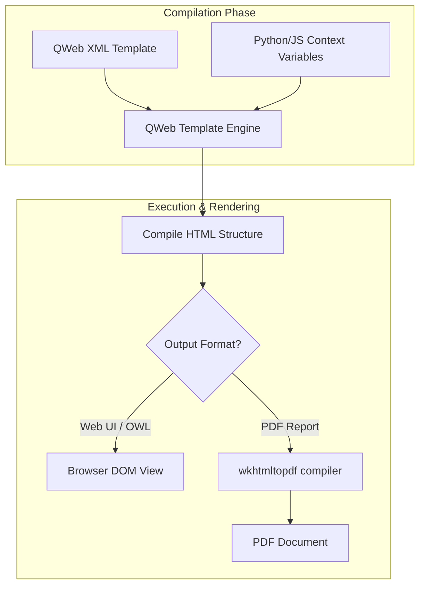

# QWeb: Odoo's XML Template Engine

QWeb is Odoo's primary rendering engine. Unlike typical HTML engines (like Jinja or Liquid), QWeb templates are written entirely in XML, allowing Odoo's standard xpath tools to inherit and extend them.

---

## QWeb XML Templating Basics
QWeb is an XML-based templating engine used in Odoo to generate dynamic output, including PDF report layouts, email bodies, web pages, and OWL component templates. It uses specific `t-` prefixed attributes (directives) to execute conditional logic, loops, and variable bindings.

---

## Dynamic HTML Page & Report Generation
Modern business software requires dynamic templates that can translate content, display currency formatting, and allow other modules to inherit and customize layouts. QWeb compiles XML templates directly, translating directives into optimized JavaScript or Python functions.

---

## Rendering Views, Forms, and Report PDF Outputs
*   Use to define structures for PDF print documents (like invoices or quotes).
*   Use to write templates for OWL components in Odoo's web client.
*   Use to format dynamic emails.

---

## When to Use OWL Components (Interactive Web Pages)
*   **Do not** use `t-raw` (raw HTML outputting) unless you are completely sure the input is sanitized. Using raw HTML exposes the application to Cross-Site Scripting (XSS) security vulnerabilities. Use `t-out` instead.
*   **Do not** perform heavy ORM search operations directly inside QWeb template code. Query and structure your data inside backend Python models or controllers first, and pass clean objects to the template.

---

## QWeb Logic Directives (t-if, t-foreach, t-out)
Here is the core XML syntax for QWeb directives:

```xml
<!-- 1. Variables Outputting -->
<span t-out="record.name"/>

<!-- 2. Odoo Field Formatting -->
<span t-field="record.price" t-options="{'widget': 'monetary'}"/>

<!-- 3. Conditionals -->
<t t-if="record.qty > 0">In Stock</t>
<t t-else="">Out of Stock</t>

<!-- 4. Loop Iterations -->
<t t-foreach="record.line_ids" t-as="line">
    <span t-out="line.name"/>
</t>

<!-- 5. Dynamic Attributes -->
<button t-att-disabled="not record.is_active">Action</button>
```

---

## Listing Records & Rendering Conditional Fields

### A. Dynamic Class formatting (`t-attf-class`)
Formatting classes dynamically based on conditional states:

```xml
<div t-attf-class="badge {{ 'bg-success' if doc.state == 'won' else 'bg-warning' }}">
    Status: <span t-out="doc.state"/>
</div>
```

### B. Setting and Calling Templates
```xml
<!-- Assign variables inside QWeb -->
<t t-set="is_vip" t-value="doc.partner_id.credit_limit > 50000"/>

<!-- Call external layout templates -->
<t t-call="web.external_layout">
    <div class="page">
        <h1>Auction Catalog Report</h1>
        <p t-if="is_vip" class="text-danger">VIP Client Catalog</p>
    </div>
</t>
```

### 💻 Code Challenge

**Write a QWeb loop to show only bids higher than 100:**

<div class="code-challenge">
<pre><code>&lt;div t-foreach="record.bid_ids" t-as="bid"&gt;
    &lt;p <input type="text" class="quiz-input-inline w-120" data-answer="t-if=\"bid.amount > 100\""&gt;
        Bidder: &lt;span <input type="text" class="quiz-input-inline w-100" data-answer="t-out=\"bid.name\""&gt;&lt;/span&gt;
    &lt;/p&gt;
&lt;/div&gt;</code></pre>
<button class="quiz-check" onclick="checkCodeChallenge(this)">Check Code</button>
<div class="quiz-result"></div>
</div>

---

## XML Parsing Errors & Undefined Variable Scope
1.  **Using legacy `t-esc` and `t-raw` directives**: Writing template nodes using deprecated modifiers. Odoo 19 uses `t-out` to perform safe HTML escaping and rendering.
2.  **Omitting `t-key` in loops inside OWL components**: Forgetting to add `t-key` attributes when writing QWeb templates for reactive OWL interfaces. OWL requires unique loop keys to track changes inside the Virtual DOM.

---

## Page Compilation Cache & Heavy Loop Rendering
Generating thousands of PDF lines during massive print operations (like printing invoice packs) can become a bottleneck.
*   **The `t-cache` Directive**: In Odoo 19, cache HTML fragments based on record write dates to prevent redundant compilations:
    ```xml
    <div t-cache="doc.id, doc.write_date">
        <!-- Render cached expensive layout -->
        <t t-call="my_module.expensive_sub_template"/>
    </div>
    ```

---

## Senior Architect: Extending Core QWeb Templates with t-inherit
In Odoo 19:
*   Always prefer `t-out` over `t-esc`. `t-out` handles modern OWL components and specialized HTML objects more safely.
*   To inherit and extend report layouts dynamically, declare standard templates pointing to the base layout `id` using `<template>` records and xpath operations:
    ```xml
    <template id="report_invoice_inherit" inherit_id="account.report_invoice_document">
        <xpath expr="//address" position="after">
            <div>Loyalty Points: <span t-out="o.partner_id.loyalty_points"/></div>
        </xpath>
    </template>
    ```

---

## QWeb Compilation & Execution Pipeline

This diagram illustrates Odoo's QWeb compilation cycle, showing how raw template structures compile into dynamic browser interfaces or PDF report documents:



---

## Related Frontend Guides
*   [QWeb & Reports (v19)](reports.md)
*   [OWL Basics](owl.md)
*   [Assets & Bundles](assets.md)
