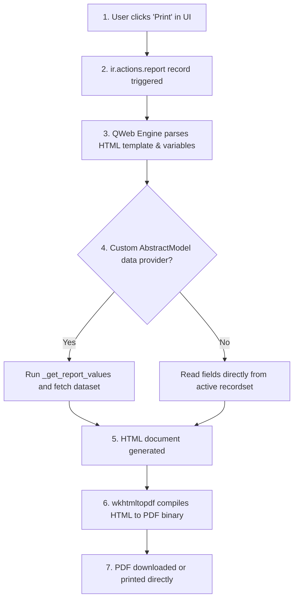

# QWeb & Reports (v19)

## QWeb PDF Report Engine
In Odoo 19, printable documents (such as Invoices, Purchase Orders, and Custom Certificates) are designed using **QWeb HTML/XML Templates**. 

When a user clicks "Print," Odoo renders these templates into high-quality HTML, which is then parsed and compiled into a PDF file using the **`wkhtmltopdf`** command-line utility.



---

## Standardized Document Generation (Invoices, Bids)
Traditional PDF generation libraries (like ReportLab or raw PDF code) require developers to specify coordinates and layout parameters manually, which is extremely tedious. 

Odoo's QWeb Report Engine solves this by allowing developers to write printable layouts using standard web standards: HTML5, CSS3, and Bootstrap grid styling. This decouples visual layout styling from backend database records.

---

## Generating Custom PDF Printouts
Use QWeb Reports whenever you need to produce standardized, printable business documents:
*   Official invoices and tax reports.
*   Product barcodes and shipping labels.
*   Auction certificates of authenticity or bid receipts.
*   Timesheets and activity logs.

---

## When to Use OWL Views (Interactive Dashboards)
*   Do not use QWeb Reports to output raw data grids (e.g. exporting 10,000 sales lines to Excel). Generating giant PDF layouts consumes massive server memory and triggers connection timeouts. Use **CSV/XLSX export controllers** instead.
*   Do not use QWeb HTML templates for emails; emails require a simpler in-line CSS structure (compiled via mail templates).

---

## Declaring Report Actions & QWeb PDF Templates

To create a PDF report, you must define:
1.  An **`ir.actions.report`** record to define the report properties.
2.  A **QWeb `<template>`** to design the HTML layout.

### A. The Report Action
```xml
<record id="action_report_auction_listing" model="ir.actions.report">
    <field name="name">Auction Listing Receipt</field>
    <field name="model">auction.listing</field>
    <field name="report_type">qweb-pdf</field> <!-- qweb-pdf or qweb-html -->
    <field name="report_name">pways_auction.report_listing_template</field>
    <field name="report_file">pways_auction.report_listing_template</field>
    <field name="binding_model_id" ref="model_auction_listing"/>
    <field name="binding_type">report</field>
</record>
```

### B. Standard Layout Structure
QWeb utilizes structural Odoo wrappers (like `web.html_container` and `web.external_layout`) to ensure consistent corporate headers, footers, and page numbers:
```xml
<template id="report_listing_template">
    <t t-call="web.html_container">
        <!-- Iterate over records inside active recordset (passed as 'docs') -->
        <t t-foreach="docs" t-as="o">
            <t t-call="web.external_layout">
                <div class="page">
                    <!-- HTML Page Content Here -->
                    <h2 t-out="o.name"/>
                </div>
            </t>
        </t>
    </t>
</template>
```

---

## Designing Invoices and Auction Receipt Layouts

### Beginner: Simple Certificate Template
Create a basic certificate sheet displaying a listing name and starting price using the new `t-out` directive.
```xml
<template id="report_listing_certificate">
    <t t-call="web.html_container">
        <t t-foreach="docs" t-as="o">
            <div class="page text-center border p-5 mt-5">
                <h1>Certificate of Authenticity</h1>
                <p>This document certifies the registration of:</p>
                <h2 class="text-primary" t-out="o.name"/>
                <p>Starting Value: <span t-field="o.starting_price"/></p>
            </div>
        </t>
    </t>
</template>
```

### Intermediate: Loop-Based Bid History Receipt
Loop through an auction's child bid records inside the printable invoice using Bootstrap tables.
```xml
<template id="report_listing_bids">
    <t t-call="web.html_container">
        <t t-foreach="docs" t-as="o">
            <t t-call="web.external_layout">
                <div class="page">
                    <h2>Bid History: <span t-out="o.name"/></h2>
                    <table class="table table-striped mt-4">
                        <thead>
                            <tr>
                                <th>Bidder</th>
                                <th>Date</th>
                                <th>Amount</th>
                            </tr>
                        </thead>
                        <tbody>
                            <tr t-foreach="o.bid_ids" t-as="bid">
                                <td><span t-out="bid.bidder_name"/></td>
                                <td><span t-field="bid.create_date"/></td>
                                <td><span t-field="bid.amount"/></td>
                            </tr>
                        </tbody>
                    </table>
                </div>
            </t>
        </t>
    </t>
</template>
```

### Real-World: Custom Data Provider via AbstractModel
For complex reports requiring raw SQL queries, aggregates, or calculations that aren't stored on the model, create an **AbstractModel Data Provider**.

=== "Python Data Provider"
    ```python
    from odoo import api, models

    # Name MUST match 'report.your_module_name.your_template_id'
    class BidHistoryReport(models.AbstractModel):
        _name = 'report.pways_auction.report_bid_summary_template'
        _description = 'Bid Summary Data Provider'

        @api.model
        def _get_report_values(self, docids, data=None):
            # 1. Fetch listings
            docs = self.env['auction.listing'].browse(docids)
            
            # 2. Run complex query to fetch top bid stats
            self.env.cr.execute("""
                SELECT listing_id, MAX(amount) as max_amount, COUNT(id) as bid_count 
                FROM auction_bid 
                WHERE listing_id IN %s 
                GROUP BY listing_id
            """, [tuple(docids)])
            stats = {row['listing_id']: row for row in self.env.cr.dictfetchall()}

            # 3. Return variables injected into QWeb evaluation context
            return {
                'doc_ids': docids,
                'doc_model': 'auction.listing',
                'docs': docs,
                'bid_stats': stats,
            }
    ```

=== "QWeb Template"
    ```xml
    <template id="report_bid_summary_template">
        <t t-call="web.html_container">
            <t t-foreach="docs" t-as="o">
                <t t-call="web.external_layout">
                    <div class="page">
                        <h2 t-out="o.name"/>
                        <!-- Read data from python injected dict 'bid_stats' -->
                        <div class="alert alert-info mt-3">
                            Total Bids: <span t-out="bid_stats.get(o.id, {}).get('bid_count', 0)"/><br/>
                            Highest Bid: <span t-out="bid_stats.get(o.id, {}).get('max_amount', 0.0)"/>
                        </div>
                    </div>
                </t>
            </t>
        </t>
    </template>
    ```

---

## WKHTMLTOPDF CSS Bugs & Page Break Overlaps

### ❌ Using Deprecated `t-esc` Directive
In legacy Odoo, fields were printed using `t-esc`. In Odoo 19, this is deprecated and can trigger security warnings or fail to escape raw values.
```xml
<!-- Wrong: Deprecated syntax -->
<div t-esc="o.description"/>
```

### ✅ Using `t-out`
```xml
<!-- Right: Safe HTML escape engine standard in Odoo 19 -->
<div t-out="o.description"/>
```

### ❌ Accessing Uncached Fields inside Loops (N+1 Query)
Evaluating computed values or un-prefetched attributes inside template tables forces the report engine to execute database SELECT queries inside the render loop, making the print job take minutes.

---

## Batch Rendering PDF generation and Cache Optimizations
*   **Batch Prefetching**: Always pre-load relational fields by calling `browse()` on all IDs at the start of your print method.
*   **Avoid complex Python methods inside the QWeb XML template**: Instead of executing `t-out="o.calculate_totals()"` inside a loop, pre-calculate the values in your Python report data provider class and pass them to the rendering context.

---

## Senior Architect: Dynamic PDF Generation with Custom Parsers
*   **Paper Format Rules**: Define custom margins, layouts, and page dimension records (`report.paperformat`) to print label or envelope formats accurately.
*   **Multi-language Support**: Use `t-lang` inside the html container wrapper to translate PDF reports according to each recipient partner's preferred language code (`o.partner_id.lang`).

---

## Report Generation & Compilation Flow
*   **Previous Lesson**: [Assets & Bundles](assets.md)
*   **Next Lesson**: [Unit Testing](../testing/unit_tests.md)
*   **See Also**: [AbstractModel Pattern](../advanced/abstract_models.md), [Prefetching Mechanism](../advanced/prefetching.md)
