# Odoo 19 Senior Masterclass

Welcome to the **most comprehensive Odoo 19 development guide** on the web. This curriculum is designed to take you from a complete beginner (newbie) to a Senior Odoo Architect.

---

## 🏗️ The Master Project: Auction Marketplace
To make learning practical, this course uses a **Capstone Project**. Throughout every lesson, you will build a professional **Auction Marketplace** module. 
*   **Real-world Logic**: Handle tiered bidding, anti-sniping timers, and automatic invoicing.
*   **Modern UI**: Build real-time price updates using OWL 2.0 and WebSockets.
*   **Scalable Architecture**: Design the backend to handle thousands of concurrent bidders.

    <ul>
        <li>
            <a href="https://github.com/Kashyap-001/odoo19-docs">
                <strong><svg xmlns="http://www.w3.org/2000/svg" viewBox="0 0 24 24"><path d="M12 .297c-6.63 0-12 5.373-12 12 0 5.303 3.438 9.8 8.205 11.385.6.113.82-.258.82-.577 0-.285-.01-1.04-.015-2.04-3.338.724-4.042-1.61-4.042-1.61C4.422 18.07 3.633 17.7 3.633 17.7c-1.087-.744.084-.729.084-.729 1.205.084 1.838 1.236 1.838 1.236 1.07 1.835 2.809 1.305 3.495.998.108-.776.417-1.305.76-1.605-2.665-.3-5.466-1.332-5.466-5.93 0-1.31.465-2.38 1.235-3.22-.135-.303-.54-1.523.105-3.176 0 0 1.005-.322 3.3 1.23.96-.267 1.98-.399 3-.405 1.02.006 2.04.138 3 .405 2.28-1.552 3.285-1.23 3.285-1.23.645 1.653.24 2.873.12 3.176.765.84 1.23 1.91 1.23 3.22 0 4.61-2.805 5.625-5.475 5.92.42.36.81 1.096.81 2.22 0 1.606-.015 2.896-.015 3.286 0 .315.21.69.825.57C20.565 22.092 24 17.592 24 12.297c0-6.627-5.373-12-12-12"/></svg> View Companion Source Code</strong>
                

                Explore the complete Odoo 19 module repository alongside these docs.
            </a>
        </li>
    </ul>

---

## ⏱️ Course Duration & Time Investment
This Masterclass is designed to take approximately **28 Hours** to complete. Here is the recommended time allocation to ensure you master the concepts without burning out:

  
<strong>Part 1: Backend Developer</strong> Phase 1: Foundations (~3 hrs) Phase 2: Inheritance (~2 hr) Phase 3: ORM Engine (~4 hrs) Phase 4: Business Logic (~3 hrs)

  
<strong>Part 2: Frontend & Integration</strong> Phase 5: OWL 2.0 (~4 hrs) Phase 6: Multi-Company (~1.5 hr) Phase 7: Web Controllers (~1.5 hr)

  
<strong>Part 3: Senior Architect</strong> Phase 8: Pro Quality (~2.5 hrs) Phase 9: DevOps & Architecture (~4 hrs) Phase 10: Standards (~2.5 hrs)

---

## Your Learning Roadmap

```mermaid
graph LR
    Start(Newbie) --> Foundation[The Foundations]
    Foundation --> ORM[ORM Engine]
    ORM --> Search[Search & Logic]
    Search --> Advanced[Advanced ORM]
    Advanced --> Logic[Business Logic]
    Logic --> Frontend[OWL Frontend]
    Frontend --> DevOps[Scaling & DevOps]
    DevOps --> Senior(Odoo Architect)
    
    style Start fill:#f9f,stroke:#333,stroke-width:2px
    style Senior fill:#00ff00,stroke:#333,stroke-width:4px

    click Foundation "foundation/setup/" "Go to Foundations"
    click ORM "crud/index/" "Go to ORM Engine"
    click Search "search/search/" "Go to Search & Logic"
    click Advanced "advanced/decorators/" "Go to Advanced ORM"
    click Logic "business/inheritance/" "Go to Business Logic"
    click Frontend "frontend/owl/" "Go to OWL Frontend"
    click DevOps "deployment/config/" "Go to Scaling & DevOps"
```

---

## 💡 How to Remember Odoo: The "MVP" Model

To keep the 3-Tier architecture in your head, remember **MVP**:

*   **M**odel: The **Brain** (Data & Logic).
*   **V**iew: The **Face** (UI & XML).
*   **P**ortal (Controller): The **Messenger** (Web routes & JSON-RPC).

---

  

    <h2>🚀 Foundations</h2>
    
Start your journey by setting up a professional development environment and understanding the anatomy of an Odoo 19 module.

    <a href="foundation/setup/">Start Learning &rarr;</a>
  

  

    <h2>🛠️ Core Development</h2>
    
Master the ORM, CRUD operations, and advanced search domains. Learn how Odoo interacts with the database efficiently.

    <a href="crud/index/">Master the ORM &rarr;</a>
  

  

    <h2>🌐 Frontend & OWL</h2>
    
Learn to build modern, reactive user interfaces using Odoo's OWL (Odoo Web Library) framework. From basic components to advanced patching.

    <a href="frontend/owl/">Explore OWL &rarr;</a>
  

  

    <h2>🧪 Testing & Security</h2>
    
Professional code must be secure and tested. Learn to write unit tests, UI tours, and implement complex security rules.

    <a href="testing/unit_tests/">Learn Testing &rarr;</a>
  

  

    <h2>🚀 Scaling & Deployment</h2>
    
Go beyond code. Learn how to configure production servers, use Docker, scale horizontally, and migrate legacy data.

    <a href="deployment/config/">Go Professional &rarr;</a>
  

---

!!! info "Odoo 19 Support"
    This documentation is strictly focused on **Odoo 19.0**, utilizing the latest Python 3.12 features and the newest OWL 2.0 standards.

!!! tip "Architect Advice"
    To become a Senior Developer, don't just learn *how* to write code; learn *why* Odoo's architecture works the way it does. Read the "Senior OWL" and "Performance" sections carefully.

---

## 👨‍💻 About the Creator
**Odoo 19 Masterclass** was developed and is owned by **Kashyap Patel**. It was created as a definitive guide to empower developers worldwide to achieve architectural mastery in the Odoo ecosystem.

**Connect with Kashyap:**  
🔗 [LinkedIn Profile](https://www.linkedin.com/in/kashyap-patel6334/)  
🐙 [GitHub Repositories](https://github.com/Kashyap-001)

---

    Was this page helpful?
    

        <button class="feedback-btn" onclick="sendFeedback(true)">👍 Yes</button>
        <button class="feedback-btn" onclick="sendFeedback(false)">👎 No</button>
    

